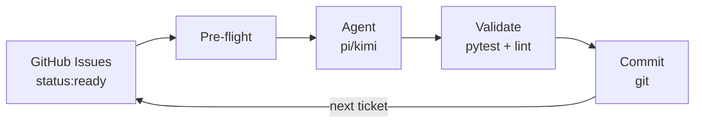
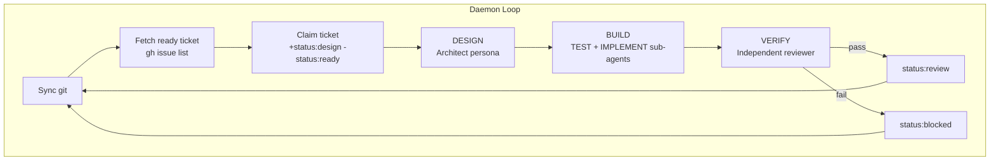

# Ralph v3 — Automated Build System

> AI-agent-powered continuous build loop. GitHub Issues as tickets, GitHub Labels as
> status, GitHub Kanban as dashboard. No databases. No beads. Just git and gh.

Ralph reads your ticket queue from GitHub Issues, feeds tickets to an AI coding agent
(pi or kimi) through a 3-stage pipeline (DESIGN → BUILD → VERIFY), validates the
output, and commits — all in a continuous loop. You write the tickets; Ralph builds
the code.



## Quick Install

```bash
# One-line install (macOS / Linux)
curl -fsSL https://raw.githubusercontent.com/samdharma/Ralph_loop/ralph-v3/scripts/install.sh | bash
source ~/.zshrc
ralph version   # → ralph v3.0.0
```

Requires: **git**, **gh** (GitHub CLI), **python 3.10+**, and **pi** or **kimi**.
The installer checks all prerequisites and shows install instructions for any
that are missing.

## Quick Start

```bash
# 1. Create a new project (with GitHub labels)
ralph init my-project --create-labels

# 2. Or init an existing cloned repo
git clone https://github.com/you/your-repo.git
cd your-repo
ralph init --create-labels

# 3. Verify everything
ralph setup

# 4. Create a GitHub issue with label status:ready, then:
ralph daemon
```

## How It Works



## Project Layout

```
my-project/
├── .ralph/config.toml        # Project config
├── config/
│   ├── ralph_preflight.sh    # Pre-flight guardrails
│   └── TEST_MAP.yaml         # Source → test mapping
├── docs/agent/
│   ├── PROMPT.md             # Base agent prompt
│   ├── PROGRESS.md           # Agent progress log
│   └── prompts/              # Stage-specific persona prompts
├── src/                      # Application source
├── tests/                    # Unit + integration tests
├── AGENTS.md                 # Quick reference for agents
└── .gitignore
```

## Commands

| Command | Purpose |
|---------|---------|
| `ralph init [dir]` | Scaffold a Ralph project (default: current directory) |
| `ralph setup` | Check prerequisites (gh auth, labels, deps, create dirs) |
| `ralph daemon [--auto-close]` | Start the build loop (foreground) |
| `ralph status` | Show daemon PID, active issue, recent metrics |
| `ralph validate [--tier=...]` | Run validation gate (pytest + lint) |
| `ralph report` | Generate daily/weekly summary |
| `ralph generate-test-map` | Auto-generate TEST_MAP.yaml from project structure |
| `ralph version` | Show version |
| `ralph help` | Show help |

## Documentation

| Document | Topic |
|----------|-------|
| [Getting Started](docs/getting_started.md) | Full guide: install, setup, tickets, pipeline, cheat sheet |
| [v3 Redesign PRD](docs/v3-redesign.md) | System design, phases, build notes, validation gates |
| [System Validation Test](docs/system_test.md) | Step-by-step test plan (26 tests, 8 suites) |

## License

MIT
