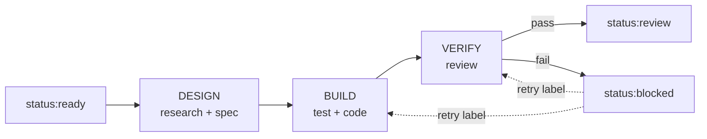

# Ralph v3.1 — Automated Build System

> AI-agent-powered continuous build loop. GitHub Issues are tickets, labels are
> status, the Kanban board is your dashboard. No databases. Just `git` and `gh`.



## Quick Install

Ralph v3.1 ships via GitHub Releases. Two install paths are supported:

### Path A — `make install` (recommended for new users)

```bash
git clone https://github.com/samdharma/Ralph_loop
cd Ralph_loop
git checkout ralph-v3.1
make install              # symlinks bin/ralph into ~/.local/bin or /usr/local/bin
ralph version             # → ralph v3.1.0
```

### Path B — `bin/ralph` symlink (preserved from v3)

```bash
git clone https://github.com/samdharma/Ralph_loop
cd Ralph_loop
git checkout ralph-v3.1
./scripts/install.sh
# Adds bin/ralph to ~/.local/bin and exports RALPH_HOME in your shell profile
```

Requires: **git**, **gh**, **python 3.10+**, and **pi** or **kimi**.

## Upgrading from v3

If you're upgrading from Ralph v3, run `ralph migrate` once after upgrading:

```bash
cd your-project
ralph migrate             # Migrate v3 state files + regenerate default stage prompts
ralph daemon              # Start as usual
```

The migration tool is idempotent, supports `--dry-run`, and refuses to run while the daemon is active. See [`docs/development_workflow.md`](docs/development_workflow.md) for details.

## Quick Start

```bash
# Create a new project
ralph init my-project --create-labels

# Or init an existing repo
cd your-repo && ralph init --create-labels

# Verify everything
ralph setup

# Create a GitHub issue with label status:ready, then:
ralph daemon              # continuous loop
ralph daemon --issue 42   # single issue
```

## How It Works

Ralph runs a **3-stage pipeline** for each `status:ready` issue:

| Stage | What happens | Label |
|-------|-------------|-------|
| **DESIGN** | Agent researches codebase, writes design spec to `docs/designs/<N>.md`. Posts summary as issue comment. | `status:design` |
| **BUILD** | Two sub-agents: TEST writes tests from spec (isolated), IMPLEMENT writes code to pass them. | `status:build` |
| **VERIFY** | Fresh isolated reviewer checks diff against spec + issue. 5-axis review. | `status:verify` |

**On success:** issue → `status:review` (your turn to inspect and close).
**On failure:** issue → `status:blocked` with a detailed comment pointing to artifacts.

### Retry After a Failure

Fix the problem, then re-queue with a retry label — no need to re-run earlier stages:

| Label | What it re-runs |
|-------|----------------|
| `status:verify-retry` | VERIFY only |
| `status:build-retry` | BUILD → VERIFY |
| `status:ready` | Full pipeline (DESIGN → BUILD → VERIFY) |

## Commands

| Command | Purpose |
|---------|---------|
| `ralph init [dir]` | Scaffold a Ralph project |
| `ralph setup` | Check prerequisites (gh auth, labels, deps) |
| `ralph daemon [--auto-close] [--issue=N] [--pi-flag=FLAG]` | Start the build loop |
| `ralph status` | Show daemon PID, active issue, recent metrics |
| `ralph validate [--tier=...]` | Run the validation gate (pytest + lint) |
| `ralph doctor [N]` | Diagnose recent failures (v3.1+) |
| `ralph trajectory <N>` | Show per-issue trajectory timeline (v3.1+) |
| `ralph migrate [--dry-run]` | Migrate v3 state files to v3.1 (v3.1+) |
| `ralph report` | Generate daily/weekly summary |

## Project Layout

```
my-project/
├── .ralph/config.toml        # Project config
├── config/
│   ├── ralph_preflight.sh    # Pre-flight guardrails
│   └── TEST_MAP.yaml         # Source → test mapping
├── docs/agent/
│   ├── PROMPT.md             # Base agent rules
│   └── prompts/              # Stage personas (design, test, implement, verify)
├── src/                      # Application source
├── tests/                    # Unit + integration tests
├── AGENTS.md                 # Quick reference for agents
└── .gitignore
```

## Development

Ralph v3.1 development happens on the `ralph-v3.1` branch with one squash-merged PR per phase. See [`docs/development_workflow.md`](docs/development_workflow.md) for:

- Branch strategy
- PR review checklist (8 items)
- E2E test repo convention
- v3 → v3.1 upgrade flow (`ralph migrate`)
- Migration archive cleanup

## Documentation

| Document | Topic |
|----------|-------|
| [Getting Started](docs/getting_started.md) | Full guide: install, setup, tickets, pipeline, observability |
| [Observability](docs/observability.md) | Monitoring: metrics, dashboards, external tools |
| [v3 Redesign](docs/v3-redesign.md) | System design, phases, build notes (for Ralph developers) |
| [Development Workflow](docs/development_workflow.md) | Branch strategy, PR checklist, upgrade flow (v3.1+) |
| [Improvement Roadmap Spec](docs/IMPROVEMENT_ROADMAP_SPEC.md) | What v3.1 builds (v3.1+) |
| [Improvement Roadmap Plan](docs/IMPROVEMENT_ROADMAP_PLAN.md) | How v3.1 sequences the work (v3.1+) |
| [CHANGELOG](docs/CHANGELOG.md) | Version history (v3.1+) |

## License

MIT

*Last updated: 2026-06-27. v3.1.0 release (Phase A complete).*