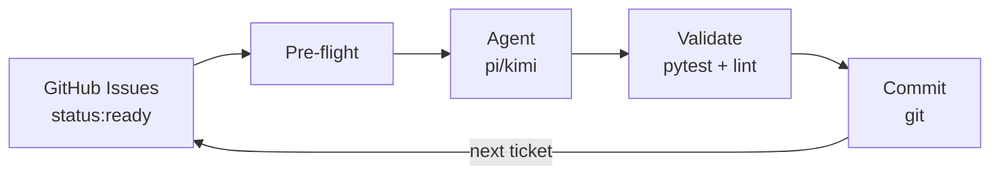
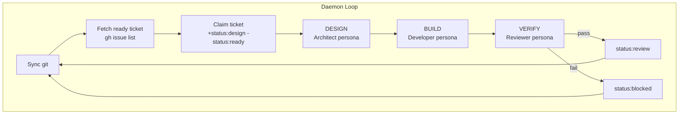

# Ralph v3 — Automated Build System

> AI-agent-powered continuous build loop. GitHub Issues as tickets, GitHub Labels as
> status, GitHub Kanban as dashboard. No databases. No beads. Just git and gh.

Ralph is a global CLI tool installed at `~/.ralph/`. It reads your ticket queue from
GitHub Issues, feeds tickets to an AI coding agent (pi or kimi) through a 3-stage
pipeline (DESIGN → BUILD → VERIFY), validates the output, and commits — all in a
continuous loop. You write the tickets; Ralph builds the code.



## Quick Install

```bash
git clone https://github.com/samdharma/Ralph_loop.git ~/.ralph
cd ~/.ralph && git checkout ralph-v3
bash ~/.ralph/scripts/install.sh
source ~/.zshrc
ralph version   # verify: ralph v3.0.0
```

## Quick Start

```bash
ralph init my-project          # scaffold a new project
cd my-project
ralph setup                    # check prerequisites (gh auth, labels, etc.)
ralph daemon                   # start the background build loop
```

## How It Works



## Project Layout

```
my-project/
├── .ralph/config.toml        # Project config
├── config/
│   ├── ralph_preflight.sh    # Pre-flight guardrails
│   └── TEST_MAP.yaml         # Source → test mapping
├── docs/agent/
│   ├── PROMPT.md             # Base agent prompt
│   ├── PROGRESS.md           # Agent progress log
│   └── prompts/              # Stage-specific persona prompts
├── src/                      # Application source
├── tests/                    # Unit + integration tests
├── AGENTS.md                 # Quick reference for agents
└── .gitignore
```

## Commands

| Command | Purpose |
|---------|---------|
| `ralph init [name]` | Scaffold a new Ralph project |
| `ralph setup` | Check prerequisites (gh auth, git remote, labels, deps) |
| `ralph daemon` | Start the background build loop |
| `ralph status` | Show daemon PID, active issue, recent metrics |
| `ralph validate [--tier=...]` | Run validation gate (pytest + lint) |
| `ralph report` | Generate daily/weekly summary |
| `ralph version` | Show version |
| `ralph help` | Show help |

## Prerequisites

| Tool | Purpose |
|------|---------|
| **git** 2.30+ | Version control |
| **gh** (GitHub CLI) 2.0+ | Issue read/write, label management |
| **python3** 3.10+ | Core orchestrator (all engine code is Python) |
| **pi** or **kimi** | AI coding agent |

## Documentation

| Document | Topic |
|----------|-------|
| [v3 Redesign PRD](docs/v3-redesign.md) | Full system design, phases, build notes |

## License

MIT
