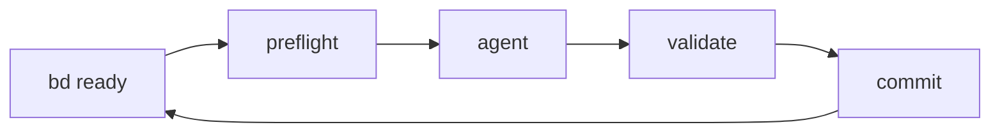

# Ralph Wiggum Loop Build System

> AI-agent-powered continuous build loop — turns your beads ticket queue into working,
> tested, committed code. One iteration at a time.

Ralph is a global CLI tool installed at `~/.ralph/`. It reads your ticket queue (beads),
feeds tickets to an AI coding agent (kimi or pi), validates the output, and commits —
all in a loop. You write the tickets; Ralph builds the code.



## Quick Install

```bash
git clone https://github.com/samdharma/Ralph_loop.git ~/.ralph
bash ~/.ralph/scripts/install.sh
source ~/.zshrc
```

## Quick Start

```bash
ralph init                    # scaffold a new project
cd my-project
ralph daemon                  # start background build loop
```

## Documentation

| Document | Topic |
|----------|-------|
| [Getting Started](docs/getting-started.md) | What Ralph solves, prerequisites, your first project |
| [Deployment](docs/deployment.md) | Installing Ralph on a new machine |
| [Daily Usage & Troubleshooting](docs/daily-usage.md) | Workflow, monitoring, failure scenarios, recovery |
| [Architecture](docs/architecture.md) | System design, components, data flow |
| [Ticket Management](docs/ticket-management.md) | Beads workflow, ticket hierarchy, naming conventions |
| [Configuration](docs/configuration.md) | All environment variables and defaults |
| [Orchestrator Roadmap](docs/orchestrator-roadmap.md) | Planned automated pipeline orchestration |
| [FAQ](docs/faq.md) | Common questions |
| [Version History](docs/version-history.md) | Release notes, migration guides |

## License

MIT
