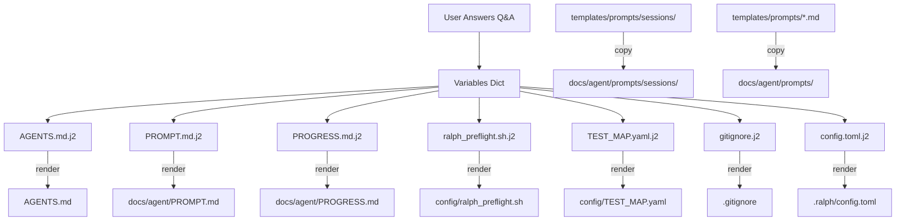

# Ralph Wiggum Loop — Architecture v1.2

> System design, data flow, component relationships, and design decisions.
> **Revision**: 2026-06-13 — Updated for 4-stage pipeline + global tool architecture

---

## High-Level Architecture

```mermaid
graph TB
    subgraph "User's Computer"
        CLI[ralph CLI]
        WIZARD[init.py Wizard]
    end

    subgraph "Ralph Home (~/.ralph)"
        CORE[core/ — 12 generic scripts]
        TEMPLATES[templates/ — 7 .j2 templates]
    end

    subgraph "User Project"
        subgraph "Project Config (committed to repo)"
            RALPH_CFG[.ralph/config.toml]
            AGENTS[AGENTS.md]
            PROMPT[docs/agent/PROMPT.md]
            PROGRESS[docs/agent/PROGRESS.md]
            PF_CONF[config/ralph_preflight.sh]
            TEST_MAP[config/TEST_MAP.yaml]
            SESSION_PROMPTS[docs/agent/prompts/sessions/]
        end

        subgraph "External Tools"
            BEADS[beads (bd)]
            GIT[git]
        end

        subgraph "AI Agents"
            KIMI[kimi CLI]
            PI[pi CLI]
        end
    end

    CLI --> WIZARD
    WIZARD --> |renders| TEMPLATES
    WIZARD --> |writes| RALPH_CFG
    CORE --> |ralph loop| BEADS
    CORE --> |sources| PF_CONF
    CORE --> |invokes| KIMI
    CORE --> |invokes| PI
    CORE --> |validates via| VALIDATE
    CORE --> |commits to| GIT
    CLI --> |sources| CORE
    TEMPLATES --> AGENTS
    TEMPLATES --> PROMPT
    TEMPLATES --> SESSION_PROMPTS
    TEMPLATES --> PF_CONF
    TEMPLATES --> TEST_MAP
```

---

## 4-Stage Pipeline Lifecycle


Each stage is an independent agent invocation with a stage-specific prompt:

| Stage | Command | Prompt | Output |
|-------|---------|--------|--------|
| **DESIGN** | `ralph design --ticket=<id>` | `sessions/design.md` | Architecture plan in PROGRESS.md |
| **TEST** | `ralph test --ticket=<id>` | `sessions/test.md` | Functional/system tests (should FAIL) |
| **IMPLEMENT** | `ralph implement --ticket=<id>` | `sessions/implement.md` | Code + unit tests (all tests pass) |
| **VERIFY** | `ralph verify --ticket=<id>` | `sessions/verify.md` | Pass/fail report, ticket closed or flagged |

### Why 4 Stages?

```
Before (anti-pattern):  IMPLEMENT writes tests + code -> marks own homework
After (correct):        TEST writes tests from spec -> IMPLEMENT passes them -> VERIFY checks
```

The TEST stage writes functional and system tests from the design spec **before any code exists**.
The IMPLEMENT stage then writes code to pass those tests, plus developer-written unit tests.
This is true independent verification.

## Continuous Loop Lifecycle

```mermaid
sequenceDiagram
    participant Loop as ralph_loop.sh
    participant Beads as beads (bd)
    participant Preflight as ralph_preflight.sh
    participant Agent as AI Agent (kimi/pi)
    participant Validate as ralph_validate.sh
    participant Git as git

    Loop->>Beads: bd ready --json
    Beads-->>Loop: [ticket1, ticket2, ...]

    Loop->>Loop: Deterministic sort

    loop For each candidate ticket
        Loop->>Preflight: Check labels + type
        Preflight-->>Loop: READY or BLOCKED
        alt READY
            Loop->>Loop: Select this ticket, break
        end
    end

    Loop->>Beads: bd update <id> --claim
    Loop->>Beads: bd update <id> --status in_progress

    Loop->>Loop: Write checkpoint
    Loop->>Loop: Assemble adaptive prompt

    Loop->>Agent: Invoke with prompt
    Agent-->>Loop: Iteration complete

    Loop->>Validate: ralph validate --tier=targeted

    alt Clean + tests pass
        Loop->>Loop: Clear checkpoint, commit
    else Dirty or tests fail
        Loop->>Loop: Retain checkpoint
    end

    Loop->>Loop: Log metrics, sleep 5s
```

---

## Component Details

### 1. `ralph_loop.sh` — Main Harness (~500 lines)

The brain of the system. Manages:

| Feature | Mechanism |
|---------|-----------|
| **Task selection** | `bd ready --json` → filters epics/features → deterministic sort |
| **Preflight gating** | Iterates candidates through `ralph_preflight.sh`, picks first READY |
| **Session mode** | `--session=design|test|implement|verify` forces single-shot with stage-specific prompt |
| **Prompt assembly** | Base prompt (`PROMPT.md`) + session-specific or type-specific + task context + build phase doc |
| **Agent invocation** | `kimi --print -p "..."` or `pi --print "..."` |
| **Checkpoint/resume** | Writes `.ralph_checkpoint.json` before iteration; recovers dirty worktrees on restart |
| **Signal handling** | Traps SIGINT/SIGTERM, clears checkpoint, exits cleanly |
| **Remote sync** | Fetches origin before iteration; auto-rebases hotfixes; blocks on divergence |

### 2. `run_ralph_loop.sh` — Daemon Wrapper (40 lines)

- PID-file based singleton (`~/.ralph_loop.pid`)
- Redirects stdout/stderr to `logs/ralph_loop.log`
- Forwards all arguments to `ralph_loop.sh`
- Starts with `nohup` for background execution

### 3. `ralph_preflight.sh` — Guardrail System (45 lines)

Two-layer architecture:

```
ralph_preflight.sh (core)
    │
    ├── sources config/ralph_preflight.sh (project-specific)
    │       Sets SKIP_REASON to block a ticket
    │
    └── sources RALPH_PREFLIGHT_EXTRA (optional additional checks)
```

**Contract**: Must output exactly `READY` to stdout to allow a ticket. Anything else blocks it.

### 4. `ralph_validate.sh` — Quality Gate (250 lines)

```mermaid
graph LR
    A[Changed .py files] --> B[pytest<br/>tiered]
    B --> C[black --check]
    C --> D[isort --check-only]
    D --> E[flake8]
    E --> F[mypy]
    F --> G{PASS/FAIL}

    style G fill:#2d2d2d,stroke:#38bdf8
```



| Tier | Test Scope | Use Case |
|------|-----------|----------|
| `smoke` | Unit tests, fail-fast | Fastest feedback |
| `targeted` | Only affected tests (via TEST_MAP.yaml) | Default in loop |
| `integration` | Integration marker tests | Pre-merge check |
| `full` | All tests except e2e/perf | Human operator only |
| `e2e` | End-to-end tests | Blocked in loop (RALPH_ALLOW_E2E=1 to override) |
| `performance` | Performance benchmarks | Blocked in loop |

### 5. `ralph_health.sh` — Health Monitor (180 lines)

5-point health check runnable by cron or manually:

| # | Check | Threshold | Config |
|---|-------|-----------|--------|
| 1 | Metrics age | 2 hours (default) | `RALPH_MAX_METRICS_AGE_SEC` |
| 2 | Checkpoint age | 30 minutes (default) | `RALPH_MAX_CHECKPOINT_AGE_SEC` |
| 3 | Beads DB integrity | `dolt status` exit | — |
| 4 | Git divergence | Ahead/behind/dirty | — |
| 5 | Beads sync status | Uncommitted dolt changes | — |

### 6. `ralph_metrics.sh` — JSONL Logger (40 lines)

Appends one JSON line per event to `logs/ralph_metrics.jsonl`:

```json
{"timestamp":"2026-05-24T10:30:00Z","hostname":"macbook","event":"iteration_start","task_id":"proj.1.2","iteration":"5","task_type":"task","tier":"targeted"}
```

Events: `iteration_start`, `iteration_end`, `checkpoint_cleared`, `checkpoint_retained`, `task_rolled_back`, `all_tasks_blocked`.

### 7. `detect_affected_tests.py` — Test Mapper (160 lines)

Maps git-diff'd source files to test files using `config/TEST_MAP.yaml`:

```yaml
mappings:
  - source: src/myapp/auth.py
    tests:
      - tests/unit/test_auth.py
default_tests:
  - tests/unit/
```

Fallback: if no TEST_MAP.yaml exists or no mappings match, runs `tests/unit/`.

---

## Data Flow: Template Rendering (`ralph init`)



> Note: Core build scripts live in `~/.ralph/core/` (global install).
> They are NOT copied into the project. Only config files and templates go into the repo.

---

## File Permissions Model

| File Type | Permissions | Reason |
|-----------|------------|--------|
| `core/*.sh` | `755` (rwxr-xr-x) | Must be executable |
| `core/*.py` | `755` (rwxr-xr-x) | Runnable directly |
| `templates/*.j2` | `644` (rw-r--r--) | Read-only, rendered during init |
| User's `config/*.sh` | `755` (rwxr-xr-x) | Sourced by preflight, must be executable |
| User's `.env` | `600` (rw-------) | Secrets |

---

## Design Decisions

| Decision | Rationale |
|----------|-----------|
| **Bash, not Python, for core** | Agent loops run in shells. No venv bootstrapping issues. |
| **Python for complex logic** | Init wizard, report gen, metrics analysis are easier in Python |
| **No Jinja2 dependency** | Templates are simple `{{ VAR }}` replacement. No pip install needed. |
| **Env-var-driven configuration** | No config file parsing needed in bash. Backward-compatible with any shell. |
| **`{{ }}` template syntax** | Familiar to Jinja2 users, trivial to parse, no dependency. |
| **Deterministic task sort** | Feature number ascending, task number ascending. Predictable build order. |
| **Checkpoint before agent call** | Crash safety. If agent crashes, we know what was attempted and can roll back. |
| **Targeted tests only** | Running full test suite in the loop is wasteful. Only affected tests run. |
| **e2e/perf blocked by default** | These are expensive and operator-triggered. Gate behind `RALPH_ALLOW_E2E=1`. |
