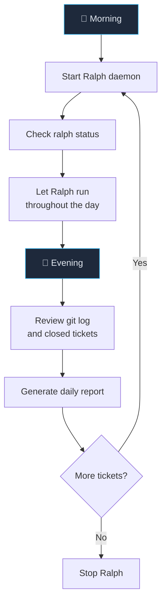
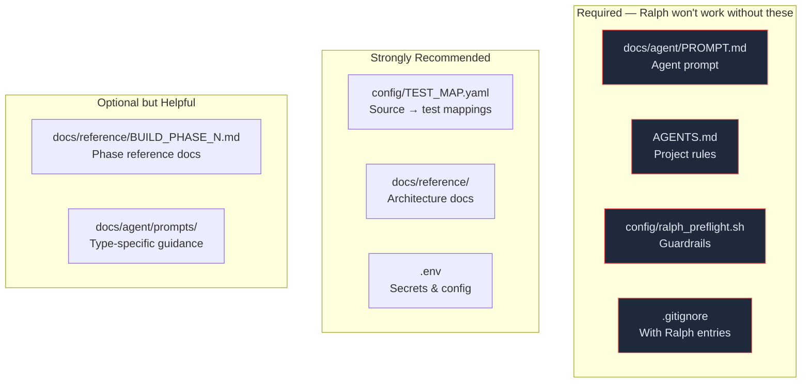

# Daily Usage — Building with Ralph

> Day-to-day workflow, must-have files, and application specs.

---

## Daily Workflow



### Morning

```bash
# 1. Navigate to your project
cd ~/Dev/my-trading-bot

# 2. Pull latest code if collaborating
git pull --rebase
bd dolt pull

# 3. Review what's ready
bd ready

# 4. Start the loop
bash scripts/ralph/run_ralph_loop.sh

# 5. Verify it started
cat .ralph_loop.pid
tail logs/ralph_loop.log
```

### During the Day

```bash
# Check progress periodically
ralph status

# Tail the loop log
tail -f logs/ralph_loop.log

# Check ticket status
bd list

# Check git commits
git log --oneline -10
```

### Evening

```bash
# 1. Stop the loop if tickets are done
cat .ralph_loop.pid | xargs kill

# 2. Review what was built
git log --oneline --since="1 day ago"
bd list --status closed

# 3. Generate report
bash scripts/ralph/ralph_report.sh --daily

# 4. Push to remote (if collaborating)
git push
bd dolt push

# 5. Create tomorrow's tickets
bd new "Next feature" --type task --labels "phase-2"
```

---

## Must-Have Files Checklist

These files must exist and be kept up to date for Ralph to function properly:



### Required Files (Ralph Won't Start Without)

| File | Check | Failure Mode |
|------|-------|-------------|
| `docs/agent/PROMPT.md` | Loop checks `if [[ ! -f "${PROMPT_BASE}" ]]` | Loop exits with error |
| `AGENTS.md` | Agent reads on iteration start | Agent lacks project context |
| `config/ralph_preflight.sh` | Sourced by preflight | Uses default (skips epics/features) |
| `.gitignore` | Must exclude `.ralph_*` files | Checkpoint/PID files could be committed |

### Recommended Files

| File | Why |
|------|-----|
| `config/TEST_MAP.yaml` | Without it, targeted tier falls back to `tests/unit/` |
| `docs/reference/*.md` | Agent reads these for context — faster iterations, less research |
| `.env` | Preflight can check for it; agent needs secrets for integration tests |

---

## Application Spec Files

These are the application-specific files *you* create for *your* project.
They define what the AI agent should build.

### Architecture Spec

```
docs/reference/ARCHITECTURE.md     ← Single source of truth for design decisions
```

Should contain:
- System overview (what this project is)
- Technology stack (Python/Node/Go, frameworks, databases)
- Component diagram
- Data model
- API design
- Key design decisions and rationale

### Build Phase Docs

```
docs/reference/BUILD_PHASE_1.md    ← Pre-researched API types for Phase 1
docs/reference/BUILD_PHASE_2.md    ← Pre-researched API types for Phase 2
...
```

Each build phase doc should contain:
- **Goal**: what this phase delivers
- **Dependencies**: what must exist before this phase
- **API Reference**: pre-discovered library types/methods/signatures
- **Implementation patterns**: code snippets showing the pattern to follow
- **Tests to write**: specific tests needed

The loop auto-injects the matching BUILD_PHASE doc when a ticket has a `phase-N` label.

### Ticket Plan

```
docs/agent/TICKET_PLAN.md          ← Ticket dependency tree
```

Shows the hierarchy of tickets and their dependencies. The agent reads this
at session start to understand the broader plan.

---

## Starting a New Project from Scratch

### 1. Create a Fresh Ralph Project

```bash
ralph init
```

### 2. Set Up Your Application

```bash
cd my-project

# Python example
python3 -m venv .venv
source .venv/bin/activate
pip install pytest black isort flake8 mypy

# Create pyproject.toml with tool configs
# Create src/<package>/__init__.py
# Create your first test
```

### 3. Customize Files

```bash
# Edit AGENTS.md with your project rules
# Edit docs/agent/PROMPT.md with your context
# Create docs/reference/ARCHITECTURE.md
# Create docs/reference/BUILD_PHASE_1.md (if using phases)
```

### 4. Create Tickets

```bash
bd new "Set up project skeleton" --type task --labels "phase-1"
bd new "Implement core module" --type task --labels "phase-1"
```

### 5. Start Building

```bash
bash scripts/ralph/run_ralph_loop.sh
```

---

## Running Tests Manually

Sometimes you want to run tests without the full validation gate:

```bash
# Unit tests only (fast)
pytest tests/unit/ -q --tb=short

# Specific test file
pytest tests/unit/test_auth.py -q --tb=short

# Targeted: only tests affected by your changes
python3 scripts/ralph/detect_affected_tests.py | xargs pytest -q --tb=short

# Full validation gate
bash scripts/ralph/ralph_validate.sh --tier=targeted
```

---

## Running a Single Ticket Manually

```bash
# One ticket, one iteration
bash scripts/ralph/ralph_loop.sh --ticket=my-project.1.3 --agent=kimi

# With specific test tier
bash scripts/ralph/ralph_loop.sh --ticket=my-project.1.3 --agent=kimi --tier=integration

# Force mode (skip dirty-worktree check)
bash scripts/ralph/ralph_loop.sh --ticket=my-project.1.3 --agent=kimi --force
```
