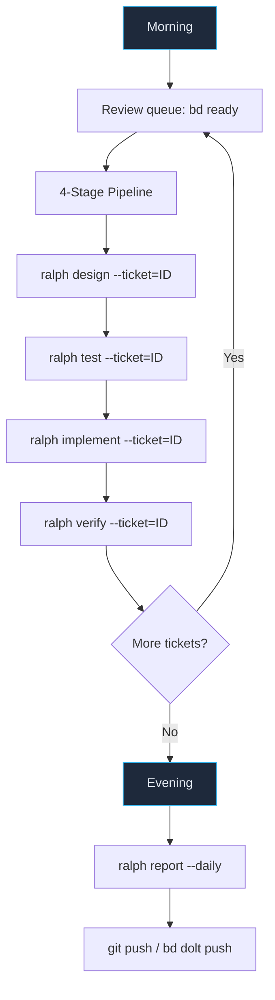

# Daily Usage — Building with Ralph v1.2

> Day-to-day workflow, 4-stage pipeline, and monitoring.

**Revision**: 2026-06-13 — Updated for 4-stage pipeline + global tool architecture

---

## Daily Workflow



### Morning

```bash
cd ~/Dev/my-project

# Pull latest
git pull --rebase && bd dolt pull

# Review queue
bd ready
ralph status

# Optional: start continuous daemon for batch mode
ralph daemon
```

### During the Day — 4-Stage Pipeline

```bash
# Per-ticket pipeline (recommended — independent verification)

# Stage 1: Design the solution
ralph design --ticket=myproject.1.1 --agent=pi

# Stage 2: Write functional tests from the spec
ralph test --ticket=myproject.1.1 --agent=pi

# Stage 3: Implement code to pass tests
ralph implement --ticket=myproject.1.1 --agent=pi

# Stage 4: Validate and close (or flag)
ralph verify --ticket=myproject.1.1 --agent=pi
```

Or use the all-in-one continuous loop for batch processing:

```bash
ralph daemon
```

### During the Day — Monitoring

```bash
# Check project health
ralph status

# Tail loop logs
tail -f logs/ralph_loop.log

# View ticket status
bd list

# Check recent commits
git log --oneline -10

# View metrics
ralph metrics
```

### Evening

```bash
# Stop daemon if running
cat .ralph_loop.pid | xargs kill 2>/dev/null

# Review what was built
git log --oneline --since="1 day ago"

# Generate daily report
ralph report --daily

# Push to remote
git push && bd dolt push
```

---

## Must-Have Files Checklist

### Required (Ralph won't work without these)

| File | Check | Failure Mode |
|------|-------|-------------|
| `docs/agent/PROMPT.md` | Loop checks on start | Loop exits with error |
| `AGENTS.md` | Agent reads on iteration start | Agent lacks project context |
| `config/ralph_preflight.sh` | Sourced by preflight | Uses default (skips epics/features) |
| `.gitignore` | Must exclude `.ralph_*` files | Checkpoint/PID files could be committed |

### Strongly Recommended

| File | Why |
|------|-----|
| `config/TEST_MAP.yaml` | Without it, targeted tier falls back to `tests/unit/` |
| `docs/reference/*.md` | Agent reads these for context — faster iterations |
| `docs/agent/prompts/sessions/` | 4-stage pipeline prompts (auto-generated by `ralph init`) |
| `.env` | Secrets and environment config |

### Optional but Helpful

| File | Why |
|------|-----|
| `docs/reference/BUILD_PHASE_N.md` | Phase-specific reference docs (auto-injected by loop) |
| `docs/agent/prompts/bugfix.md` | Type-specific guidance for bug tickets |
| `docs/agent/prompts/feature.md` | Type-specific guidance for feature tickets |

---

## Application Spec Files

### Architecture Spec

```
docs/reference/ARCHITECTURE.md     ← Design decisions, component diagram, data model
```

### Build Phase Docs

```
docs/reference/BUILD_PHASE_1.md    ← Pre-researched API types for Phase 1
docs/reference/BUILD_PHASE_2.md    ← Pre-researched API types for Phase 2
```

The loop auto-injects the matching BUILD_PHASE doc when a ticket has a `phase-N` label.

---

## Starting a New Project

```bash
ralph init                          # Scaffold new project
cd my-project
python3 -m venv .venv && source .venv/bin/activate
pip install pytest black isort flake8 mypy

# Customize AGENTS.md and docs/agent/PROMPT.md
# Create tickets in beads
# Start building
```

---

## Running a Single Ticket Manually

```bash
# Full pipeline (4 stages)
ralph design --ticket=myproject.1.3 --agent=kimi
ralph test --ticket=myproject.1.3 --agent=kimi
ralph implement --ticket=myproject.1.3 --agent=kimi
ralph verify --ticket=myproject.1.3 --agent=kimi

# All-in-one single iteration
ralph loop --ticket=myproject.1.3 --agent=kimi

# With specific test tier
ralph loop --ticket=myproject.1.3 --agent=kimi --tier=integration
```

---

## Running Tests Manually

```bash
# Unit tests only
pytest tests/unit/ -q --tb=short

# Targeted: only affected tests
ralph validate --tier=targeted

# Full validation gate
ralph validate --tier=full

# Metrics viewer
ralph metrics

# Health check
ralph health --verbose
```
