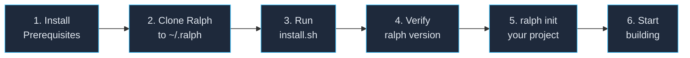

# Deployment — Installing Ralph on a New Computer

> From zero to `ralph init` on a brand-new machine.

---

## Prerequisites

Before installing Ralph, ensure these are available on your system:

| Tool | How to Check | How to Install |
|------|-------------|----------------|
| **git** | `git --version` | `brew install git` (macOS) or `apt install git` (Linux) |
| **Python 3.10+** | `python3 --version` | `brew install python@3.12` or from python.org |
| **beads (bd)** | `bd --version` | [beads docs](https://github.com/beadsboard/beads) — ticket management |
| **kimi** or **pi** | `which kimi` or `which pi` | At least one AI agent CLI (Pi supports DeepSeek, Kimi supports k2.6) |
| **GitHub access** | `git ls-remote https://github.com/samdharma/Ralph_loop.git HEAD` | Required for clone + push |

---

## High-Level Deployment Steps



---

## Detailed Step-by-Step

### Step 1: Install Prerequisites

```bash
# macOS (Homebrew)
brew install git python@3.12

# Verify
git --version        # Should be 2.x+
python3 --version    # Should be 3.10+

# Install beads (follow their docs)
# https://github.com/beadsboard/beads

# Install your AI agent (kimi or pi)
# Follow the agent's install instructions
```

### Step 2: Clone Ralph

```bash
git clone https://github.com/samdharma/Ralph_loop.git ~/.ralph
```

This places Ralph in your home directory at `~/.ralph`. You can choose a different
location, but `~/.ralph` is the convention.

### Step 3: Run the Installer

```bash
bash ~/.ralph/scripts/install.sh
```

The installer does three things:

1. **Symlinks** `~/.ralph/bin/ralph` to `/usr/local/bin/ralph` (or `~/.local/bin/ralph` if `/usr/local/bin` isn't writable)
2. **Sets execute permissions** on all Ralph scripts
3. **Adds `RALPH_HOME`** to your shell profile (`~/.zshrc` or `~/.bashrc`)

### Step 4: Make Ralph Available System-Wide

After install, restart your shell or source your profile:

```bash
# If using zsh (macOS default)
source ~/.zshrc

# If using bash
source ~/.bashrc

# If ~/.local/bin was used, ensure it's in your PATH:
export PATH="$HOME/.local/bin:$PATH"
```

### Step 5: Verify Installation

```bash
# Check Ralph is available from anywhere
ralph version
# Output: ralph v1.0.0

# Check the help
ralph help

# Verify RALPH_HOME is set
echo $RALPH_HOME
# Output: /Users/you/.ralph
```

### Step 6: Initialize Your First Project

```bash
# From any directory
ralph init
```

Answer the prompts — project name, language, AI agent, etc. This scaffolds
your project with everything needed.

### Step 7: Start Building

```bash
cd your-project-directory

# Start the background daemon
bash scripts/ralph/run_ralph_loop.sh

# Or run a single ticket
bash scripts/ralph/ralph_loop.sh --ticket=<your-ticket-id> --agent=kimi
```

---

## How to Check if Ralph Exists (from any directory)

```bash
# Version check (fastest)
ralph version

# Full check
which ralph && ralph version && echo "RALPH_HOME=$RALPH_HOME"

# If `ralph` is not found
ls -la ~/.ralph/bin/ralph        # Is the repo cloned?
ls -la /usr/local/bin/ralph      # Is the symlink there?
ls -la ~/.local/bin/ralph        # Alternative symlink location
echo $PATH | tr ':' '\n' | grep ralph  # Is it on PATH?

# Dependencies health check (built into install.sh)
bash ~/.ralph/scripts/install.sh  # Re-run to validate prerequisites
```

---

## Post-Install: What Ralph Needs to Function

For Ralph to work in a project, the project must have:

| Requirement | Created by `ralph init`? | Notes |
|-------------|--------------------------|-------|
| Git repo | ✅ Yes | `git init` |
| Beads initialized | ✅ Yes | `bd init` |
| `.ralph/config.toml` | ✅ Yes | Single source of truth (committed) |
| `docs/agent/PROMPT.md` | ✅ Yes | Rendered from template |
| `config/ralph_preflight.sh` | ✅ Yes | Default: skips epics/features |
| `docs/agent/prompts/sessions/` | ✅ Yes | 3-session pipeline prompts |
| `.gitignore` | ✅ Yes | With Ralph entries |
| AI agent (kimi/pi) in PATH | ❌ Must install separately | `which kimi` or `which pi` |
| GitHub remote (optional) | ❌ Set up manually | `git remote add origin <url>` |

---

## Updating Ralph

```bash
cd ~/.ralph
git pull
# Re-run installer to update symlinks if needed
bash scripts/install.sh
```

---

## Uninstalling

```bash
# Remove symlinks
rm -f /usr/local/bin/ralph ~/.local/bin/ralph

# Remove the repo
rm -rf ~/.ralph

# Remove RALPH_HOME from shell profile
# Edit ~/.zshrc or ~/.bashrc and remove the RALPH_HOME lines
```

---

## Deployment Checklist

- [ ] git installed (`git --version`)
- [ ] Python 3.10+ installed (`python3 --version`)
- [ ] beads installed (`bd --version`) — required for ticket management
- [ ] At least one AI agent installed (`which kimi` or `which pi`)
- [ ] GitHub access verified (`git ls-remote https://github.com/samdharma/Ralph_loop.git HEAD`)
- [ ] Ralph cloned to `~/.ralph`
- [ ] `install.sh` run (validates all prerequisites automatically)
- [ ] `ralph version` works from any directory
- [ ] `RALPH_HOME` is set in shell profile
- [ ] First project initialized with `ralph init`
