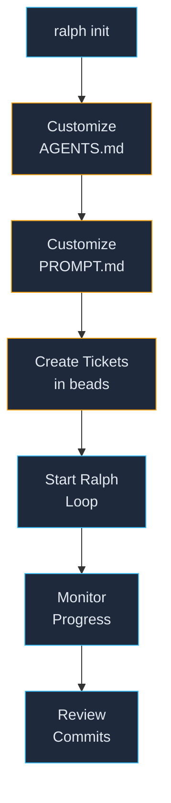

# Getting Started — Your First Ralph Project

> Step-by-step walkthrough from `ralph init` to your first completed ticket.

---

## Overview



---

## Step 1: Initialize Your Project

```bash
ralph init
```

### What You'll Be Asked

```
Project name: My Trading Bot
Project directory [/Users/you/Dev/my-trading-bot]:
Primary language [python]:
AI agent:
  1) kimi — Kimi CLI (available)
  2) pi   — Pi Coding Agent (available)
  3) both — Try kimi, fall back to pi
  4) auto — Detect best available
Choose [1]:
Test framework [pytest]:
Lint / format tools [black isort flake8 mypy]:
Brief project description:
  > An autonomous trading system.
```

### What Gets Created

```
my-trading-bot/
├── AGENTS.md                          ← ✏️ Customize this!
├── .gitignore
├── .git/                              (initialized)
├── .beads/                            (initialized)
├── config/
│   ├── ralph_preflight.sh             ← ✏️ Add your guardrails
│   └── TEST_MAP.yaml                  ← ✏️ Map sources to tests
├── docs/
│   └── agent/
│       ├── PROMPT.md                  ← ✏️ Customize this!
│       ├── PROGRESS.md                (auto-updated)
│       └── prompts/
│           ├── bugfix.md
│           ├── docs.md
│           ├── feature.md
│           ├── ops.md
│           └── regression_test.md
├── scripts/
│   └── ralph/                         (12 core scripts)
├── src/
│   └── my_trading_bot/
│       └── __init__.py
├── tests/
│   ├── unit/
│   │   └── __init__.py
│   └── integration/
│       └── __init__.py
└── logs/                              (created at runtime)
```

---

## Step 2: Files You MUST Customize

These are **mandatory** before starting the loop:

### 2a. `AGENTS.md` — Project Rules

This is the first file the AI agent reads every iteration. It must contain:

```markdown
# AGENTS.md — My Trading Bot

## Build & Test
```bash
bash scripts/ralph/ralph_validate.sh --tier=targeted
pytest tests/unit/ -q --tb=short
```

## Conventions
- Python 3.12+. Type hints on all public APIs.
- Configuration via env vars + frozen dataclasses.
- Package name: my_trading_bot.
```

**Minimum required sections:**
- Build & test commands
- Project conventions (language version, style, patterns)
- Any non-negotiable design rules

### 2b. `docs/agent/PROMPT.md` — Agent Prompt

This is fed to the agent fresh every iteration. Must describe:

- **Project root path** (already filled by init)
- **Architecture reference docs** the agent should read
- **Session resumption protocol** — which files to read at iteration start
- **Design rules** — your non-negotiable constraints
- **Test tiering protocol** — what tiers to use when

### 2c. `config/ralph_preflight.sh` — Guardrails

Default already skips epics and features. Add your own rules:

```bash
# Example: skip e2e tickets during trading hours
if [[ "${LABELS}" == *"e2e"* ]]; then
    HOUR=$(date +%H)
    if [[ "$HOUR" -ge 9 && "$HOUR" -lt 17 ]]; then
        SKIP_REASON="e2e_blocked_during_market_hours"
    fi
fi

# Example: block if .env is missing
if [[ ! -f "${PROJECT_DIR}/.env" ]]; then
    SKIP_REASON="env_file_missing"
fi
```

---

## Step 3: Application-Specific Files You Need

Beyond Ralph's infrastructure, every project needs:

| File | Purpose | Ralph Uses It? |
|------|---------|---------------|
| `.env` | Secrets & config | No (but preflight can check for it) |
| `pyproject.toml` / `package.json` | Dependencies | Validation gate uses it for tool config |
| `src/<pkg>/` | Your source code | Agent implements here |
| `tests/` | Your test suite | Validation gate runs these |
| `config/bundles.yaml` or similar | App-specific config | Agent reads as needed |
| `docs/reference/` | Architecture docs | Agent reads for context |
| `docs/reference/BUILD_PHASE_N.md` | Phase reference docs | Loop auto-injects if ticket has `phase-N` label |

### BUILD_PHASE Docs (Optional but Recommended)

If your tickets use `phase-<N>` labels, create reference docs:

```
docs/reference/BUILD_PHASE_1.md   ← Pre-discovered API types for Phase 1
docs/reference/BUILD_PHASE_2.md   ← Pre-discovered API types for Phase 2
...
```

The Ralph loop auto-detects the phase label and injects the corresponding doc
into the agent prompt. This saves the agent from redundant research.

---

## Step 4: Create Your First Tickets

```bash
# Create an epic (container, stays open)
bd new "My Trading Bot v1" --type epic --labels "epic,meta-grouping"

# Create a feature (container, stays open)
bd new "Phase 1: Core Engine" --type feature --labels "phase-1,meta-grouping"

# Create work tickets
bd new "P1: Set up project structure" --type task --labels "phase-1"
bd new "P1: Implement data model" --type task --labels "phase-1"
bd new "P1: Add CLI entry point" --type task --labels "phase-1"

# Create an exit ticket (last ticket for the phase)
bd new "[EXIT] P1: Integration test + docs" --type task --labels "exit,phase-1"

# Set dependencies
bd dep add <exit-ticket-id> <work-ticket-1>
bd dep add <exit-ticket-id> <work-ticket-2>
bd dep add <exit-ticket-id> <work-ticket-3>
```

### Ticket Naming Convention

```
<PROJECT-SLUG>.<FEATURE-NUM>.<TASK-NUM>

Examples:
  my-trading-bot.1.1    → Phase 1, Task 1
  my-trading-bot.1.2    → Phase 1, Task 2
  my-trading-bot.2.1    → Phase 2, Task 1
```

This dotted-number format is what Ralph's deterministic sorter reads.

---

## Step 5: Start the Loop

### Option A: Background Daemon (Recommended)

```bash
bash scripts/ralph/run_ralph_loop.sh
```

This runs in the background. Only one instance at a time (PID-file gated).
Logs go to `logs/ralph_loop.log`.

### Option B: Foreground Single Ticket

```bash
bash scripts/ralph/ralph_loop.sh --ticket=my-trading-bot.1.1 --agent=kimi
```

Useful for testing or manual intervention.

### Option C: Tag-Filtered Loop

```bash
bash scripts/ralph/run_ralph_loop.sh --tag=phase-1
```

Only processes tickets with label `phase-1`.

---

## Step 6: Monitor Progress

### Live Monitoring

```bash
# Tail the loop log
tail -f logs/ralph_loop.log

# Check project health
ralph status

# Run health check
bash scripts/ralph/ralph_health.sh --verbose
```

### Review Completed Work

```bash
# See commits
git log --oneline -20

# See ticket status
bd list

# Generate daily report
bash scripts/ralph/ralph_report.sh --daily
```

---

## Step 7: Stopping the Loop

```bash
# Graceful stop (find PID and kill)
cat .ralph_loop.pid | xargs kill

# Force stop (clears checkpoint too)
rm -f .ralph_loop.pid .ralph_checkpoint.json
```

---

## Next Steps

- [DAILY_USAGE.md](DAILY_USAGE.md) — Day-to-day building workflow
- [TICKET_MANAGEMENT.md](TICKET_MANAGEMENT.md) — Beads ticket workflow
- [TROUBLESHOOTING.md](TROUBLESHOOTING.md) — When things go wrong
