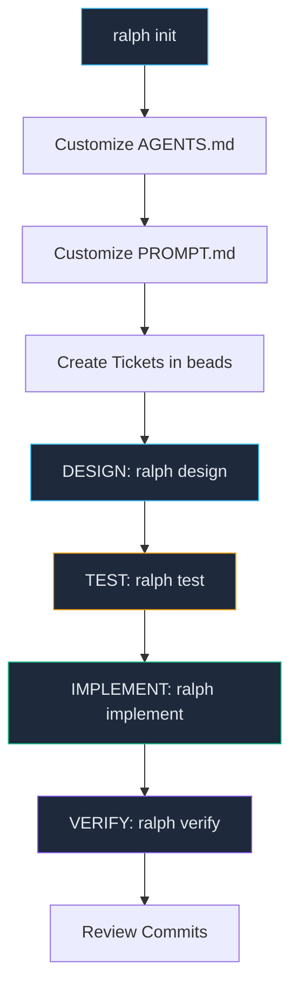

# Getting Started — Your First Ralph Project v1.2

> Step-by-step walkthrough from `ralph init` to your first completed ticket.

**Revision**: 2026-06-13 — Updated for 4-stage pipeline + global tool architecture

---

## Overview



---

## Step 1: Initialize Your Project

```bash
ralph init
```

### What You'll Be Asked

```
Project name: My Trading Bot
Project directory [/Users/you/Dev/my-trading-bot]:
Primary language [python]:
AI agent:
  1) kimi — Kimi CLI (available)
  2) pi   — Pi Coding Agent (available)
  3) both — Try kimi, fall back to pi
  4) auto — Detect best available
Choose [1]:
Test framework [pytest]:
Lint / format tools [black isort flake8 mypy]:
Brief project description:
  > An autonomous trading system.
```

### What Gets Created

```
my-trading-bot/
├── .ralph/
│   └── config.toml                  ← Single source of truth (committed)
├── AGENTS.md                        ← Customize this!
├── .gitignore
├── .git/                            (initialized)
├── .beads/                          (initialized)
├── config/
│   ├── ralph_preflight.sh           ← Add your guardrails
│   └── TEST_MAP.yaml                ← Map sources to tests
├── docs/
│   └── agent/
│       ├── PROMPT.md                ← Customize this!
│       ├── PROGRESS.md              (auto-updated)
│       └── prompts/
│           ├── bugfix.md
│           ├── docs.md
│           ├── feature.md
│           ├── ops.md
│           ├── regression_test.md
│           └── sessions/
│               ├── design.md
│               ├── test.md
│               ├── implement.md
│               └── verify.md
├── src/
│   └── my_trading_bot/
│       └── __init__.py
├── tests/
│   ├── unit/
│   │   └── __init__.py
│   └── integration/
│       └── __init__.py
└── logs/                            (created at runtime)
```

> Note: Build scripts live in `~/.ralph/core/` (global install). They are NOT in the project repo.

---

## Step 2: Customize Project Files

### 2a. `AGENTS.md` — Project Rules

This is the first file the AI agent reads. Must contain:

```markdown
# AGENTS.md — My Trading Bot

## Build & Test
```bash
ralph validate --tier=targeted
pytest tests/unit/ -q --tb=short
```

## Conventions
- Python 3.12+. Type hints on all public APIs.
- Configuration via env vars + frozen dataclasses.
- Package name: my_trading_bot.
```

### 2b. `docs/agent/PROMPT.md` — Agent Prompt

Fed to the agent fresh every iteration. Must describe:
- Project root path (already filled by init)
- Architecture reference docs
- Design rules (non-negotiable constraints)
- Test tiering protocol

### 2c. `config/ralph_preflight.sh` — Guardrails

Add your own rules:

```bash
# Skip e2e tickets during market hours
if [[ "${LABELS}" == *"e2e"* ]]; then
    HOUR=$(date +%H)
    if [[ "$HOUR" -ge 9 && "$HOUR" -lt 17 ]]; then
        SKIP_REASON="e2e_blocked_during_market_hours"
    fi
fi
```

---

## Step 3: Create Your First Tickets

```bash
# Create an epic (container)
bd new "My Trading Bot v1" --type epic --labels "epic,meta-grouping"

# Create a feature (container)
bd new "Phase 1: Core Engine" --type feature --labels "phase-1,meta-grouping"

# Create work tickets
bd new "P1: Set up project structure" --type task --labels "phase-1"
bd new "P1: Implement data model" --type task --labels "phase-1"

# Create an exit ticket
bd new "[EXIT] P1: Integration test + docs" --type task --labels "exit,phase-1"

# Set dependencies
bd dep add <exit-id> <work-ticket-1>
bd dep add <exit-id> <work-ticket-2>
```

---

## Step 4: Build with the 4-Stage Pipeline

```bash
# Per-ticket, independent verification pipeline:
ralph design --ticket=my-trading-bot.1.1 --agent=pi    # Plan
ralph test --ticket=my-trading-bot.1.1 --agent=pi       # Write tests from spec
ralph implement --ticket=my-trading-bot.1.1 --agent=pi  # Code + unit tests
ralph verify --ticket=my-trading-bot.1.1 --agent=pi     # Validate & close
```

Or use the continuous batch loop:

```bash
ralph daemon    # Background, processes all ready tickets
ralph loop      # Foreground, continuous
```

---

## Step 5: Monitor Progress

```bash
# Project dashboard
ralph status

# Tail the loop log
tail -f logs/ralph_loop.log

# Health check
ralph health --verbose

# Ticket status
bd list

# Recent commits
git log --oneline -20
```

---

## Step 6: Review and Push

```bash
# Generate daily report
ralph report --daily

# Review ticket closure
bd list --status closed

# Push to remote
git push && bd dolt push
```

---

## Stopping the Loop

```bash
# Graceful stop
cat .ralph_loop.pid | xargs kill

# Force stop
rm -f .ralph_loop.pid .ralph_checkpoint.json
```

---

## Next Steps

- [DAILY_USAGE.md](DAILY_USAGE.md) — Day-to-day building workflow
- [TICKET_MANAGEMENT.md](TICKET_MANAGEMENT.md) — Beads ticket workflow
- [CONFIGURATION.md](CONFIGURATION.md) — All environment variables
- [VERSION_HISTORY.md](VERSION_HISTORY.md) — Release notes and changes
