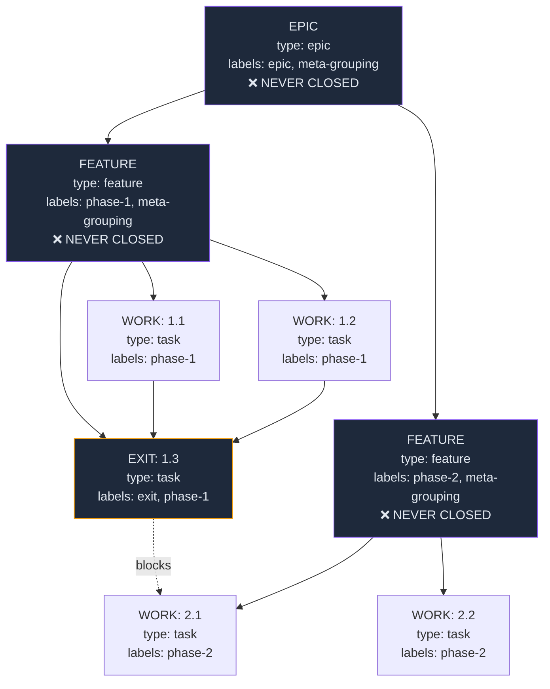

# Ticket Management — Working with Beads

> How to name, structure, and manage tickets in beads for Ralph to consume.

---

## Ticket Naming Rules

Ralph's deterministic sorter reads ticket IDs to order work. Follow this convention:

### Format

```
<PROJECT-SLUG>.<FEATURE-NUMBER>.<TASK-NUMBER>
```

### Examples

| ID | Meaning | Sort Order |
|----|---------|------------|
| `mybot.1.1` | Feature 1, Task 1 | First |
| `mybot.1.2` | Feature 1, Task 2 | Second |
| `mybot.1.3` | Feature 1, Task 3 (EXIT) | Third (blocks next feature) |
| `mybot.2.1` | Feature 2, Task 1 | Fourth |
| `mybot.2.2` | Feature 2, Task 2 | Fifth |

### Rules

1. **Feature numbers must be integers**: `phase-1`, `phase-2`, etc. Ralph parses `.<N>.` from the ID.
2. **Task numbers must be integers**: Sequential within a feature.
3. **Non-numeric suffixes break sorting**: Don't use `phase-1a` or `task-1b`.
4. **Lower numbers are built first**: Feature 1 before Feature 2. Task 1 before Task 2.

---

## Ticket Hierarchy



### Label Rules

| Ticket Type | Allowed Labels | Example |
|-------------|---------------|---------|
| **EPIC** | `epic`, `meta-grouping` + optional `phase-N` | `epic,meta-grouping` |
| **FEATURE** | `<phase-tag>`, `meta-grouping` | `phase-1,meta-grouping` |
| **WORK** (task, bug, test, docs) | `<phase-tag>` **only** | `phase-1` |
| **EXIT** | `exit`, `<phase-tag>` | `exit,phase-1` |

### Dependency Rules

1. **FEATUREs are containers** — they must NOT have blocking dependencies (including on EXIT tickets)
2. **Phase gating** — Feature N's first work ticket depends on Feature N-1's EXIT ticket **only**
3. **EXIT tickets** depend on all their phase's work tickets
4. **No redundant transitive deps** — if A→B and B→C, don't add A→C
5. **No cross-phase skip links** — a phase-3 ticket must NOT directly depend on a phase-1 ticket

The **preflight guardrail** in `config/ralph_preflight.sh` already skips epics and features
by default (they're containers, not work items).

---

## Beads Commands Cheat Sheet

### Creating Tickets

```bash
# Epic (container — never closed)
bd new "My Project v1" --type epic --labels "epic,meta-grouping"

# Feature (container — never closed)
bd new "Phase 1: Core Engine" --type feature --labels "phase-1,meta-grouping"

# Task (work item)
bd new "P1: Implement data model" --type task --labels "phase-1"

# Bug fix
bd new "Fix null pointer in parser" --type bug --labels "phase-1"

# Exit ticket (last ticket in phase)
bd new "[EXIT] P1: Integration tests" --type task --labels "exit,phase-1"
```

### Managing Dependencies

```bash
# Add a dependency (ticket B depends on ticket A)
bd dep add <child-id> <parent-id>

# View dependency tree
bd dep tree <id>

# List dependencies of a ticket
bd dep list <id> --json
```

### Viewing the Queue

```bash
# All tickets
bd list

# Only ready (unblocked) tickets
bd ready

# Filtered by label
bd ready --label phase-1

# With JSON for scripting
bd ready --json
```

### Updating Status

```bash
# Claim a ticket
bd update <id> --claim

# Mark in progress
bd update <id> --status in_progress

# Mark blocked
bd update <id> --status blocked --notes="Waiting for API key"

# Close completed
bd update <id> --status closed --notes="All tests pass"

# Re-open
bd update <id> --status open
```

### Remembering Context

```bash
# Persistent notes (survives across sessions)
bd remember checkpoint "Last completed: phase-1 exit ticket"

# Read back
bd recall checkpoint
```

---

## Monitoring Ticket Progress

### Check What's in the Queue

```bash
# Quick overview
bd list

# Count by status
bd list --json | python3 -c "
import json, sys
from collections import Counter
tickets = json.load(sys.stdin)
statuses = Counter(t.get('status','unknown') for t in tickets)
for s, c in sorted(statuses.items()):
    print(f'{s:12s}: {c}')
"
```

### What Ralph Sees

```bash
# This is exactly what Ralph calls to get work
bd ready --json | python3 -m json.tool
```

### Check a Specific Ticket

```bash
# Full details
bd show <id>

# JSON for scripting
bd show <id> --json | python3 -m json.tool
```

---

## Common Ticket Patterns

### Pattern 1: Sequential Build Phase

```
phase-1, meta-grouping (FEATURE)     ← Container
├── phase-1 (TASK) mybot.1.1         ← First task, no deps (or deps on prev EXIT)
├── phase-1 (TASK) mybot.1.2         ← Depends on 1.1
├── phase-1 (TASK) mybot.1.3         ← Depends on 1.2
└── exit, phase-1 (TASK) mybot.1.4   ← EXIT: depends on 1.1, 1.2, 1.3
                                       Blocks mybot.2.1
```

### Pattern 2: Parallel Work Within a Phase

```
phase-1, meta-grouping (FEATURE)
├── phase-1 (TASK) mybot.1.1         ← No deps (parallel with 1.2)
├── phase-1 (TASK) mybot.1.2         ← No deps (parallel with 1.1)
├── phase-1 (TASK) mybot.1.3         ← Depends on 1.1 AND 1.2 (merge task)
└── exit, phase-1 (TASK) mybot.1.4   ← EXIT: depends on 1.3
```

Ralph processes ready tickets in order (1.1, then 1.2, etc.) but if there are no
dependency constraints between 1.1 and 1.2, they'll each get one iteration in sequence.

### Pattern 3: Bug Fix Sprint

```
bugfix-sprint, meta-grouping (FEATURE)
├── bugfix-sprint (BUG) mybot.bug.1
├── bugfix-sprint (BUG) mybot.bug.2
├── bugfix-sprint (BUG) mybot.bug.3
└── exit, bugfix-sprint (TASK) mybot.bug.4   ← EXIT: all bugs fixed + regression tests
```
