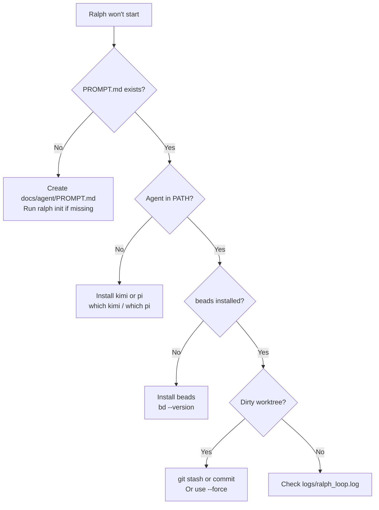
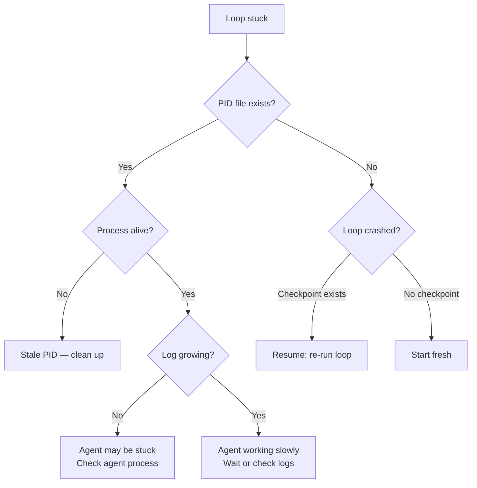

# Troubleshooting — When Ralph Doesn't Work

> Failure scenarios, monitoring, diagnostics, and recovery procedures.

---

## Quick Diagnostic

```bash
# The one-command health check
bash scripts/ralph/ralph_health.sh --verbose
```

This runs all 5 health checks and tells you exactly what's wrong.

---

## Common Failure Scenarios

### Scenario 1: Ralph Won't Start



**Symptoms:**
```
[RALPH] ERROR: docs/agent/PROMPT.md not found.
[RALPH] ERROR: No supported agent found in PATH (kimi or pi).
[RALPH] ERROR: beads (bd) not found in PATH.
[RALPH] ERROR: Working tree has uncommitted changes.
```

**Fixes:**

```bash
# Missing PROMPT.md — re-run init (won't overwrite existing files)
ralph init

# Missing agent — install kimi or pi
which kimi || echo "kimi not installed"
which pi || echo "pi not installed"

# Missing beads — install from https://github.com/beadsboard/beads
bd --version

# Dirty worktree — commit or stash
git stash
# Or force past it (risky)
bash scripts/ralph/ralph_loop.sh --force
```

---

### Scenario 2: Loop is Stuck (No Progress)

**Symptoms:**
- Last log entry was hours ago
- No new git commits
- `ralph status` shows IDLE or STALE PID



**Fixes:**

```bash
# Check if running
cat .ralph_loop.pid
ps -p $(cat .ralph_loop.pid)

# Kill stuck process
kill $(cat .ralph_loop.pid)

# Clear stale state
rm -f .ralph_loop.pid .ralph_checkpoint.json

# Restart
bash scripts/ralph/run_ralph_loop.sh
```

---

### Scenario 3: Agent Keeps Failing Validation

**Symptoms:**
- Same ticket iterates repeatedly
- Gate failures every time
- Checkpoint file persists

**Pattern:**
```
[RALPH] Iteration 5 | Task: myproj.1.2
... agent works ...
RALPH_GATE_FAILED

[RALPH] Iteration 6 | Task: myproj.1.2  ← Same ticket!
... agent works ...
RALPH_GATE_FAILED
```

**Fixes:**

```bash
# 1. Check what's failing
bash scripts/ralph/ralph_validate.sh --tier=targeted

# 2. Fix manually if it's a simple lint issue
black src/ tests/
isort src/ tests/

# 3. If the ticket is too complex, break it up
bd update <id> --status open --notes="Too complex. Splitting into subtasks."

# 4. If tests are wrong, fix the tests first
#    Create a new ticket for test fixes, make it a dependency

# 5. Skip this ticket and move on
bd update <id> --status blocked --notes="Needs manual intervention."
rm -f .ralph_checkpoint.json
bash scripts/ralph/run_ralph_loop.sh
```

---

### Scenario 4: Checkpoint Recovery Messed Up

**Symptoms:**
- Ralph starts, sees checkpoint, rolls back work
- "Marking previous task as failed due to incomplete iteration"
- Lost work

**What happened:**

The checkpoint system detected a dirty worktree and reverted to the pre-iteration
commit. This is by design — it prevents half-baked code from persisting.

**Recovery:**

```bash
# Check git reflog for lost commits
git reflog

# If there's a commit you want to keep
git cherry-pick <commit-hash>

# Clear checkpoint and restart
rm -f .ralph_checkpoint.json
```

---

### Scenario 5: Preflight Blocking All Tickets

**Symptoms:**
```
[RALPH] Task proj.1.1 skipped — BLOCKED: some_reason
[RALPH] Task proj.1.2 skipped — BLOCKED: some_reason
[RALPH] Iteration 1 | All 3 ready tasks failed pre-flight checks.
[RALPH] Sleeping 60 seconds before next check...
```

**Fixes:**

```bash
# Check your preflight rules
cat config/ralph_preflight.sh

# Test a specific ticket's labels against preflight
bash scripts/ralph/ralph_preflight.sh "phase-1" "task"
# Should output: READY

# If it outputs BLOCKED, your rules are too aggressive
# Edit config/ralph_preflight.sh and adjust
```

---

## Monitoring

### Real-time Monitoring

```bash
# Tail the loop log (live)
tail -f logs/ralph_loop.log

# Watch with grep for key events
tail -f logs/ralph_loop.log | grep -E "Iteration|GATE|ERROR|BLOCKED"

# Watch metrics file
tail -f logs/ralph_metrics.jsonl | python3 -m json.tool
```

### Periodic Health Check

Add to crontab for hourly health checks:

```bash
# crontab -e
0 * * * * cd /path/to/project && bash scripts/ralph/ralph_health.sh >> logs/health.log 2>&1
```

### Dashboard

```bash
# Full status dashboard
ralph status

# Metrics viewer
python3 scripts/ralph/ralph_metrics_viewer.py

# HTML report
python3 scripts/ralph/ralph_metrics_viewer.py --output html --save /tmp/ralph_report.html
```

---

## Cleanup Procedures

### Clean Up a Stuck Session

```bash
# Full cleanup — kills loop, clears all transient state
kill $(cat .ralph_loop.pid) 2>/dev/null || true
rm -f .ralph_loop.pid
rm -f .ralph_checkpoint.json

# Verify clean
git status                    # Should be clean
ls .ralph_*                   # Should return nothing
```

### Reset and Restart

```bash
# 1. Stop everything
kill $(cat .ralph_loop.pid) 2>/dev/null || true
rm -f .ralph_loop.pid .ralph_checkpoint.json

# 2. Ensure clean state
git checkout -- .
git clean -fd

# 3. Re-open any in-progress tickets
bd list --status in_progress --json | python3 -c "
import json, sys
tickets = json.load(sys.stdin)
for t in tickets:
    print(t.get('id',''))
" | while read id; do
    [ -n "$id" ] && bd update "$id" --status open
done

# 4. Restart
bash scripts/ralph/run_ralph_loop.sh
```

### Clean Metrics (Start Fresh)

```bash
# Archive old metrics
mv logs/ralph_metrics.jsonl logs/ralph_metrics.$(date +%Y%m%d).jsonl

# New file will be created automatically on next iteration
```

---

## Log Locations

| File | Purpose | Rotation |
|------|---------|----------|
| `logs/ralph_loop.log` | All loop output (stdout+stderr) | Manual |
| `logs/ralph_metrics.jsonl` | Structured event log | Manual |
| `.ralph_checkpoint.json` | Current iteration checkpoint | Auto-cleared |
| `.ralph_loop.pid` | Daemon PID | Auto-removed on stop |

---

## Emergency Contacts (Debug Data)

When reporting issues, collect:

```bash
# Debug bundle
echo "=== RALPH DEBUG BUNDLE ===" > /tmp/ralph_debug.txt
echo "Date: $(date)" >> /tmp/ralph_debug.txt
echo "" >> /tmp/ralph_debug.txt

echo "=== VERSION ===" >> /tmp/ralph_debug.txt
ralph version >> /tmp/ralph_debug.txt 2>&1

echo "=== GIT STATUS ===" >> /tmp/ralph_debug.txt
git status >> /tmp/ralph_debug.txt 2>&1
git log --oneline -5 >> /tmp/ralph_debug.txt 2>&1

echo "=== BEADS ===" >> /tmp/ralph_debug.txt
bd list >> /tmp/ralph_debug.txt 2>&1

echo "=== LAST 50 LOOP LINES ===" >> /tmp/ralph_debug.txt
tail -50 logs/ralph_loop.log >> /tmp/ralph_debug.txt 2>&1

echo "=== HEALTH CHECK ===" >> /tmp/ralph_debug.txt
bash scripts/ralph/ralph_health.sh --verbose >> /tmp/ralph_debug.txt 2>&1

echo "=== CHECKPOINT ===" >> /tmp/ralph_debug.txt
cat .ralph_checkpoint.json 2>/dev/null >> /tmp/ralph_debug.txt || echo "(none)" >> /tmp/ralph_debug.txt

echo "Bundle saved to /tmp/ralph_debug.txt"
```
