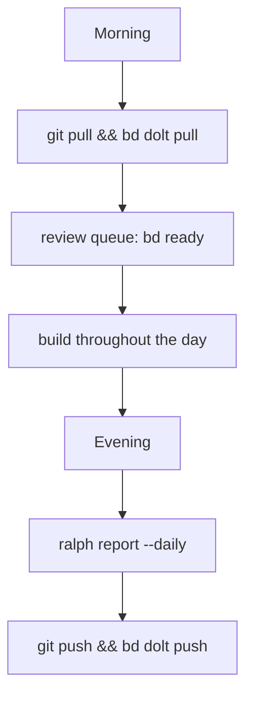
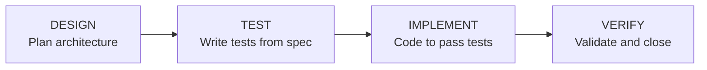
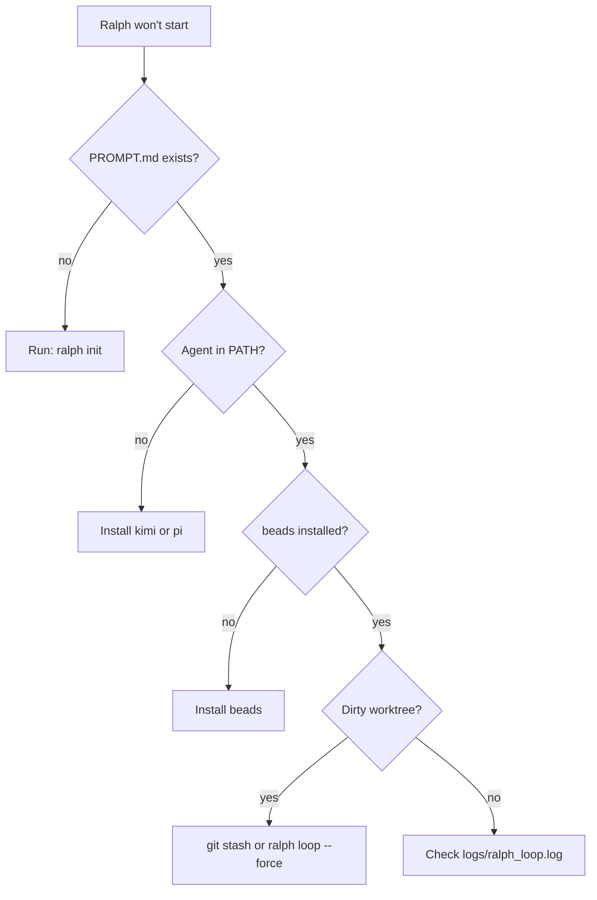
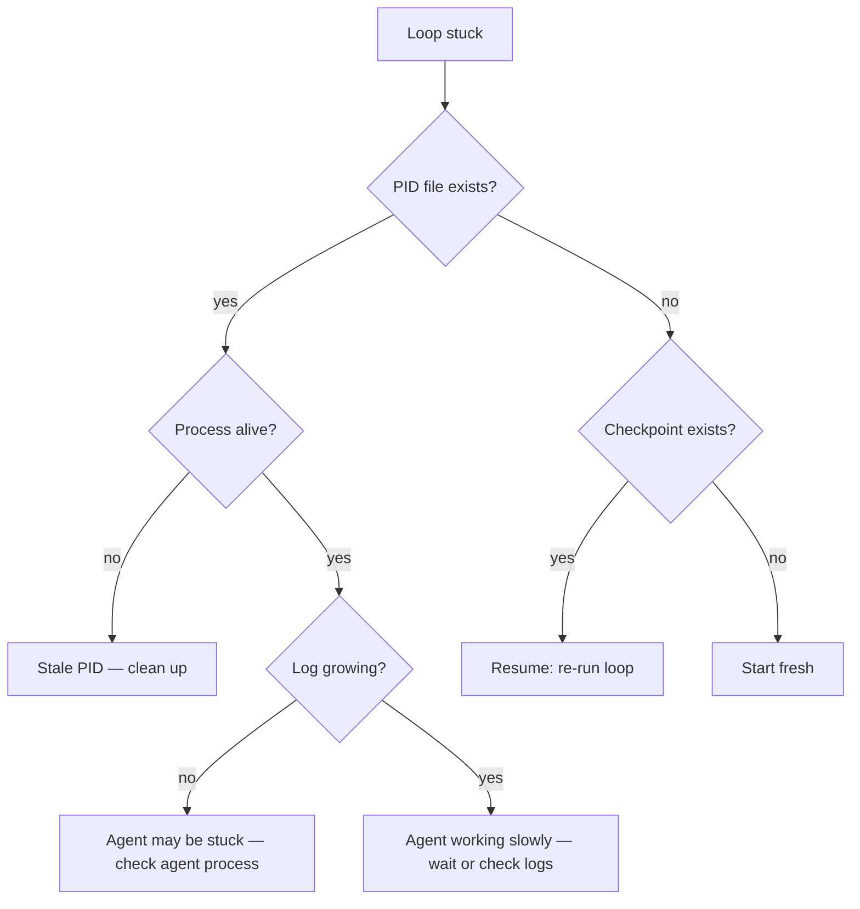

# Daily Usage & Troubleshooting

> Day-to-day workflow, 4-stage pipeline, monitoring, failure scenarios, and recovery.

---

## Daily Workflow



### Morning

```bash
cd ~/dev/my-project

# Pull latest changes and ticket data
git pull --rebase && bd dolt pull

# Review the queue
bd ready
ralph status

# Start the continuous daemon for batch mode
ralph daemon
```

### During the Day — 4-Stage Pipeline

The recommended workflow runs each ticket through four independent sessions:



```bash
# Per-ticket pipeline:
ralph design --ticket=myproject.1.1 --agent=pi     # session 1: plan
ralph test --ticket=myproject.1.1 --agent=pi        # session 2: write functional tests
ralph implement --ticket=myproject.1.1 --agent=pi   # session 3: implement + unit tests
ralph verify --ticket=myproject.1.1 --agent=pi      # session 4: validate and close
```

For batch processing (less critical tickets):

```bash
ralph daemon    # background, processes all ready tickets
ralph loop      # foreground, continuous
```

**When to use pipeline vs loop:**

| Use Case | Recommended |
|----------|-------------|
| Critical features with acceptance criteria | 4-stage pipeline |
| Bug fixes (high risk) | 4-stage pipeline |
| Docs, typo fixes, trivial changes | `ralph loop --ticket=<id>` |
| Batch processing many tickets | `ralph daemon` |
| Exploratory or prototype work | `ralph daemon` |

### Evening

```bash
# Stop daemon if running
cat .ralph_loop.pid | xargs kill 2>/dev/null

# Review what was built today
git log --oneline --since="1 day ago"

# Generate daily report
ralph report --daily

# Push everything
git push && bd dolt push
```

---

## Monitoring

### Status Dashboard

```bash
ralph status
```

Shows loop status (RUNNING/IDLE/STALE), metrics (iterations today, pass rate), beads queue counts by status, git branch and dirty status, and health checks.

### Live Logs

```bash
tail -f logs/ralph_loop.log                          # all loop output
tail -f logs/ralph_loop.log | grep -E "Iteration|GATE|ERROR|BLOCKED"  # key events only
```

### Metrics

```bash
ralph metrics     # metrics viewer
```

Metrics are logged as JSONL to `logs/ralph_metrics.jsonl`. Each event records timestamp, hostname, task ID, iteration number, task type, and test tier.

### Health Check

```bash
ralph health --verbose
```

Runs 5 checks: metrics freshness, checkpoint age, beads integrity, git divergence, and beads sync status. Add to crontab for hourly monitoring:

```bash
0 * * * * cd /path/to/project && ralph health >> logs/health.log 2>&1
```

---

## Running Tests Manually

```bash
# Unit tests only (fastest)
pytest tests/unit/ -q --tb=short

# Targeted: only tests for changed files (default in loop)
ralph validate --tier=targeted

# Integration tests
ralph validate --tier=integration

# Full suite (except e2e and performance)
ralph validate --tier=full
```

| Tier | Scope | Use |
|------|-------|-----|
| `smoke` | Unit tests, fail-fast | Fastest feedback |
| `targeted` | Affected tests only (via TEST_MAP.yaml) | Default in loop |
| `integration` | Integration marker tests | Pre-merge |
| `full` | All except e2e/perf | Operator only |

---

## Single Ticket Mode

```bash
# Full 4-stage pipeline for one ticket
ralph design --ticket=myproject.1.3 --agent=kimi
ralph test --ticket=myproject.1.3 --agent=kimi
ralph implement --ticket=myproject.1.3 --agent=kimi
ralph verify --ticket=myproject.1.3 --agent=kimi

# All-in-one single iteration
ralph loop --ticket=myproject.1.3 --agent=kimi

# With specific test tier
ralph loop --ticket=myproject.1.3 --agent=kimi --tier=integration
```

---

## Required Files Checklist

| File | Purpose | Failure Mode |
|------|---------|-------------|
| `docs/agent/PROMPT.md` | Agent context | Loop exits with error |
| `AGENTS.md` | Project rules | Agent lacks context |
| `config/ralph_preflight.sh` | Guardrails | Falls back to default |
| `.gitignore` | Exclude runtime files | Checkpoint/PID files committed |
| `config/TEST_MAP.yaml` | Source → test mapping | Targeted tier runs `tests/unit/` only |
| `.env` | Secrets and config | Preflight can enforce existence |

---

## Troubleshooting

### Quick Diagnostic

```bash
ralph health --verbose
```

### Ralph Won't Start



**Common error messages and fixes:**

| Error | Fix |
|-------|-----|
| `PROMPT.md not found` | Re-run `ralph init` in the project directory |
| `No supported agent found` | Install kimi or pi: `which kimi \|\| echo "not found"` |
| `beads (bd) not found` | Install from [beads](https://github.com/beadsboard/beads) |
| `Working tree has uncommitted changes` | `git stash` or use `--force` |

### Loop is Stuck (No Progress)

**Symptoms:** Last log entry was hours ago, no new commits, `ralph status` shows IDLE or STALE PID.



**Fix:**

```bash
# Check if still running
cat .ralph_loop.pid
ps -p $(cat .ralph_loop.pid)

# Kill stuck process and clear stale state
kill $(cat .ralph_loop.pid)
rm -f .ralph_loop.pid .ralph_checkpoint.json

# Restart
ralph daemon
```

### Agent Keeps Failing Validation

**Symptoms:** Same ticket iterates repeatedly, gate failures every time, checkpoint persists.

**Pattern in logs:**
```
[RALPH] Iteration 5 | Task: myproj.1.2
RALPH_GATE_FAILED
[RALPH] Iteration 6 | Task: myproj.1.2   ← same ticket
RALPH_GATE_FAILED
```

**Fix:**

```bash
# 1. See what's failing
ralph validate --tier=targeted

# 2. Fix lint issues manually
black src/ tests/
isort src/ tests/

# 3. If the task is too complex, break it up
bd update <id> --status open --notes="Too complex. Splitting."

# 4. If tests are wrong, fix tests first — create a test-fix ticket and make it a dependency

# 5. Block the ticket and move on
bd update <id> --status blocked --notes="Needs manual intervention."
rm -f .ralph_checkpoint.json
ralph daemon
```

### Checkpoint Recovery Issues

**Symptoms:** Ralph starts, sees checkpoint, rolls back work. "Marking previous task as failed due to incomplete iteration." Lost work.

The checkpoint system detects a dirty worktree and reverts to the pre-iteration commit. This prevents half-baked code from persisting.

**Recovery:**

```bash
# Find lost commits
git reflog

# Recover a specific commit
git cherry-pick <commit-hash>

# Clear checkpoint and restart
rm -f .ralph_checkpoint.json
```

### Preflight Blocking All Tickets

**Symptoms:**
```
[RALPH] Task proj.1.1 skipped — BLOCKED: some_reason
[RALPH] Task proj.1.2 skipped — BLOCKED: some_reason
[RALPH] All 3 ready tasks failed pre-flight checks.
```

**Fix:**

```bash
# Review your guardrail rules
cat config/ralph_preflight.sh

# Test a ticket's labels against preflight
# Edit config/ralph_preflight.sh and adjust overly aggressive rules
```

### DESIGN Session Produces Poor Output

1. Check `docs/agent/PROGRESS.md` — is there a DESIGN entry?
2. Verify `AGENTS.md` and `PROMPT.md` have enough context
3. The ticket description may be too vague — add acceptance criteria
4. Try a different agent: `ralph design --ticket=<id> --agent=kimi`

### TEST Session Writes Implementation Code

1. Check `docs/agent/prompts/sessions/test.md` — is it the latest version?
2. The agent may ignore prohibitions — try a different model
3. Refresh from template: `cp ~/.ralph/templates/prompts/sessions/test.md docs/agent/prompts/sessions/`

### IMPLEMENT Session Modifies Functional Tests

1. The implement prompt forbids this — check `sessions/implement.md`
2. Revert modified tests: `git checkout -- tests/`
3. Re-run: `ralph implement --ticket=<id> --agent=pi`

### VERIFY Session Closes a Failing Ticket

1. Reopen it: `bd update <id> --status open --notes="Reopened: verification incomplete"`
2. Review the VERIFY session log
3. Re-run verify with a different agent

---

## Cleanup Procedures

### Clean Up a Stuck Session

```bash
kill $(cat .ralph_loop.pid) 2>/dev/null || true
rm -f .ralph_loop.pid .ralph_checkpoint.json
git status    # should be clean
```

### Full Reset

```bash
# Stop everything
kill $(cat .ralph_loop.pid) 2>/dev/null || true
rm -f .ralph_loop.pid .ralph_checkpoint.json

# Ensure clean state
git checkout -- .
git clean -fd

# Re-open in-progress tickets
bd list --status in_progress --json | python3 -c "
import json, sys
for t in json.load(sys.stdin):
    print(t.get('id',''))
" | while read id; do
    [ -n "$id" ] && bd update "$id" --status open
done

# Restart
ralph daemon
```

### Archive Old Metrics

```bash
mv logs/ralph_metrics.jsonl logs/ralph_metrics.$(date +%Y%m%d).jsonl
# New file created automatically on next iteration
```

---

## Log Locations

| File | Purpose | Rotation |
|------|---------|----------|
| `logs/ralph_loop.log` | All loop output (stdout+stderr) | Manual |
| `logs/ralph_metrics.jsonl` | Structured event log | Manual |
| `.ralph_checkpoint.json` | Current iteration checkpoint | Auto-cleared |
| `.ralph_loop.pid` | Daemon PID | Auto-removed on stop |

---

## Emergency Debug Bundle

When reporting issues, collect:

```bash
echo "=== RALPH DEBUG BUNDLE ===" > /tmp/ralph_debug.txt
echo "Date: $(date)" >> /tmp/ralph_debug.txt
echo "" >> /tmp/ralph_debug.txt

echo "=== VERSION ===" >> /tmp/ralph_debug.txt
ralph version >> /tmp/ralph_debug.txt 2>&1

echo "=== GIT STATUS ===" >> /tmp/ralph_debug.txt
git status >> /tmp/ralph_debug.txt 2>&1
git log --oneline -5 >> /tmp/ralph_debug.txt 2>&1

echo "=== BEADS ===" >> /tmp/ralph_debug.txt
bd list >> /tmp/ralph_debug.txt 2>&1

echo "=== LAST 50 LOOP LINES ===" >> /tmp/ralph_debug.txt
tail -50 logs/ralph_loop.log >> /tmp/ralph_debug.txt 2>&1

echo "=== HEALTH ===" >> /tmp/ralph_debug.txt
ralph health --verbose >> /tmp/ralph_debug.txt 2>&1

echo "=== CHECKPOINT ===" >> /tmp/ralph_debug.txt
cat .ralph_checkpoint.json 2>/dev/null >> /tmp/ralph_debug.txt || echo "(none)" >> /tmp/ralph_debug.txt

echo "Bundle saved to /tmp/ralph_debug.txt"
```
