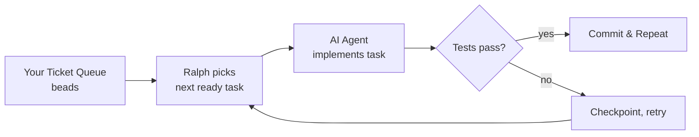
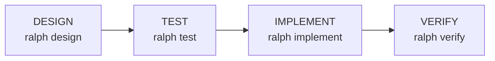

# Getting Started — Your First Ralph Project

> What Ralph solves, prerequisites, and your first build from `ralph init` to a completed ticket.

---

## The Problem Ralph Solves

Building software with AI agents is powerful but tedious. The cycle looks like this:

1. Pick a ticket from your queue
2. Figure out what it needs — read specs, reference docs
3. Open your AI agent, paste 500 lines of context, craft a prompt
4. Wait 10–20 minutes for the agent to finish
5. Run tests, fix lint errors, re-run
6. `git add`, `git commit`, `bd update`
7. Go back to step 1 — and repeat all day

You are the **orchestrator** — the human glue between tickets and agents. Ralph replaces you as the orchestrator.

## What Ralph Is

Ralph is an **automatic ticket-to-code pipeline**. Think of it as a conveyor belt:



**A day with Ralph:** `ralph daemon` in the morning → go make coffee, attend meetings → check `git log` — 6–8 tickets committed → `ralph status` at end of day.

### What Ralph Does NOT Do

- **Does not write your tickets** — you define them in beads
- **Does not design your architecture** — you define that in `AGENTS.md`
- **Does not replace you as the developer** — it replaces the mechanical orchestration steps
- **Does not run in production** — this is a development-time tool, not CI/CD

### Who Should Use Ralph

| You are... | Ralph is for you if... |
|------------|----------------------|
| A solo developer | You want to multiply your output by parallelizing with AI |
| A team lead | You want a consistent build pipeline that runs continuously |
| An open-source maintainer | You have a backlog of well-defined tickets |
| A startup founder | You need to ship features fast with a small team |

---

## Prerequisites

| Tool | Check | Install |
|------|-------|---------|
| **git** | `git --version` | `brew install git` |
| **Python 3.10+** | `python3 --version` | `brew install python@3.12` |
| **beads (bd)** | `bd --version` | [beads docs](https://github.com/beadsboard/beads) |
| **kimi or pi** | `which kimi` or `which pi` | At least one AI agent CLI required |

---

## Install Ralph

```bash
git clone https://github.com/samdharma/Ralph_loop.git ~/.ralph
bash ~/.ralph/scripts/install.sh
source ~/.zshrc   # or source ~/.bashrc

# Verify
ralph version     # → ralph v1.2.0
```

---

## Create Your First Project

```bash
ralph init
```

Answer the prompts — project name, language, AI agent preference, test framework. Ralph scaffolds everything.

### What Gets Created

```
my-project/
├── .ralph/
│   └── config.toml                  # single source of truth (committed)
├── AGENTS.md                        # project rules — customize this
├── .gitignore
├── .git/                            # initialized
├── .beads/                          # initialized
├── config/
│   ├── ralph_preflight.sh           # guardrail rules — customize this
│   └── TEST_MAP.yaml                # source → test file mappings
├── docs/
│   └── agent/
│       ├── PROMPT.md                # agent context — customize this
│       ├── PROGRESS.md              # auto-updated iteration log
│       └── prompts/
│           ├── bugfix.md
│           ├── docs.md
│           ├── feature.md
│           ├── ops.md
│           ├── regression_test.md
│           └── sessions/
│               ├── design.md
│               ├── test.md
│               ├── implement.md
│               └── verify.md
├── src/
│   └── my_project/
│       └── __init__.py
├── tests/
│   ├── unit/
│   │   └── __init__.py
│   └── integration/
│       └── __init__.py
└── logs/                            # created at runtime
```

Build scripts live in `~/.ralph/core/` (global install). They are **not** in your project repo.

---

## Customize Your Project

### `AGENTS.md` — Project Rules

The first file the AI agent reads on every iteration. Must describe:

```markdown
# AGENTS.md — My Project

## Build & Test
```bash
ralph validate --tier=targeted
pytest tests/unit/ -q --tb=short
```

## Conventions
- Python 3.12+. Type hints on all public APIs.
- Configuration via env vars + frozen dataclasses.
```

### `docs/agent/PROMPT.md` — Agent Context

Fed fresh to the agent on every iteration. Covers project root path, architecture references, design rules, and test tiering conventions.

### `config/ralph_preflight.sh` — Guardrails

Add rules to control when tickets run:

```bash
# Skip e2e tickets during market hours
if [[ "${LABELS}" == *"e2e"* ]]; then
    HOUR=$(date +%H)
    if [[ "$HOUR" -ge 9 && "$HOUR" -lt 17 ]]; then
        SKIP_REASON="e2e_blocked_during_market_hours"
    fi
fi
```

---

## Create Your First Tickets

```bash
# Epic (container — never closed)
bd new "My Project v1" --type epic --labels "epic,meta-grouping"

# Feature (container — never closed)
bd new "Phase 1: Core Engine" --type feature --labels "phase-1,meta-grouping"

# Work tickets
bd new "P1: Set up project structure" --type task --labels "phase-1"
bd new "P1: Implement data model" --type task --labels "phase-1"

# Exit ticket (last ticket in the phase)
bd new "[EXIT] P1: Integration test + docs" --type task --labels "exit,phase-1"

# Set dependencies
bd dep add <exit-id> <work-ticket-1>
bd dep add <exit-id> <work-ticket-2>
```

---

## Build with the 4-Stage Pipeline



Each stage is an independent agent invocation:

```bash
ralph design --ticket=myproject.1.1 --agent=pi     # plan the solution
ralph test --ticket=myproject.1.1 --agent=pi        # write functional tests from spec
ralph implement --ticket=myproject.1.1 --agent=pi   # code to pass tests + unit tests
ralph verify --ticket=myproject.1.1 --agent=pi      # validate and close
```

For batch processing, use the continuous daemon:

```bash
ralph daemon    # background, processes all ready tickets
ralph loop      # foreground, continuous
```

---

## Monitor Progress

```bash
ralph status                    # project health dashboard
tail -f logs/ralph_loop.log     # live loop output
ralph health --verbose          # 5-point health check
bd list                         # ticket queue status
git log --oneline -20           # recent commits
```

---

## Next Steps

- [Daily Usage & Troubleshooting](daily-usage.md) — day-to-day workflow, monitoring, failure recovery
- [Ticket Management](ticket-management.md) — beads ticket conventions and patterns
- [Configuration](configuration.md) — all environment variables
- [Architecture](architecture.md) — system design and component details
