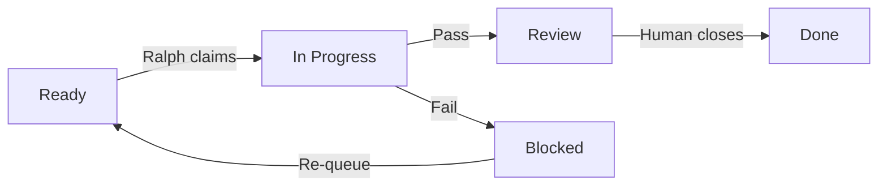
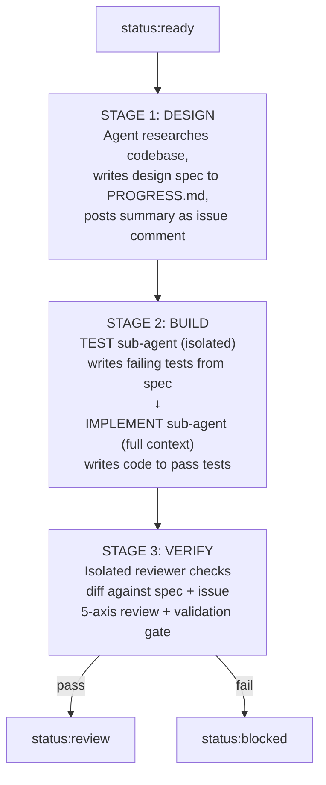
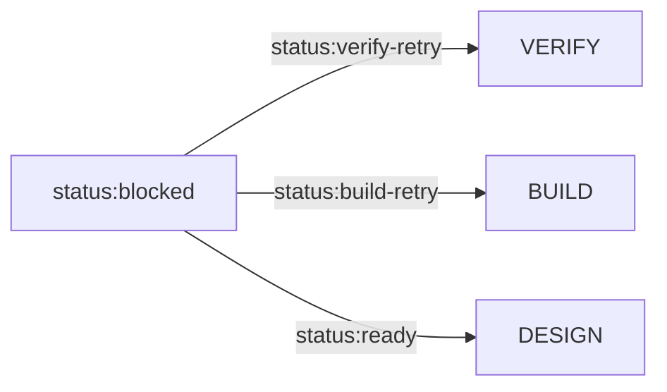

# Ralph v3 — Getting Started

Ralph is an AI-agent-powered automated build system. You write GitHub Issues; Ralph
picks them up, feeds them to an AI coding agent through a 3-stage pipeline, validates
the output, and commits and pushes the results.

---

## Installation

### Prerequisites

| Tool | Version | Install |
|------|---------|---------|
| **git** | 2.30+ | `brew install git` |
| **gh** (GitHub CLI) | 2.0+ | `brew install gh` |
| **python3** | 3.10+ | `brew install python` |
| **pi** or **kimi** | latest | `npm install -g pi-coding-agent` |

### One-Line Install

```bash
curl -fsSL https://raw.githubusercontent.com/samdharma/Ralph_loop/ralph-v3/scripts/install.sh | bash
source ~/.zshrc
```

The installer checks prerequisites, clones Ralph to `~/.ralph/`, symlinks `ralph` into your PATH, and shows install instructions for any missing tools.

### Authenticate GitHub

```bash
gh auth login --scopes repo,project
gh auth status
```

The `project` scope is optional — needed only if you want Ralph to update Kanban board columns automatically.

---

## Project Setup

### New Project

```bash
ralph init my-project --create-labels
```

The wizard prompts for repo name, AI agent preference, and optional Kanban board sync. Use `--yes` for non-interactive mode with auto-detected defaults.

### Existing Repo

```bash
git clone https://github.com/you/your-repo.git
cd your-repo
ralph init --create-labels
```

### Labels

Ralph manages these labels. `--create-labels` creates them all:

```bash
# Status labels (Ralph manages)
gh label create "status:ready"        --color 0E8A16
gh label create "status:design"       --color 1D76DB
gh label create "status:build"        --color 0052CC
gh label create "status:verify"       --color 5319E7
gh label create "status:review"       --color D4C5F9
gh label create "status:blocked"      --color B60205
gh label create "status:build-retry"  --color F9D0C4
gh label create "status:verify-retry" --color FEF2C0

# Type labels (you apply)
gh label create "type:task"    --color 0E8A16
gh label create "type:bug"     --color D73A4A
gh label create "type:feature" --color 0075CA
```

### Kanban Board

Create a GitHub Project with the **Kanban** template. Enable sync during `ralph init` (or set `ticket.project` in `.ralph/config.toml`):

```toml
[ticket]
repo = "owner/repo"
project = 1
```

Ralph mirrors every label transition to the Project's Status field. Default mapping:

| Ralph label | Board column |
|-------------|-------------|
| `status:ready` | Ready |
| `status:design` / `status:build` / `status:verify` | In Progress |
| `status:review` | Review |
| `status:blocked` | Blocked |
| Closed (`--auto-close`) | Done |



---

## Writing Tickets

Create a GitHub Issue with `type:task` and `status:ready`:

```markdown
### Description
Add a utils.py module with a get_version() function that returns "0.1.0".

### Acceptance Criteria
- [ ] src/my_project/utils.py exists with get_version()
- [ ] get_version() returns the string "0.1.0"
- [ ] A unit test verifies the return value

### Reference Docs
Reference: docs/reference/BUILD_utils.md

### Dependencies
Depends on: #42
```

Ralph picks the **open `status:ready` issue with the smallest number**. Dependencies (`Depends on: #N`) are checked — if any are open, the issue is skipped.

---

## Running the Daemon

```bash
ralph daemon                 # foreground
ralph daemon &               # background
ralph daemon --auto-close    # close issues on success
ralph daemon --issue 42      # single issue, then exit
```

The daemon syncs from origin, picks up ready tickets, runs the pipeline, and pushes commits after DESIGN and BUILD.

### Signal Handling

| Signal | Behavior |
|--------|----------|
| `SIGINT` / `SIGTERM` | Graceful shutdown. Marks in-flight issue `status:blocked`, suggests retry label. |
| Crash / `SIGKILL` | Checkpoint preserved. On restart, rolls back to pre-stage commit and resumes. |

---

## The Pipeline



### Stage Details

| Stage | Agent | Mode | Key constraint |
|-------|-------|------|---------------|
| **DESIGN** | Parent | Full context | Writes PROGRESS.md. No code. |
| **BUILD — TEST** | Sub-agent | Isolated (Mode A) | Sees spec only. Writes tests that SHOULD fail. |
| **BUILD — IMPLEMENT** | Sub-agent | Inherits DESIGN (Mode B) | Finds tests on disk, implements code. No new tests. |
| **VERIFY** | Sub-agent | Isolated (Mode A) | Sees issue + spec + git diff. 5-axis review. |

### Mode A vs Mode B

| | Mode A (Isolated) | Mode B (Inherits Context) |
|---|---|---|
| **Context** | Fresh session. No prior knowledge. | Full DESIGN session context. |
| **Used for** | TEST, VERIFY — independence is the point | IMPLEMENT — needs codebase familiarity |
| **Prevents** | "Marking your own homework" | Coding blind without conventions |

---

## Design Spec & Issue Comments

After DESIGN completes, Ralph posts a **permanent summary** as a GitHub issue comment:

```
## 📐 Design Complete
**Design Spec: #42 Add email validation to User model**
**Summary:** Add RFC-simple email validation to User.email setter.
**Files:** See docs/agent/PROGRESS.md
**Key Decisions:**
- 1. Validate in setter, not __init__
- 2. ValueError for invalid emails
**Acceptance Criteria:** 6 criteria defined.
Full design spec committed to docs/agent/PROGRESS.md.
```

PROGRESS.md remains the full design artifact (committed to the repo). The issue comment is the permanent application-build record.

---

## Failure Handling

When a stage fails, Ralph posts a detailed comment with:

```
❌ DESIGN stage failed.

See docs/agent/PROGRESS.md for the design spec.
Check .ralph/ for any agent-produced logs or partial artifacts.

## Partial Design Spec
<partial spec if the agent wrote anything before failing>

Could not produce a complete design spec. See artifacts above. Blocking issue.
```

The AI agent is instructed to write `.ralph/issue-N-report.md` with a structured failure report (stage, what was attempted, what failed, root cause, recommended next step). Ralph posts this as part of the issue comment.

### Retry After Failure

Fix the problem, then re-queue without re-running the full pipeline:



| Retry label | What runs |
|-------------|-----------|
| `status:verify-retry` | VERIFY only (fastest — skips DESIGN + BUILD) |
| `status:build-retry` | BUILD → VERIFY (skips DESIGN) |
| `status:ready` | Full pipeline (DESIGN → BUILD → VERIFY) |

---

## Validation Gate

```bash
ralph validate --tier=<smoke|targeted|integration|full>
```

| Tier | Scope | Default for |
|------|-------|-------------|
| `smoke` | Unit tests, fail-fast | Quick feedback |
| `targeted` | Affected tests only (git diff + TEST_MAP.yaml) | **Pipeline loop** |
| `integration` | Integration marker tests | Pre-merge |
| `full` | All tests except e2e/perf | VERIFY stage |

The gate also runs linters (`black`, `isort`, `flake8`, `mypy`) on modified Python files.

---

## Observability

Ralph is observable through three channels:

| Channel | How | When |
|---------|-----|------|
| **Kanban board** | Labels → Board columns | Real-time |
| **`ralph status`** | PID, active issue, stage, recent metrics | On-demand |
| **`logs/ralph_metrics.jsonl`** | Structured JSONL events | Post-hoc analysis |

```bash
# Dashboard
ralph status

# Watch metrics
tail -f logs/ralph_metrics.jsonl | jq .

# Periodic summary
ralph report
ralph report --period=week

# Count blocked issues
gh issue list --label status:blocked --json number --jq 'length'
```

See [Observability](observability.md) for dashboards, metric event types, and external tool integration.

---

## Environment Variables

| Variable | Default | Purpose |
|----------|---------|---------|
| `RALPH_HOME` | `~/.ralph` | Install directory |
| `RALPH_AGENT` | (auto-detect) | `pi` or `kimi` |
| `RALPH_PYTHON_CMD` | `python3` | Python executable |
| `RALPH_GITHUB_PROJECT` | (from config) | Override Kanban project number |
| `RALPH_PROJECT_SYNC` | (from config) | `0` to disable board sync |
| `RALPH_ALLOW_E2E` | (unset) | `1` to allow e2e tests in loop |

---

## Troubleshooting

**"Daemon already running":** Kill the stale process or remove `/tmp/ralph_daemon_<project>.pid`.

**"No ready tickets":** Check `gh issue list --label "status:ready"`. Verify no unmet `Depends on:` references.

**Agent not found:** Set `RALPH_AGENT=pi` or configure `[agent].binary` in `.ralph/config.toml`.

**Crash recovery:** Restart `ralph daemon`. It detects the checkpoint, rolls back, and resumes at the interrupted stage.

**Board columns not updating:** Re-authenticate with `gh auth login --scopes repo,project`.

---

*Next: [Observability](observability.md) for metrics and monitoring, [v3 Redesign](v3-redesign.md) for system architecture.*

*Last updated: 2026-06-19.*
