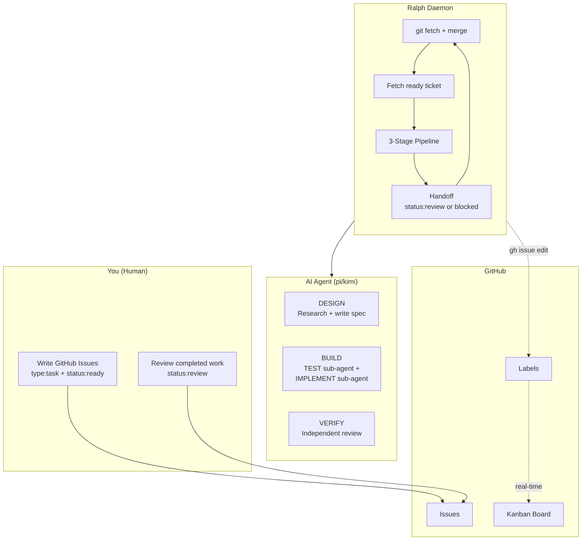
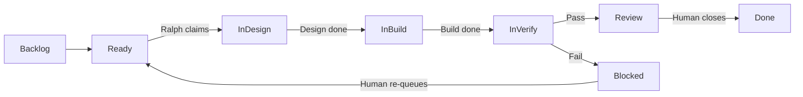
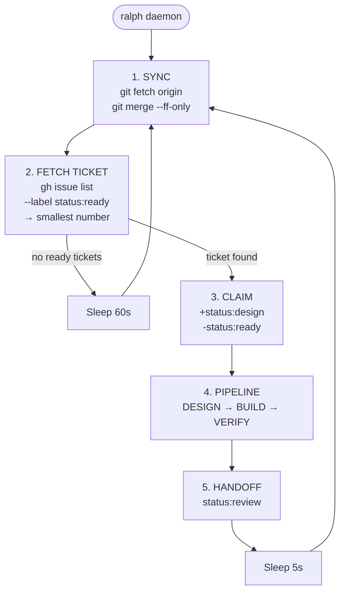
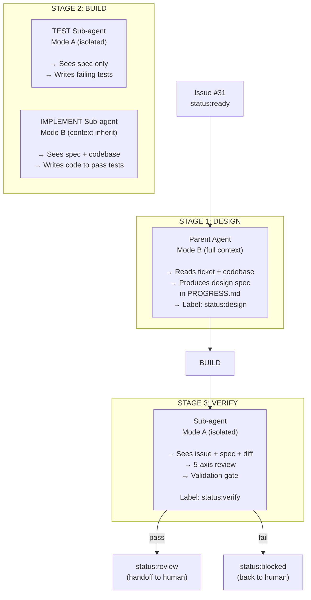
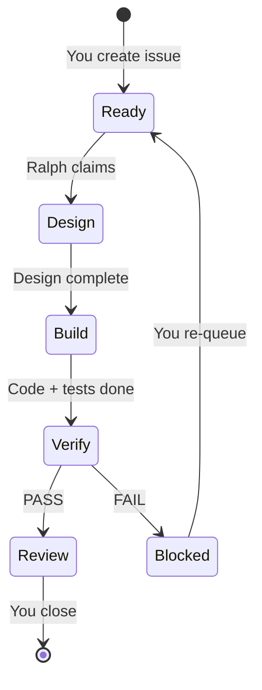

# Ralph v3 — Getting Started

> **Ralph** is an AI-agent-powered automated build system. You write GitHub Issues.
> Ralph picks them up, feeds them to an AI coding agent through a 3-stage pipeline, validates
> the output, and commits and pushes the results. All status is visible on a GitHub Kanban board in
> real time.

---

## Table of Contents

1. [Overview](#overview)
2. [Installation](#installation)
3. [GitHub Project Setup](#github-project-setup)
4. [Creating Your First Project](#creating-your-first-project)
5. [Writing Tickets](#writing-tickets)
6. [Running the Daemon](#running-the-daemon)
7. [Understanding the Pipeline](#understanding-the-pipeline)
8. [Validation Gate](#validation-gate)
9. [Monitoring & Observability](#monitoring--observability)
10. [Cheat Sheet](#cheat-sheet)
11. [Troubleshooting](#troubleshooting)

---

## Overview



**Key principles:**
- **GitHub is source of truth** — issues, labels, and code all live on GitHub
- **No databases** — zero `dolt`, `beads`, or local state beyond a checkpoint file
- **Observable by default** — every pipeline stage updates a label visible on the Kanban board
- **3-stage pipeline** — DESIGN (research) → BUILD (code) → VERIFY (review)

---

## Installation

### Prerequisites

| Tool | Version | Install | Purpose |
|------|---------|---------|---------|
| **git** | 2.30+ | `brew install git` / `apt install git` | Version control |
| **gh** | 2.0+ | `brew install gh` / `apt install gh` | GitHub Issues + Labels |
| **python3** | 3.10+ | `brew install python` / `apt install python3` | Core orchestrator |
| **pi** or **kimi** | latest | `npm install -g pi-coding-agent` | AI coding agent |

### One-Line Install

```bash
curl -fsSL https://raw.githubusercontent.com/samdharma/Ralph_loop/ralph-v3/scripts/install.sh | bash
source ~/.zshrc   # or ~/.bashrc
ralph version     # verify: ralph v3.0.0
```

The installer:
1. Checks all prerequisites (git, gh, python, agent)
2. Clones Ralph to `~/.ralph/` (or uses an existing local clone)
3. Symlinks `ralph` into `/usr/local/bin/` (or `~/.local/bin/`)
4. Sets `RALPH_HOME` in your shell profile
5. Shows install instructions for any missing tools

> **Clone-based alternative:** If you prefer not to pipe from the network, you can
> `gh repo clone samdharma/Ralph_loop ~/.ralph`, checkout `ralph-v3`, and run
> `bash scripts/install.sh`.

### Authenticate GitHub CLI

Ralph uses `gh` to read/write issues and manage labels:

```bash
gh auth login
gh auth status   # verify
```

---

## GitHub Project Setup

Ralph uses **GitHub Issues** as tickets and **GitHub Labels** to track progress through
the pipeline. Every state transition is a label change, visible in real time on the
Kanban board.

### Labels

Ralph manages these labels automatically. You can create them all in one command:

```bash
ralph init --create-labels
```

Or create them manually if you prefer:

```bash
REPO=owner/repo

# Status labels (Ralph manages these)
gh label create "status:ready"    --color 0E8A16 --repo $REPO
gh label create "status:design"   --color 1D76DB --repo $REPO
gh label create "status:build"    --color 0052CC --repo $REPO
gh label create "status:verify"   --color 5319E7 --repo $REPO
gh label create "status:review"   --color D4C5F9 --repo $REPO
gh label create "status:blocked"  --color B60205 --repo $REPO

# Type labels (you apply these)
gh label create "type:task"    --color 0E8A16 --repo $REPO
gh label create "type:bug"     --color D73A4A --repo $REPO
gh label create "type:feature" --color 0075CA --repo $REPO
gh label create "type:epic"    --color 3F2D7E --repo $REPO
gh label create "type:exit"    --color FBCA04 --repo $REPO
```

### Kanban Board

Create a GitHub Project with the **Kanban** template. The board columns are
independent of issue labels, so Ralph must be told which project to sync to.

The easiest way is to enable sync during `ralph init`:

```
Enable GitHub Project board sync? [y/N]: y
GitHub project number: 1
```

This writes `ticket.project` into `.ralph/config.toml`. You can also edit the
file manually:

```toml
[ticket]
repo = "owner/repo"
project = 1
```

Make sure the Project's **Status** field options match the default mapping
(customize `[project].status_map` if they differ):

| Ralph label | Default board column |
|-------------|----------------------|
| `status:ready` | Ready |
| `status:design` | In Progress |
| `status:build` | In Progress |
| `status:verify` | In Progress |
| `status:review` | Review |
| `status:blocked` | Blocked |
| closed (`--auto-close`) | Done |

```toml
[project]
status_field = "Status"

[project.status_map]
"status:ready"   = "Ready"
"status:design"  = "In Progress"
"status:build"   = "In Progress"
"status:verify"  = "In Progress"
"status:review"  = "Review"
"status:blocked" = "Blocked"
"closed"         = "Done"
```



Ralph moves issues between columns automatically by mirroring every label
transition to the Project's Status field. You watch the board — no CLI tailing.

> **Token scope:** Updating the Project Status field requires a GitHub token
> with `project` scope. If `gh auth login` was only granted `repo`, board sync
> will warn but will not block the build pipeline. Re-authenticate with
> `gh auth login --scopes repo,project` if you want the board to update.

---

## Creating Your First Project

### Option A: New Project

```bash
ralph init my-project --create-labels
```

The wizard asks:
```
GitHub repo (owner/name) [samdharma/my-project]:
AI agent [pi]:
Default test tier [targeted]:
Enable GitHub Project board sync? [y/N]:
GitHub project number: 1
```

All have sensible defaults auto-detected from your environment. The `--create-labels`
flag creates all 17 Ralph labels on your GitHub repo. Board sync is optional —
say `N` (or leave `ticket.project` commented) to disable it; labels will still
update, but Kanban cards will not move automatically.

After init, Ralph automatically runs `git init && git add -A && git commit -m "ralph init"`.

### Option B: Existing Repo

```bash
git clone https://github.com/you/your-repo.git
cd your-repo
ralph init --create-labels
```

Ralph detects the existing `.git` directory and remote, skips git init, and
pre-fills the repo name from your remote URL.

### Non-Interactive Mode

Use `--yes` to skip all prompts and use auto-detected defaults:

```bash
ralph init . --yes --create-labels
```

To enable board sync non-interactively, add `--github-project`:

```bash
ralph init . --yes --create-labels --github-project 5
```

### Verify Setup

```bash
ralph setup
```

Checks:
- ✅ GitHub CLI authenticated
- ✅ Git remote exists
- ✅ Python 3.10+
- ✅ AI agent available (pi or kimi)
- ✅ Required labels present on GitHub
- ✅ GitHub Project board sync configured (if enabled)
- ✅ Local directories (logs/, .ralph/) created

---

## Writing Tickets

### Minimal Ticket

Create a GitHub Issue with these labels:
- `type:task` — identifies it as a work ticket
- `status:ready` — tells Ralph to pick it up

```markdown
### Description
Add a utils.py module with a get_version() function that returns "0.1.0".

### Acceptance Criteria
- [ ] src/my_project/utils.py exists with get_version()
- [ ] get_version() returns the string "0.1.0"
- [ ] A unit test verifies the return value
```

### Full Ticket Template

```markdown
### Description
<!-- What needs to be built or fixed -->

### Acceptance Criteria
<!-- Checkboxes that must all be ticked for the issue to be done -->
- [ ] Criterion 1
- [ ] Criterion 2
- [ ] Criterion 3

### Reference Docs
<!-- Optional: BUILD_<feature>.md files to include in agent context -->
Reference: docs/reference/BUILD_order_book.md

### Dependencies
<!-- Other issues this depends on. Ralph skips the issue until these are closed. -->
Depends on: #42
```

### Ticket Selection

Ralph picks the **open `status:ready` issue with the smallest number**.
This is deterministic — issue #31 is processed before #97, regardless of
creation date.

---

## Running the Daemon

```bash
ralph daemon
```

The daemon runs in the **foreground**. For background operation:

```bash
ralph daemon &          # shell backgrounding
# or
nohup ralph daemon &    # persists after terminal closes
```

### Daemon Loop



### Flags

| Flag | Effect |
|------|--------|
| `--auto-close` | Close issues on success instead of marking `status:review` |

### Signal Handling

| Signal | Behavior |
|--------|----------|
| `SIGINT` (Ctrl+C) | Graceful shutdown — marks in-flight issue `status:blocked`, clears checkpoint |
| `SIGTERM` | Same graceful shutdown |
| `SIGKILL` (kill -9) | Immediate — checkpoint preserved for crash recovery on restart |

On restart after a crash, Ralph detects the checkpoint file, rolls back to the
pre-stage commit, and resumes the pipeline at the interrupted stage.

---

## Understanding the Pipeline



### Stage Details

| Stage | Agent | Mode | What It Does |
|-------|-------|------|-------------|
| **DESIGN** | Parent | Mode B (full context) | Reads the issue, researches the codebase, writes a design spec in `PROGRESS.md`. Does NOT write code. |
| **BUILD — TEST** | Sub-agent | Mode A (isolated) | Sees the design spec ONLY. Writes failing tests from the acceptance criteria. No code visibility — genuine independent testing. |
| **BUILD — IMPLEMENT** | Sub-agent | Mode B (context inherit) | Inherits DESIGN session context. Finds test files on disk, writes minimal code to make them pass. |
| **VERIFY** | Sub-agent | Mode A (isolated) | Fresh session. Sees only the issue, design spec, and git diff. Does a 5-axis review (correctness, simplicity, tests, security, maintainability). |

### Mode A vs Mode B

| | Mode A (Isolated) | Mode B (Sequential) |
|---|---|---|
| **Context** | Fresh session. No prior knowledge. | Inherits full parent context. |
| **Sees** | Only what the orchestrator provides | Everything the parent agent saw |
| **Used for** | TEST, VERIFY — independence is the point | IMPLEMENT — needs codebase familiarity |
| **Prevents** | "Marking your own homework" | Coding blind without conventions |

---

## Validation Gate

The validation gate runs after BUILD and after VERIFY:

```bash
ralph validate --tier=<smoke|targeted|integration|full>
```

| Tier | Scope | When |
|------|-------|------|
| `smoke` | Unit tests, fail-fast | Fastest feedback |
| `targeted` | Changed files only (via TEST_MAP.yaml + git diff) | **Default in loop** |
| `integration` | Integration marker tests | Pre-merge |
| `full` | All tests except e2e/perf | VERIFY stage |

The gate also runs linters (`black`, `isort`, `flake8`, `mypy`) on modified Python files.

---

## Monitoring & Observability

### Kanban Board

The primary dashboard. When `ticket.project` is configured, every pipeline
transition updates both the issue label and the Project Status field, moving the
card between columns in real time. If the project is not configured, labels still
update but the board column will not change.

### CLI Status

```bash
ralph status
```

Shows:
- Daemon PID and uptime
- Currently active issue and stage
- Recent pipeline metrics

### Metrics Log

Structured JSONL at `logs/ralph_metrics.jsonl`:

```json
{"timestamp":"2026-06-14T10:30:00Z","event":"pipeline_start","issue":"31","agent":"pi"}
{"timestamp":"2026-06-14T10:32:10Z","event":"stage_complete","issue":"31","stage":"design"}
{"timestamp":"2026-06-14T10:36:05Z","event":"pipeline_complete","issue":"31","result":"review"}
```

### Reports

```bash
ralph report
```

Generates a daily/weekly summary from metrics + issue history.

---

## Cheat Sheet

### Install & Setup

```bash
# One-time install
curl -fsSL https://raw.githubusercontent.com/samdharma/Ralph_loop/ralph-v3/scripts/install.sh | bash
source ~/.zshrc

# Authenticate GitHub
gh auth login

# Init a project
ralph init my-project --create-labels        # new project + labels
ralph init . --yes --create-labels           # current dir, non-interactive

# Verify
ralph setup
```

### Daily Workflow

```bash
# Start building
ralph daemon                 # foreground
ralph daemon &               # background
ralph daemon --auto-close    # close issues on success

# Check progress
ralph status                 # what's Ralph working on?

# Validate manually
ralph validate --tier=targeted

# Generate a report
ralph report
```

### Creating Tickets

```bash
# Via CLI
gh issue create --repo owner/repo \
  --title "Add user authentication" \
  --body "### Description ... ### Acceptance Criteria ..." \
  --label "type:task,status:ready"

# Or via GitHub UI — just add type:task + status:ready labels
```

### Label Cheat Sheet

| Label | Set by | Meaning |
|-------|--------|---------|
| `status:ready` | **You** | Ready to be built |
| `status:design` | Ralph | Architect is researching |
| `status:build` | Ralph | Agent is coding |
| `status:verify` | Ralph | Independent review in progress |
| `status:review` | Ralph | Done — waiting for you |
| `status:blocked` | Ralph | Failed — needs your attention |
| `type:task` | **You** | Work ticket |
| `type:bug` | **You** | Bug fix |
| `type:feature` | **You** | Feature container |
| `type:exit` | **You** | Integration test ticket |

### Pipeline Stage → Label



### Environment Variables

| Variable | Default | Purpose |
|----------|---------|---------|
| `RALPH_HOME` | `~/.ralph` | Ralph install directory |
| `RALPH_PROJECT_DIR` | `pwd` | Project root |
| `RALPH_AGENT` | auto-detect | Force agent: `pi` or `kimi` |
| `RALPH_PYTHON_CMD` | `python3` | Python executable |
| `RALPH_GITHUB_PROJECT` | (from config) | Override `ticket.project` board sync |
| `RALPH_PROJECT_SYNC` | (from config) | Set to `0` to disable board sync; `1` to force enable |
| `RALPH_ALLOW_E2E` | (unset) | Set to `1` to allow e2e tests in loop |

---

## Troubleshooting

### "Daemon already running"

A previous daemon instance left a stale PID file. The new daemon refuses to start
to prevent duplicates.

```bash
# Find and kill the old process
cat /tmp/ralph_daemon_<project>.pid
kill <pid>

# If the process is already dead, just remove the PID file
rm /tmp/ralph_daemon_<project>.pid
```

### "No ready tickets"

Ralph only picks up issues with `status:ready`. Check your issues:

```bash
gh issue list --label "status:ready" --repo owner/repo
```

If you have issues but they're not showing up:
- Verify they have `status:ready` (not `status:review` or `status:blocked`)
- Check dependencies — Ralph skips issues with unmet `Depends on: #N` references

### "Missing labels" in ralph setup

```bash
# Create all labels in one go
ralph init . --create-labels
```

### Agent not found

```bash
# Verify agent is installed
which pi     # or: which kimi

# Set explicitly
export RALPH_AGENT=pi
ralph daemon
```

### Crash recovery

If Ralph crashes mid-pipeline:

1. **Restart** — `ralph daemon` detects the checkpoint and resumes at the
   interrupted stage
2. **Check the Kanban** — the issue should be in the appropriate column
3. **If the issue is `status:blocked`** — Ralph couldn't recover. Check the
   issue comments for details, re-queue with `status:ready`

---

*Ready to go deeper? Read the [v3 Redesign PRD](v3-redesign.md) for the full system
design, implementation notes, and validation gate details.*
