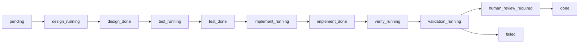
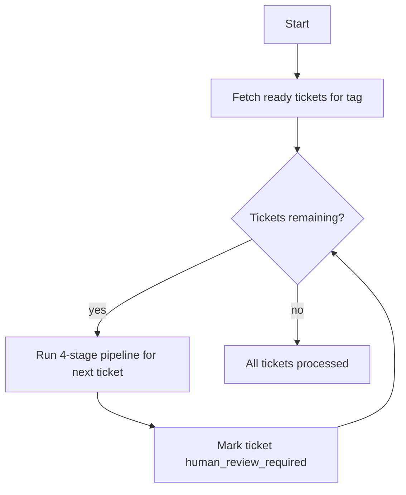
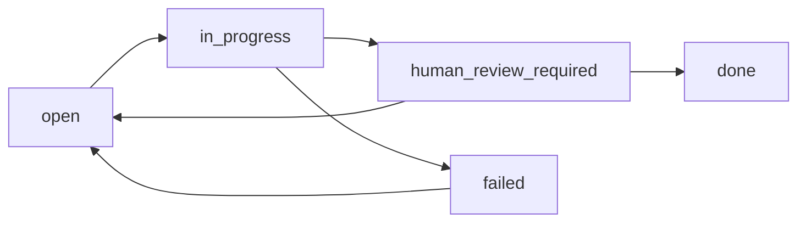

# Ralph Build Orchestrator Roadmap

> High-level plan for automating the Ralph 4-stage pipeline across single tickets and feature tags.

---

## Problem

Today `ralph loop --ticket=<id>` performs a single generic agent invocation and exits. It does not progress a ticket through the intended `design → test → implement → verify` workflow, and it leaves the ticket in `in_progress` without a clear human-review signal. Running the full pipeline requires the user to execute four separate commands manually per ticket.

This document defines a phased plan for an orchestrator that automates the pipeline while keeping the human in the loop.

---

## Guiding Principles

1. **Safety first.** The orchestrator must never lose work or leave the repository in an unrecoverable state.
2. **Resume-friendly.** Each stage is checkpointed so a failed run can resume from where it left off.
3. **Human review is mandatory by default.** A ticket is never auto-closed unless the operator explicitly opts in.
4. **Beads is the source of truth.** Ticket status, dependencies, and readiness come from `bd`.
5. **Sequential over parallel initially.** Parallel `test` + `implement` sessions are desirable later, but they require git isolation (worktrees or branches) to avoid file conflicts.

---

## Phase 1 — Single-Ticket Orchestrator

### Goal

Provide a single command that runs the full 4-stage pipeline for one ticket:

```bash
ralph build --ticket=ib_trading_v3_1-id7.1.1 --agent=kimi
```

### Context

- The ticket must exist, be `open`, and have no unresolved dependencies.
- Each stage reuses the existing session prompts in `docs/agent/prompts/sessions/`.
- The orchestrator maintains a state file (`.ralph/build_state.json`) so it can resume after interruption.
- After the `verify` session, the orchestrator runs the validation gate objectively and updates the ticket status.

### State Machine



### Human Actions

- Start the command.
- Review the ticket and diff when it reaches `human_review_required`.
- Close or reopen the ticket manually.

### Deliverables

- `core/ralph_build.sh`
- `build` subcommand in `bin/ralph`
- `.ralph/build_state.json` state tracking

---

## Phase 2 — Feature / Tag Orchestrator

### Goal

Extend the orchestrator to process all ready tickets under a feature tag:

```bash
ralph build --tag=ib_trading_v3_1-id7.1 --agent=kimi
```

### Context

- A feature tag groups related tickets (e.g., `id7.1.1`, `id7.1.2`, `id7.1.3`).
- `bd ready --label <tag>` returns the tickets that are ready to build.
- Beads dependency handling naturally serializes dependent tickets: a downstream ticket will not appear as `ready` until its dependencies are closed.
- Each ticket is processed through the full 4-stage pipeline from Phase 1.

### Workflow



### Human Actions

- Start the command.
- Review each ticket when it reaches `human_review_required`.
- After reviewing, manually close the ticket so dependent tickets become ready.

### Deliverables

- `--tag` support in `core/ralph_build.sh`
- Iteration over `bd ready --label <tag>`
- Per-ticket state isolation

---

## Phase 3 — Daemon / Overnight Mode

### Goal

Allow the orchestrator to run unattended for long periods:

```bash
ralph build --tag=ib_trading_v3_1-id7.1 --agent=kimi --daemon
```

### Context

- The orchestrator runs as a background process managed by `core/run_ralph_loop.sh` or a similar wrapper.
- It polls `bd ready` periodically and processes newly ready tickets.
- It handles transient failures with retries and exponential backoff.
- It writes a daily summary report.

### Reliability Requirements

| Concern | Mitigation |
|---|---|
| Agent hangs | Per-session timeout (default 30 min) |
| Crash / power loss | State file + checkpoint recovery on restart |
| Repeated failures | Max retries per stage, then mark `failed` and move on |
| Network issues | Remote sync gate already exists in `ralph_loop.sh` |
| Human notification | Optional webhook/email/Slack on completion or failure |

### Human Actions

- Start the daemon before leaving for the day.
- Review the morning report and tickets marked `human_review_required` or `failed`.

### Deliverables

- `ralph build --daemon`
- PID file and log rotation
- Morning report integration with `ralph report`

---

## Phase 4 — Parallel Test + Implement Sessions

### Goal

Reduce wall-clock time by running the `test` and `implement` stages in parallel after design is complete.

### Context

- `test` writes functional/system tests from the design spec.
- `implement` writes production code to satisfy those tests.
- Running both on the same git worktree simultaneously risks file conflicts.

### Options

| Approach | Description | Trade-off |
|---|---|---|
| Sequential (Phases 1-3) | Run test, then implement | Safe, slower |
| Git worktrees | Each stage runs in a separate worktree directory | True parallelism, requires merge strategy |
| Git branches | test and implement on separate branches | Parallel, but merge conflicts possible |
| Spec-driven contract | Design produces a machine-readable spec; test and implement operate on copies | Complex to implement |

### Recommendation

Use **git worktrees**. After the design stage:

1. Create a worktree for the test session and a worktree for the implement session.
2. Run both sessions in parallel.
3. Merge the resulting changes back into the main worktree.
4. Run verify/validation.

### Human Actions

- Minimal; the merge happens automatically if clean.
- If the merge conflicts, the orchestrator stops and marks the ticket for human review.

### Deliverables

- Worktree management in `core/ralph_build.sh`
- Parallel stage execution with merge logic
- Conflict detection and human-escalation

---

## Ticket Status Lifecycle Under the Orchestrator



- `open`: ticket is ready to build.
- `in_progress`: orchestrator has claimed the ticket and is running a stage.
- `human_review_required`: all stages and validation passed; waiting for operator review.
- `done`: operator reviewed and closed the ticket (or `--auto-close` was used).
- `failed`: a stage or validation failed after retries; requires human intervention.

---

## Metrics & Observability

The orchestrator writes structured events to `logs/ralph_metrics.jsonl`:

```json
{"event": "build_started", "ticket_id": "...", "agent": "kimi"}
{"event": "stage_started", "ticket_id": "...", "stage": "design"}
{"event": "stage_completed", "ticket_id": "...", "stage": "design"}
{"event": "validation_passed", "ticket_id": "...", "tier": "targeted"}
{"event": "human_review_required", "ticket_id": "..."}
{"event": "build_failed", "ticket_id": "...", "stage": "...", "reason": "..."}
```

Operators can monitor with:

```bash
ralph status
ralph health --verbose
tail -f logs/ralph_build.log
```

---

## Acceptance Criteria for Phase 1

1. `ralph build --ticket=<id>` runs design, test, implement, and verify sequentially.
2. The orchestrator resumes from the last incomplete stage if interrupted.
3. After verify, the orchestrator runs `ralph validate --tier=targeted` objectively.
4. On validation pass, the ticket is set to `human_review_required`.
5. On any stage or validation failure, the ticket is set to `failed` and the orchestrator exits with a clear error.
6. State is written to `.ralph/build_state.json` and logs to `logs/ralph_build.log`.
