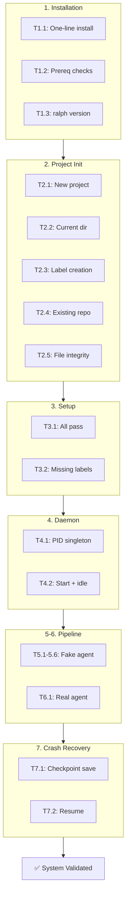
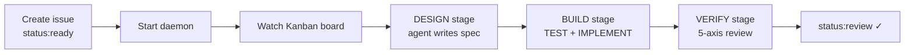
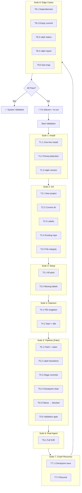

# Ralph v3 — System Validation Test

> Step-by-step test plan for validating a Ralph v3 installation end-to-end.
> Each test includes preconditions, actions, expected outputs, and pass/fail
> criteria. Run these after installation or after any significant change.

---

## Table of Contents

1. [Test Environment](#test-environment)
2. [Test Flow Overview](#test-flow-overview)
3. [Suite 1: Installation](#suite-1-installation)
4. [Suite 2: Project Init](#suite-2-project-init)
5. [Suite 3: Setup](#suite-3-setup)
6. [Suite 4: Daemon Basics](#suite-4-daemon-basics)
7. [Suite 5: Pipeline (Fake Agent)](#suite-5-pipeline-fake-agent)
8. [Suite 6: Pipeline (Real Agent)](#suite-6-pipeline-real-agent)
9. [Suite 7: Crash Recovery](#suite-7-crash-recovery)
10. [Suite 8: Edge Cases](#suite-8-edge-cases)
11. [Result Summary](#result-summary)

---

## Test Environment

### Prerequisites

| Requirement | How to verify |
|-------------|---------------|
| macOS or Linux machine | `uname -s` |
| Internet access | `curl -I https://github.com` |
| GitHub account with a repo | Create `your-username/ralph-system-test` on GitHub |
| Terminal with bash or zsh | `echo $SHELL` |

### Test Repo Setup

Before starting, create a test repo on GitHub:

```bash
# 1. Create a new empty repo on GitHub (do NOT initialize with README)
#    Name: ralph-system-test
#    Owner: your-username

# 2. Create labels (we'll test that ralph init --create-labels also works,
#    but some tests need labels pre-existing)
REPO="your-username/ralph-system-test"

gh label create "status:ready"   --color 0E8A16 --repo $REPO
gh label create "status:design"  --color 1D76DB --repo $REPO
gh label create "status:build"   --color 0052CC --repo $REPO
gh label create "status:verify"  --color 5319E7 --repo $REPO
gh label create "status:review"  --color D4C5F9 --repo $REPO
gh label create "status:blocked" --color B60205 --repo $REPO
gh label create "type:task"      --color 0E8A16 --repo $REPO
```

### Fake Agent Setup

Some tests use a fake agent instead of real pi/kimi to keep tests fast and
deterministic:

```bash
cat > /tmp/ralph-fake-agent << 'PYEOF'
#!/usr/bin/env python3
"""Fake agent that writes a stage marker and exits."""
import os, sys, time, random

# pi passes prompt as last CLI arg
prompt = sys.argv[-1] if len(sys.argv) > 2 and sys.argv[1] == "--print" else sys.stdin.read()

stage = "unknown"
if "systems architect" in prompt:     stage = "design"
elif "QA engineer" in prompt:         stage = "test"
elif "developer sub-agent" in prompt: stage = "implement"
elif "independent reviewer" in prompt: stage = "verify"

print(f"[fake-agent] Stage: {stage} (PID {os.getpid()})")
with open("/tmp/ralph_fake_agent_stage.txt", "w") as f:
    f.write(f"{stage}\n{os.getpid()}")

# Write dummy files so commit_stage has something to commit
proj = os.environ.get("RALPH_PROJECT_DIR", os.getcwd())
r = random.randint(1000, 9999)
if stage == "design":
    with open(os.path.join(proj, "docs", "agent", "PROGRESS.md"), "a") as f:
        f.write(f"\n# Fake design spec {r}\n")
elif stage == "test":
    with open(os.path.join(proj, "tests", "unit", f"test_fake_{r}.py"), "w") as f:
        f.write(f"# Fake test {r}\ndef test_fake_{r}(): assert True\n")
elif stage == "implement":
    os.makedirs(os.path.join(proj, "src", "my_project"), exist_ok=True)
    with open(os.path.join(proj, "src", "my_project", f"fake_impl_{r}.py"), "w") as f:
        f.write(f"# Fake impl {r}\n")

time.sleep(int(os.environ.get("RALPH_FAKE_SLEEP", "2")))
sys.exit(int(os.environ.get("RALPH_FAKE_EXIT_CODE", "0")))
PYEOF

chmod +x /tmp/ralph-fake-agent

# Put it on PATH as "pi" so Ralph invokes it
mkdir -p /tmp/fake-bin
cp /tmp/ralph-fake-agent /tmp/fake-bin/pi
chmod +x /tmp/fake-bin/pi
```

Export these for fake-agent tests:

```bash
export PATH="/tmp/fake-bin:$PATH"
export RALPH_AGENT="pi"
export RALPH_FAKE_SLEEP="2"
export RALPH_FAKE_EXIT_CODE="0"
```

---

## Test Flow Overview



Each suite is independent of the others (except they share the test repo).
Run suites in order for a full validation, or individually to verify a
specific component.

---

## Suite 1: Installation

Tests the one-line install script and prerequisite detection.

---

### T1.1 — One-Line Install

**Precondition:** No prior `~/.ralph` directory. `gh` and `git` are installed.

**Action:**
```bash
# Clean any prior install
rm -rf ~/.ralph
rm -f /usr/local/bin/ralph ~/.local/bin/ralph

# Run the installer
curl -fsSL https://raw.githubusercontent.com/samdharma/Ralph_loop/ralph-v3/scripts/install.sh | bash
```

**Expected output:**
```
╔══════════════════════════════════════════╗
║   Ralph v3 — Automated Build System      ║
╚══════════════════════════════════════════╝

Checking prerequisites...
  ✓ bash 5.x (4+ required)
  ✓ git (git version 2.x)
  ✓ gh (gh version 2.x)
  ✓ Python 3.x (3.10+ required)
  ✓ AI agent: pi (available)

Installing Ralph...
  ✓ Ralph v3.0.0 installed → /usr/local/bin/ralph
  ✓ Added RALPH_HOME to ~/.zshrc

Verifying installation...
  ✓ ralph CLI executable
  ✓ Core modules: 8 files in ~/.ralph/core/

╔══════════════════════════════════════════╗
║   Installation Complete!                 ║
╚══════════════════════════════════════════╝
```

| Pass criteria | Fail criteria |
|---------------|---------------|
| Installer exits 0 | Installer exits non-zero |
| All prerequisite checks show ✓ | Any prerequisite shows ✗ |
| `~/.ralph/` exists with core/, bin/, scripts/ | ~/.ralph/ missing or incomplete |
| `which ralph` resolves | `which ralph` fails |
| `~/.zshrc` or `~/.bashrc` contains `RALPH_HOME` | Profile not updated |

---

### T1.2 — Prerequisite Detection (Missing Tool)

**Precondition:** Simulate a missing tool by temporarily removing it from PATH.

**Action:**
```bash
# Test: installer catches missing 'gh'
PATH_WITHOUT_GH=$(echo "$PATH" | tr ':' '\n' | grep -v "$(dirname $(which gh))" | tr '\n' ':')
PATH="$PATH_WITHOUT_GH" curl -fsSL https://raw.githubusercontent.com/samdharma/Ralph_loop/ralph-v3/scripts/install.sh | bash
```

**Expected output:**
```
  ✗ gh — GitHub CLI not found in PATH

Cannot install Ralph — missing prerequisites:
  ✗ gh — https://cli.github.com/ (macOS: brew install gh)

Install the above and re-run this installer.
```

| Pass criteria | Fail criteria |
|---------------|---------------|
| Installer exits 1 | Installer exits 0 or hangs |
| Specific install instructions shown for missing tool | Generic error message |
| No partial install left behind | Partial files in ~/.ralph/ |

---

### T1.3 — `ralph version`

**Precondition:** T1.1 passed. New terminal session with `RALPH_HOME` sourced.

**Action:**
```bash
source ~/.zshrc   # or ~/.bashrc
ralph version
ralph help
```

**Expected output:**
```
ralph v3.0.0

Ralph v3 — Automated Build System

Usage: ralph <command> [options]

Commands:
  init [dir]         Scaffold a Ralph project (default: current directory)
  setup              ...
  daemon [opts]      ...
  ...
```

| Pass criteria | Fail criteria |
|---------------|---------------|
| `ralph version` prints `ralph v3.0.0` | Wrong version or command not found |
| `ralph help` lists 8+ commands | Help output truncated or missing commands |

---

## Suite 2: Project Init

Tests the `ralph init` wizard in all modes.

---

### T2.1 — New Project (Interactive)

**Precondition:** Not inside an existing Ralph project.

**Action:**
```bash
cd /tmp
rm -rf test-s2.1
mkdir test-s2.1
cd test-s2.1
# Simulate interactive input (accept all defaults)
echo -e "\n\n\n\n" | ralph init
```

**Expected output:**
```
╔══════════════════════════════════════════╗
║   Ralph v3 — Project Setup Wizard        ║
╚══════════════════════════════════════════╝

GitHub repo (owner/name) [owner/repo]:
AI agent [pi]:
Default test tier [targeted]:

Initialize git repository? [Y/n]:

Scaffolding Ralph v3 project at: /private/tmp/test-s2.1

  ✓  .ralph/
  ✓  config/
  ✓  docs/agent/prompts/
  ✓  logs/
  ✓  src/
  ✓  tests/unit/
  ✓  tests/integration/
  ✓  ... (all 24 files)

Project scaffold complete!

  ralph setup
  ralph daemon

  ✓  git init && git commit 'ralph init'
```

| Pass criteria | Fail criteria |
|---------------|---------------|
| All 24 files/dirs listed with ✓ | Missing files |
| Git repo initialized (.git/ exists) | No .git/ directory |
| `git log` shows "ralph init" commit | No commit created |
| Accepts empty input as defaults | Crashes on empty input |

---

### T2.2 — Current Directory (Non-Interactive)

**Precondition:** Existing project directory (not empty).

**Action:**
```bash
cd /tmp
rm -rf test-s2.2 && mkdir test-s2.2 && cd test-s2.2
echo "print('hello')" > main.py
git init
git add -A && git commit -m "initial"
ralph init . --yes
```

**Expected output:**
```
GitHub repo (owner/name) [owner/repo]: owner/repo
AI agent [pi]: pi
Default test tier [targeted]: targeted

Scaffolding Ralph v3 project at: /private/tmp/test-s2.2
  ✓  ... (all files)

Project scaffold complete!

  ralph setup
  ralph daemon
```

| Pass criteria | Fail criteria |
|---------------|---------------|
| Scaffold added alongside existing `main.py` | Existing files deleted or corrupted |
| `.git` directory untouched | Git history lost |
| No git init attempted (repo already exists) | Double git init warning |
| `--yes` skips all prompts | Unexpected prompts appear |

---

### T2.3 — Label Creation

**Precondition:** GitHub repo `your-username/ralph-system-test` exists and `gh` is
authenticated.

**Action:**
```bash
cd /tmp
rm -rf test-s2.3 && mkdir test-s2.3 && cd test-s2.3
git init
git remote add origin https://github.com/your-username/ralph-system-test.git
ralph init . --yes --create-labels
```

**Expected output:**
```
GitHub repo (owner/name) [your-username/ralph-system-test]: ...

Creating labels on your-username/ralph-system-test...
  ✓  status:ready
  ✓  status:design
  ... (17 labels total)
  (X already existed)
  ✓  Y labels created

Scaffolding Ralph v3 project at: ...
```

**Verify:**
```bash
gh label list --repo your-username/ralph-system-test --limit 20
```

| Pass criteria | Fail criteria |
|---------------|---------------|
| All 17 Ralph labels created (or already existed) | Labels missing after test |
| Label colors match PRD spec | Wrong colors |
| `ralph setup` passes label check | setup reports missing labels |

---

### T2.4 — Existing Git Repo (Cloned)

**Precondition:** The test repo has code committed.

**Action:**
```bash
cd /tmp
rm -rf test-s2.4
git clone https://github.com/your-username/ralph-system-test.git test-s2.4
cd test-s2.4
echo -e "\n\n\n\n" | ralph init
```

**Expected output:**
```
GitHub repo (owner/name) [your-username/ralph-system-test]:
...
Scaffolding Ralph v3 project at: ...
```

| Pass criteria | Fail criteria |
|---------------|---------------|
| Repo auto-detected from remote | `owner/repo` placeholder shown |
| Existing code untouched | Clone corrupted |
| No "cd ..." in next steps (already in project dir) | Wrong next-steps shown |
| .gitignore appended (not replaced) | Existing .gitignore overwritten |

---

### T2.5 — Scaffold File Integrity

**Precondition:** A fresh `ralph init` has completed.

**Action:**
```bash
cd /tmp/test-s2.1   # from T2.1

# Check all expected files exist
EXPECTED_FILES=(
    ".ralph/config.toml"
    "config/ralph_preflight.sh"
    "config/TEST_MAP.yaml"
    "docs/agent/PROMPT.md"
    "docs/agent/PROGRESS.md"
    "docs/agent/prompts/design.md"
    "docs/agent/prompts/build.md"
    "docs/agent/prompts/verify.md"
    "docs/agent/prompts/test.md"
    "docs/agent/prompts/implement.md"
    "AGENTS.md"
    ".gitignore"
)

ALL_OK=true
for f in "${EXPECTED_FILES[@]}"; do
    if [ -f "$f" ]; then
        echo "  ✓  $f"
    else
        echo "  ✗  $f MISSING"
        ALL_OK=false
    fi
done

# Check prompt stubs have content
for f in docs/agent/prompts/{design,build,verify,test,implement}.md; do
    if [ -s "$f" ]; then
        echo "  ✓  $f (non-empty)"
    else
        echo "  ✗  $f is empty"
        ALL_OK=false
    fi
done

# Check zero beads/dolt references
if grep -r "beads\|dolt\|\.beads" --include="*.py" --include="*.md" --include="*.sh" .; then
    echo "  ✗  Dead-code: found beads/dolt references"
    ALL_OK=false
else
    echo "  ✓  No beads/dolt references"
fi

$ALL_OK && echo "PASS" || echo "FAIL"
```

| Pass criteria | Fail criteria |
|---------------|---------------|
| All 12 files present | Any file missing |
| All 5 prompt stubs non-empty | Empty prompt file |
| Zero beads/dolt references | grep finds beads/dolt |

---

## Suite 3: Setup

Tests `ralph setup` prerequisite checking.

---

### T3.1 — All Checks Pass

**Precondition:** A scaffolded project with labels, remote, and gh auth.

**Action:**
```bash
cd /tmp/test-s2.4   # cloned repo from T2.4
ralph setup
```

**Expected output:**
```
╔══════════════════════════════════════════╗
║   Ralph v3 — Setup                       ║
╚══════════════════════════════════════════╝

Project: /private/tmp/test-s2.4

  ✓ GitHub CLI authenticated (authenticated)
  ✓ Git remote (https://github.com/...)
  ✓ Python 3.10+ (Python 3.x.y)
  ✓ AI agent (pi/kimi) (pi)
  ✓ pi-subagent extension (...)
  ✓ GitHub repo access (your-username/ralph-system-test)
  ✓ Required labels (all required labels present)

  ✓ logs/ exists
  ✓ .ralph/ exists

Setup complete! Run 'ralph daemon' to start building.
```

| Pass criteria | Fail criteria |
|---------------|---------------|
| All 7 checks show ✓ | Any check shows ✗ |
| Exit code 0 | Exit code non-zero |
| Both directories reported as existing | Dir creation errors |

---

### T3.2 — Missing Labels Detected

**Precondition:** A repo without some Ralph labels.

**Action:**
```bash
# Create a temp repo without labels
cd /tmp && rm -rf test-s3.2 && mkdir test-s3.2 && cd test-s3.2
git init
git remote add origin https://github.com/your-username/ralph-system-test.git
# Don't create labels — just scaffold
echo -e "\n\n\n\n" | ralph init
ralph setup
```

**Expected output (if labels missing from the test repo):**
```
  ✗ Required labels — missing: status:ready, status:design, ...
```

| Pass criteria | Fail criteria |
|---------------|---------------|
| Missing labels listed by name | Generic "failed" message |
| Hint shown: "run 'ralph init --create-labels'" | No remediation hint |
| Other checks still pass | Setup aborts early on first failure |

---

## Suite 4: Daemon Basics

Tests daemon startup, PID singleton, and idle behavior.

---

### T4.1 — PID Singleton

**Precondition:** `ralph setup` has passed.

**Action:**
```bash
cd /tmp/test-s2.4
export PATH="/tmp/fake-bin:$PATH"
export RALPH_AGENT="pi"

# Start first daemon (redirect output to avoid clutter)
PYTHONUNBUFFERED=1 ralph daemon > /tmp/daemon-1.log 2>&1 &
DAEMON1=$!
sleep 2

# Try to start second daemon
PYTHONUNBUFFERED=1 ralph daemon > /tmp/daemon-2.log 2>&1
EXIT_CODE=$?

echo "Second daemon exit code: $EXIT_CODE"
cat /tmp/daemon-2.log

# Cleanup
kill $DAEMON1 2>/dev/null
wait $DAEMON1 2>/dev/null
rm -f /tmp/ralph_daemon_*.pid
```

**Expected output:**
```
Second daemon exit code: 1
[ralph] Daemon already running (PID XXXX). Exiting.
```

| Pass criteria | Fail criteria |
|---------------|---------------|
| Second daemon exits with code 1 | Second daemon exits 0 |
| "Daemon already running" message shown | Two daemons running simultaneously |
| PID file has correct PID | Stale PID causes false positive |

---

### T4.2 — Starts and Idles

**Precondition:** Test repo has no `status:ready` issues. Clean PID file.

**Action:**
```bash
cd /tmp/test-s2.4
rm -f /tmp/ralph_daemon_*.pid
export PATH="/tmp/fake-bin:$PATH"
export RALPH_AGENT="pi"

PYTHONUNBUFFERED=1 ralph daemon > /tmp/daemon-idle.log 2>&1 &
DAEMON=$!
sleep 5

# Check what the daemon is doing
cat /tmp/daemon-idle.log

# Cleanup
kill $DAEMON 2>/dev/null
wait $DAEMON 2>/dev/null
rm -f /tmp/ralph_daemon_*.pid
```

**Expected output:**
```
[ralph] Daemon started
[ralph] Syncing with remote...
[ralph] No ready tickets. Sleeping...
```

| Pass criteria | Fail criteria |
|---------------|---------------|
| "Daemon started" appears | Daemon crashes on start |
| "No ready tickets" appears | Error during sync or fetch |
| Daemon continues running (not exited) | Daemon exits prematurely |
| Graceful shutdown on SIGTERM | Process must be SIGKILL'd |

---

## Suite 5: Pipeline (Fake Agent)

Full pipeline test using the fake agent. Tests ticket fetch, claim, label
transitions, stage commits, and the 3-stage flow — all without real AI.

---

### T5.1 — Ticket Fetch and Claim

**Precondition:** A `status:ready` issue exists. Fake agent on PATH. Clean daemon state.

**Setup:**
```bash
cd /tmp/test-s2.4   # cloned repo
rm -f /tmp/ralph_daemon_*.pid /tmp/ralph_fake_agent_stage.txt

# Create a test issue
gh issue create --repo your-username/ralph-system-test \
    --title "System test: add test marker" \
    --body "Add a test_marker.py file to the project.

### Acceptance Criteria
- [ ] src/my_project/test_marker.py exists
- [ ] It contains a MARKER constant set to 'ralph-system-test'" \
    --label "type:task,status:ready"

export PATH="/tmp/fake-bin:$PATH"
export RALPH_AGENT="pi"
export RALPH_FAKE_SLEEP="2"
export RALPH_FAKE_EXIT_CODE="0"
```

**Action:**
```bash
PYTHONUNBUFFERED=1 ralph daemon > /tmp/daemon-pipeline.log 2>&1 &
DAEMON=$!

# Watch for pipeline completion (max 120s)
for i in $(seq 1 240); do
    STAGE=$(head -1 /tmp/ralph_fake_agent_stage.txt 2>/dev/null || echo "")
    if grep -q "pipeline_complete\|No ready tickets" /tmp/daemon-pipeline.log 2>/dev/null; then
        echo "[$i] Pipeline complete"
        break
    fi
    sleep 0.5
done

# Wait for daemon to idle
sleep 5

# Show the log
echo "=== Daemon log ==="
cat /tmp/daemon-pipeline.log

# Cleanup
kill $DAEMON 2>/dev/null
wait $DAEMON 2>/dev/null
rm -f /tmp/ralph_daemon_*.pid
```

**Expected key lines in log:**
```
[ralph] Daemon started
[ralph] Syncing with remote...
[ralph] #N labels: +status:design / -status:ready
==================================================
[ralph] Pipeline starting for #N: System test: add test marker
==================================================
[ralph] STAGE 1/3: DESIGN for #N
[fake-agent] Stage: design ...
[ralph] Committed: [ralph] design: #N
[ralph] #N labels: +status:build / -status:design
[ralph] STAGE 2/3: BUILD for #N
[fake-agent] Stage: test ...
[fake-agent] Stage: implement ...
[ralph] Running validation gate...
[ralph] STAGE 3/3: VERIFY for #N
[fake-agent] Stage: verify ...
[ralph] #N labels: +status:review / -status:verify
[ralph] No ready tickets. Sleeping...
```

| Pass criteria | Fail criteria |
|---------------|---------------|
| DESIGN → BUILD → VERIFY stages all run | Pipeline stops at any stage |
| All 4 fake agent invocations (design, test, implement, verify) | Missing a sub-agent call |
| Label flow: ready → design → build → verify → review | Wrong label transitions |
| Stage commits present in log | Missing commits |
| Issue ends at `status:review` | Issue at wrong status |

---

### T5.2 — Label Transition Verification

**Precondition:** T5.1 completed.

**Action:**
```bash
# Check the issue labels
gh issue list --repo your-username/ralph-system-test \
    --label "status:review" \
    --json number,title,labels \
    --jq '.[] | {number, title, labels: [.labels[].name]}'
```

**Expected output:**
```json
{
  "number": N,
  "title": "System test: add test marker",
  "labels": ["type:task", "status:review"]
}
```

| Pass criteria | Fail criteria |
|---------------|---------------|
| Issue has `status:review` | Issue has `status:blocked` or wrong status |
| Only one issue in `status:review` (no leaked labels) | Dual labels present |
| `status:ready`, `status:design`, `status:build`, `status:verify` NOT present | Stale labels remain |

---

### T5.3 — Stage Commit Verification

**Precondition:** T5.1 completed.

**Action:**
```bash
cd /tmp/test-s2.4
echo "=== Git log ==="
git log --oneline -5
```

**Expected output (at minimum):**
```
XXXXXXX [ralph] design: #N
YYYYYYY [ralph] build: #N
ZZZZZZZ ralph init
```

| Pass criteria | Fail criteria |
|---------------|---------------|
| `[ralph] design: #N` commit exists | Missing stage commit |
| `[ralph] build: #N` commit exists | Wrong commit message format |
| Commits are in order (init → design → build) | Commits out of order |

---

### T5.4 — Checkpoint Cleared on Completion

**Precondition:** T5.1 completed (pipeline succeeded).

**Action:**
```bash
cd /tmp/test-s2.4
if [ -f .ralph/checkpoint.json ]; then
    echo "FAIL: checkpoint still exists"
    cat .ralph/checkpoint.json
else
    echo "PASS: checkpoint cleared"
fi
```

| Pass criteria | Fail criteria |
|---------------|---------------|
| `.ralph/checkpoint.json` does not exist | Checkpoint file present after success |

---

### T5.5 — DESIGN Failure → Blocked

**Precondition:** A fresh `status:ready` issue. Fake agent set to fail.

**Setup:**
```bash
cd /tmp/test-s2.4
rm -f /tmp/ralph_daemon_*.pid /tmp/ralph_fake_agent_stage.txt

# Create an issue that will fail
gh issue create --repo your-username/ralph-system-test \
    --title "System test: intentional DESIGN failure" \
    --body "This issue tests the DESIGN → blocked path." \
    --label "type:task,status:ready"

export PATH="/tmp/fake-bin:$PATH"
export RALPH_AGENT="pi"
export RALPH_FAKE_SLEEP="1"
export RALPH_FAKE_EXIT_CODE="1"    # <-- Force failure
```

**Action:**
```bash
PYTHONUNBUFFERED=1 ralph daemon > /tmp/daemon-fail.log 2>&1 &
DAEMON=$!

# Wait for blocked status
for i in $(seq 1 60); do
    if grep -q "status:blocked" /tmp/daemon-fail.log 2>/dev/null; then
        echo "[$i] Issue marked blocked"
        break
    fi
    sleep 1
done

sleep 3
kill $DAEMON 2>/dev/null
wait $DAEMON 2>/dev/null
rm -f /tmp/ralph_daemon_*.pid

# Check the issue
echo "=== Issue status ==="
gh issue list --repo your-username/ralph-system-test \
    --label "status:blocked" \
    --json number,title --jq '.[] | {number, title}'
```

**Expected output:**
```
[N] Issue marked blocked
=== Issue status ===
{"number": N, "title": "System test: intentional DESIGN failure"}
```

| Pass criteria | Fail criteria |
|---------------|---------------|
| Issue transitions to `status:blocked` | Issue stays at `status:design` or `status:ready` |
| Checkpoint is cleared | Checkpoint file remains |
| Daemon continues to next cycle (idles or picks another ticket) | Daemon crashes or exits |

---

### T5.6 — Validation Gate in BUILD

**Precondition:** T5.1 passed (validation gate ran during BUILD and VERIFY).

**Action:**
```bash
grep -c "RALPH_GATE_PASSED\|Validation Gate" /tmp/daemon-pipeline.log
```

**Expected output:**
```
4
```
(Validation gate runs once in BUILD and once in VERIFY — each shows
"Validation Gate Starting" and "RALPH_GATE_PASSED" = 4 matching lines)

| Pass criteria | Fail criteria |
|---------------|---------------|
| Validation gate ran at least twice (BUILD + VERIFY) | Gate ran once or not at all |
| Gate output includes tier name ("targeted") | Missing tier info |

---

## Suite 6: Pipeline (Real Agent)

Full end-to-end test with real pi/kimi. This is the "smoke test" — if this
passes, Ralph is working.

---

### T6.1 — Full Real-Agent E2E



**Precondition:** Real `pi` or `kimi` installed and working. A simple, well-scoped task
that any agent can complete.

**Setup:**
```bash
cd /tmp/test-s2.4
rm -f /tmp/ralph_daemon_*.pid

# Create a trivial issue
gh issue create --repo your-username/ralph-system-test \
    --title "Add hello() function" \
    --body "Add a hello() function to src/my_project/greeting.py that returns 'hello from ralph'.

### Acceptance Criteria
- [ ] src/my_project/greeting.py exists with a hello() function
- [ ] hello() returns 'hello from ralph'
- [ ] A unit test verifies the return value" \
    --label "type:task,status:ready"
```

**Action:**
```bash
# Run with real pi (no PATH override)
unset RALPH_FAKE_SLEEP RALPH_FAKE_EXIT_CODE
export RALPH_AGENT="pi"   # or "kimi"

PYTHONUNBUFFERED=1 ralph daemon > /tmp/daemon-real.log 2>&1 &
DAEMON=$!
echo "Daemon PID: $DAEMON"
echo "Watch the Kanban board: https://github.com/your-username/ralph-system-test/projects"
echo ""
echo "Waiting for pipeline completion..."
echo "Tail log: tail -f /tmp/daemon-real.log"
```

**Monitor:**
```bash
# Check progress every 30s
while kill -0 $DAEMON 2>/dev/null; do
    STATUS=$(gh issue list --repo your-username/ralph-system-test \
        --search "hello()" --json labels --jq '.[0].labels[].name' 2>/dev/null | grep status || echo "unknown")
    echo "$(date +%H:%M:%S) Issue status: $STATUS"
    sleep 30
done
```

**Verify after completion:**
```bash
# 1. Issue status
gh issue view --repo your-username/ralph-system-test \
    $(gh issue list --repo your-username/ralph-system-test \
        --search "hello()" --json number --jq '.[0].number') \
    --json title,labels,state

# 2. Code exists
cat src/my_project/greeting.py

# 3. Tests pass
python3 -m pytest tests/ -v

# 4. Git log
git log --oneline -5

# 5. Checkpoint cleared
[ ! -f .ralph/checkpoint.json ] && echo "Checkpoint cleared ✓"
```

| Pass criteria | Fail criteria |
|---------------|---------------|
| Issue ends at `status:review` | Issue at `status:blocked` or stuck |
| `src/my_project/greeting.py` exists with correct function | Missing or wrong file |
| `hello()` returns `'hello from ralph'` | Wrong return value |
| At least one test exists and passes | No tests or tests fail |
| Tests were written BEFORE implementation (check git log order) | Test + impl in same commit |
| 5-axis review output in VERIFY log | VERIFY skipped review steps |

---

## Suite 7: Crash Recovery

Tests checkpoint save, rollback, and resume on restart.

---

### T7.1 — Checkpoint Saved on Crash

**Precondition:** Fake agent with long sleep. A `status:ready` issue.

**Setup:**
```bash
cd /tmp/test-s2.4
rm -f /tmp/ralph_daemon_*.pid /tmp/ralph_fake_agent_stage.txt

gh issue create --repo your-username/ralph-system-test \
    --title "System test: crash recovery" \
    --body "Dummy issue for crash-recovery testing." \
    --label "type:task,status:ready"

export PATH="/tmp/fake-bin:$PATH"
export RALPH_AGENT="pi"
export RALPH_FAKE_SLEEP="10"    # Long sleep — we'll kill during this
export RALPH_FAKE_EXIT_CODE="0"
```

**Action:**
```bash
PYTHONUNBUFFERED=1 ralph daemon > /tmp/daemon-crash.log 2>&1 &
DAEMON=$!

# Wait for DESIGN stage to start
for i in $(seq 1 60); do
    STAGE=$(head -1 /tmp/ralph_fake_agent_stage.txt 2>/dev/null || echo "")
    if [ "$STAGE" = "design" ]; then
        echo "[$i] Design stage entered — crashing daemon"
        break
    fi
    sleep 0.5
done

# SIGKILL (simulates hard crash — SIGTERM handler won't fire)
kill -9 $DAEMON 2>/dev/null
wait $DAEMON 2>/dev/null

# Wait for orphan fake agent to exit
sleep 12

# Check checkpoint
echo "=== Checkpoint ==="
cat .ralph/checkpoint.json 2>/dev/null || echo "NO CHECKPOINT"
```

**Expected checkpoint:**
```json
{
  "issue": N,
  "stage": "design",
  "pre_stage_sha": "...",
  "started_at": "2026-..."
}
```

| Pass criteria | Fail criteria |
|---------------|---------------|
| Checkpoint file exists | No checkpoint after crash |
| `stage` field is `"design"` | Wrong stage |
| `pre_stage_sha` is a valid commit hash | Missing or invalid SHA |
| `issue` matches the test issue number | Wrong issue number |

---

### T7.2 — Resume After Crash

**Precondition:** T7.1 completed (checkpoint exists with stage=design).

**Action:**
```bash
cd /tmp/test-s2.4
rm -f /tmp/ralph_daemon_*.pid /tmp/ralph_fake_agent_stage.txt

export PATH="/tmp/fake-bin:$PATH"
export RALPH_AGENT="pi"
export RALPH_FAKE_SLEEP="1"
export RALPH_FAKE_EXIT_CODE="0"

PYTHONUNBUFFERED=1 ralph daemon > /tmp/daemon-resume.log 2>&1 &
DAEMON=$!

# Wait for recovery and pipeline completion
for i in $(seq 1 120); do
    if grep -q "pipeline_complete\|No ready tickets" /tmp/daemon-resume.log 2>/dev/null; then
        echo "[$i] Pipeline completed after recovery"
        break
    fi
    sleep 0.5
done

sleep 3
kill $DAEMON 2>/dev/null
wait $DAEMON 2>/dev/null
rm -f /tmp/ralph_daemon_*.pid

echo "=== Resume log (key lines) ==="
grep -E "Found checkpoint|Rolling back|Resuming|stage_complete|pipeline_complete" /tmp/daemon-resume.log
```

**Expected key lines:**
```
[ralph] Found checkpoint from previous run — recovering...
[ralph] Rolling back to commit XXXXXXXX (before design)...
[ralph] Resuming #N at stage: design
[ralph] STAGE 1/3: DESIGN for #N
...
pipeline_complete
```

| Pass criteria | Fail criteria |
|---------------|---------------|
| "Found checkpoint" appears | Checkpoint not detected |
| "Rolling back to commit" appears | No rollback performed |
| Pipeline completes successfully (DESIGN → BUILD → VERIFY) | Pipeline fails or hangs |
| Checkpoint cleared after success | Checkpoint file remains |
| Issue ends at `status:review` | Issue at wrong status |

---

## Suite 8: Edge Cases

---

### T8.1 — Dependency Check

**Precondition:** Two issues — one with an unmet dependency, one ready.

**Setup:**
```bash
cd /tmp/test-s2.4

# Create a blocker issue
gh issue create --repo your-username/ralph-system-test \
    --title "System test: dependency blocker" \
    --body "This issue blocks others." \
    --label "type:task,status:ready"

BLOCKER=$(gh issue list --repo your-username/ralph-system-test \
    --search "dependency blocker" --json number --jq '.[0].number')

# Create a dependent issue
gh issue create --repo your-username/ralph-system-test \
    --title "System test: depends on blocker" \
    --body "Depends on: #${BLOCKER}

This should be skipped until the blocker is closed." \
    --label "type:task,status:ready"
```

**Action:**
```bash
rm -f /tmp/ralph_daemon_*.pid /tmp/ralph_fake_agent_stage.txt
export PATH="/tmp/fake-bin:$PATH"
export RALPH_AGENT="pi"
export RALPH_FAKE_SLEEP="1"

PYTHONUNBUFFERED=1 ralph daemon > /tmp/daemon-deps.log 2>&1 &
DAEMON=$!
sleep 8

grep -i "skipping\|depends\|unmet" /tmp/daemon-deps.log

kill $DAEMON 2>/dev/null
wait $DAEMON 2>/dev/null
rm -f /tmp/ralph_daemon_*.pid
```

**Expected output:**
```
[ralph] Skipping #N — unmet dependencies
```

| Pass criteria | Fail criteria |
|---------------|---------------|
| Dependent issue is skipped | Dependent issue is processed |
| "unmet dependencies" message shown | No message or wrong reason |
| Daemon processes the blocker issue instead | Daemon hangs on dependent issue |

---

### T8.2 — "Nothing to Commit" Handled

**Precondition:** A pipeline stage that produces no file changes.

**Action:**
```bash
grep "Nothing to commit" /tmp/daemon-pipeline.log
```

**Expected output (may appear for VERIFY stage):**
```
[ralph] Nothing to commit for verify
```

| Pass criteria | Fail criteria |
|---------------|---------------|
| "Nothing to commit" message shown (not an error) | Pipeline crashes on empty commit |
| Pipeline continues after empty commit | Pipeline exits on commit failure |

---

### T8.3 — `ralph status` Output

**Precondition:** Daemon is running or has run recently.

**Action:**
```bash
cd /tmp/test-s2.4
ralph status
```

**Expected output:**
```
╔══════════════════════════════════════════╗
║   Ralph v3 — Status Dashboard            ║
╚══════════════════════════════════════════╝

Project: /private/tmp/test-s2.4
...
```

| Pass criteria | Fail criteria |
|---------------|---------------|
| Command exits 0 | Exits non-zero |
| Shows project path | Missing path |
| Shows daemon status (running/stopped) | Status section empty |

---

### T8.4 — `ralph report` Output

**Precondition:** At least one pipeline run has logged metrics.

**Action:**
```bash
cd /tmp/test-s2.4
ralph report
```

**Expected output:**
```
╔══════════════════════════════════════════╗
║   Ralph v3 — Report                      ║
╚══════════════════════════════════════════╝

...
```

| Pass criteria | Fail criteria |
|---------------|---------------|
| Command exits 0 | Exits non-zero |
| Report contains pipeline event counts | Empty report |
| Reads from `ralph_metrics.jsonl` | File-not-found error |

---

### T8.5 — `generate-test-map` Output

**Precondition:** Source and test files exist in the project.

**Action:**
```bash
cd /tmp/test-s2.4
ralph generate-test-map
cat config/TEST_MAP.yaml
```

**Expected output (in TEST_MAP.yaml):**
```yaml
mappings:
  - source: src/my_project/...
    tests:
      - tests/unit/...
```

| Pass criteria | Fail criteria |
|---------------|---------------|
| TEST_MAP.yaml is updated | File unchanged or empty |
| Source files mapped to test files | No mappings created |
| Output format matches expected schema | Malformed YAML |

---

## Result Summary



### Scorecard

Copy and fill this out during validation:

| Suite | Test | Status | Notes |
|-------|------|--------|-------|
| 1 | T1.1 One-line install | ⬜ | |
| 1 | T1.2 Prereq detection | ⬜ | |
| 1 | T1.3 ralph version | ⬜ | |
| 2 | T2.1 New project | ⬜ | |
| 2 | T2.2 Current dir | ⬜ | |
| 2 | T2.3 Labels | ⬜ | |
| 2 | T2.4 Existing repo | ⬜ | |
| 2 | T2.5 File integrity | ⬜ | |
| 3 | T3.1 All pass | ⬜ | |
| 3 | T3.2 Missing labels | ⬜ | |
| 4 | T4.1 PID singleton | ⬜ | |
| 4 | T4.2 Start + idle | ⬜ | |
| 5 | T5.1 Fetch + claim | ⬜ | |
| 5 | T5.2 Label transitions | ⬜ | |
| 5 | T5.3 Stage commits | ⬜ | |
| 5 | T5.4 Checkpoint clear | ⬜ | |
| 5 | T5.5 Failure → blocked | ⬜ | |
| 5 | T5.6 Validation gate | ⬜ | |
| 6 | T6.1 Real agent E2E | ⬜ | |
| 7 | T7.1 Checkpoint save | ⬜ | |
| 7 | T7.2 Resume after crash | ⬜ | |
| 8 | T8.1 Dependencies | ⬜ | |
| 8 | T8.2 Empty commit | ⬜ | |
| 8 | T8.3 ralph status | ⬜ | |
| 8 | T8.4 ralph report | ⬜ | |
| 8 | T8.5 generate-test-map | ⬜ | |

**Total: 26 tests**

---

*Run these tests after installation and after any significant code change.
The fake-agent suite (5) should take ~2 minutes. The real-agent test (T6.1)
depends on agent speed — budget 5–15 minutes.*
