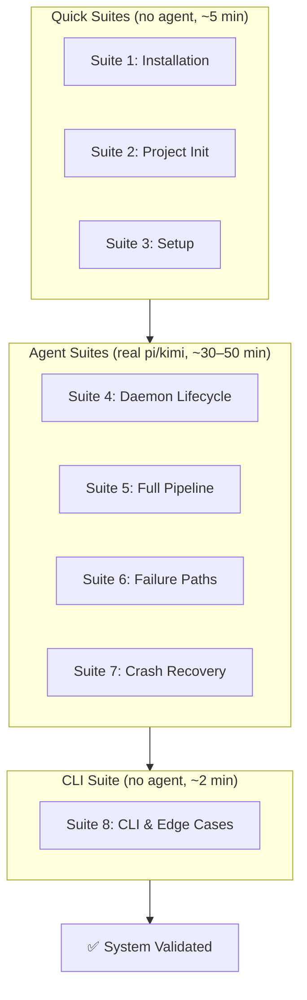
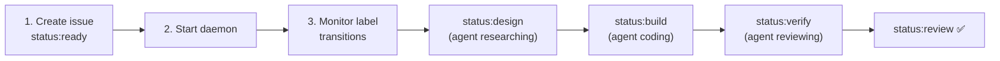
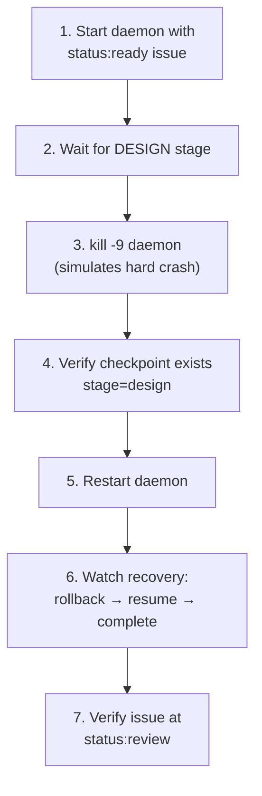

# Ralph v3 — System Validation Test

> Step-by-step test plan for validating a Ralph v3 installation against a **real
> GitHub repo** with a **real AI agent** (pi or kimi). Every test uses actual
> `gh` commands, real issues, and live agent invocations. No mocks, no stubs.
>
> **Total runtime:** ~30–60 minutes (mostly agent time).
> Quick suites (1–3) take <5 minutes. Pipeline tests (5–7) take 5–15 minutes each.

---

## Table of Contents

1. [Before You Start](#before-you-start)
2. [Test Flow Overview](#test-flow-overview)
3. [Suite 1: Installation](#suite-1-installation)
4. [Suite 2: Project Init](#suite-2-project-init)
5. [Suite 3: Setup](#suite-3-setup)
6. [Suite 4: Daemon Lifecycle](#suite-4-daemon-lifecycle)
7. [Suite 5: Full Pipeline](#suite-5-full-pipeline)
8. [Suite 6: Failure Paths](#suite-6-failure-paths)
9. [Suite 7: Crash Recovery](#suite-7-crash-recovery)
10. [Suite 8: CLI & Edge Cases](#suite-8-cli--edge-cases)
11. [Cleanup](#cleanup)
12. [Scorecard](#scorecard)

---

## Before You Start

### What You Need

| Requirement | Check |
|-------------|-------|
| A GitHub account | `gh auth status` |
| A test repo on GitHub | Create `your-username/ralph-system-test` (empty, no README) |
| `pi` or `kimi` installed | `which pi` or `which kimi` |
| Ralph installed | `ralph version` → `ralph v3.0.0` |
| ~30–60 minutes | Agent invocations take time |

### Test Repo Setup

Create the repo and labels **once** before starting:

```bash
# Set your repo name
export TEST_REPO="your-username/ralph-system-test"

# Create the repo on GitHub (empty — no README, no .gitignore)
# Do this in the GitHub web UI or via:
gh repo create "$TEST_REPO" --public --clone

# Create labels Ralph needs
for label in \
    "status:ready:0E8A16" \
    "status:design:1D76DB" \
    "status:build:0052CC" \
    "status:verify:5319E7" \
    "status:review:D4C5F9" \
    "status:blocked:B60205" \
    "type:task:0E8A16"; do
    name="${label%%:*}"
    rest="${label#*:}"
    color="${rest%%:*}"
    gh label create "$name" --color "$color" --repo "$TEST_REPO" 2>/dev/null || true
done

# Verify labels
gh label list --repo "$TEST_REPO" | grep status
```

### Helper: Quick Issue Creator

Add this function to your shell for the test session:

```bash
create_issue() {
    # Usage: create_issue "Title" "Body" [extra-labels]
    local title="$1"
    local body="$2"
    local extra="${3:-}"
    local labels="type:task,status:ready"
    [ -n "$extra" ] && labels="$labels,$extra"
    gh issue create --repo "$TEST_REPO" --title "$title" --body "$body" --label "$labels"
}
```

### Helper: Check Issue Status

```bash
issue_status() {
    # Usage: issue_status <issue-number>
    gh issue view "$1" --repo "$TEST_REPO" \
        --json number,title,labels,state \
        --jq '{number, title, labels: [.labels[].name], state}'
}
```

---

## Test Flow Overview



Run suites in order. Each suite cleans up after itself so the next suite starts
fresh. If a suite fails, fix the issue and re-run that suite before continuing.

---

## Suite 1: Installation

Validates that Ralph is installed and the CLI works. No agent, no repo needed.

**Time:** ~1 minute

---

### T1.1 — `ralph version`

```bash
ralph version
```

| Expected | How to verify |
|----------|---------------|
| `ralph v3.0.0` | Exact match |

---

### T1.2 — `ralph help`

```bash
ralph help
```

| Expected | How to verify |
|----------|---------------|
| Lists `init`, `setup`, `daemon`, `status`, `validate`, `report`, `generate-test-map`, `version`, `help` | Count commands — should be 8+ |
| Shows "Quick start" section with examples | `ralph help \| grep -c "Quick start"` → 1 |

---

### T1.3 — Core files exist

```bash
ls ~/.ralph/core/*.py
```

| Expected | How to verify |
|----------|---------------|
| Lists `engine.py`, `init.py`, `setup.py`, `status.py`, `validate.py`, `report.py`, `generate_test_map.py`, `detect_affected_tests.py` | 8 `.py` files |

---

### T1.4 — Dead-code check

```bash
! grep -r "beads\|dolt\|\.beads" --include="*.py" --include="*.sh" --include="*.md" ~/.ralph/core/ ~/.ralph/bin/ ~/.ralph/scripts/ && echo "PASS" || echo "FAIL"
```

| Expected | How to verify |
|----------|---------------|
| `PASS` | No matches found anywhere |

---

## Suite 2: Project Init

Validates `ralph init` in all modes. No agent needed.

**Time:** ~2 minutes

---

### T2.1 — New project (non-interactive)

```bash
cd /tmp
rm -rf ralph-init-test
ralph init ralph-init-test --yes

# Verify
echo "=== Files created ==="
ls ralph-init-test/.ralph/config.toml && echo "config.toml ✓"
ls ralph-init-test/docs/agent/PROMPT.md && echo "PROMPT.md ✓"
ls ralph-init-test/docs/agent/prompts/design.md && echo "design.md ✓"
ls ralph-init-test/docs/agent/prompts/implement.md && echo "implement.md ✓"
ls ralph-init-test/config/ralph_preflight.sh && echo "preflight.sh ✓"
ls ralph-init-test/AGENTS.md && echo "AGENTS.md ✓"
[ -s ralph-init-test/docs/agent/prompts/design.md ] && echo "design.md non-empty ✓"

echo "=== Config ==="
grep -q "^# project = 1" ralph-init-test/.ralph/config.toml && echo "project sync disabled by default ✓"

echo "=== Git repo ==="
[ -d ralph-init-test/.git ] && echo ".git exists ✓"
cd ralph-init-test && git log --oneline -1
```

| Expected | How to verify |
|----------|---------------|
| 6+ files created | All `ls` checks show ✓ |
| design.md is non-empty (not a stub) | `[ -s ... ]` passes |
| `ticket.project` is commented out in --yes mode | grep shows `# project = 1` |
| Git repo initialized | `.git/` exists |
| One commit: "ralph init" | `git log` shows it |

---

### T2.2 — Init in existing directory

```bash
cd /tmp
rm -rf ralph-existing-test && mkdir ralph-existing-test && cd ralph-existing-test
echo "print('hello')" > app.py
git init && git add -A && git commit -m "initial"
ralph init . --yes 2>&1

# Verify
echo "=== Existing file preserved? ==="
[ -f app.py ] && echo "app.py preserved ✓"
echo "=== New files added? ==="
[ -f .ralph/config.toml ] && echo "ralph files added ✓"
echo "=== Git not re-initialized? ==="
git log --oneline | head -1 | grep "ralph init" || echo "(newest commit is not 'ralph init' — git skipped ✓)"
```

| Expected | How to verify |
|----------|---------------|
| Existing `app.py` untouched | `app.py preserved ✓` |
| Ralph scaffold added alongside existing files | `ralph files added ✓` |
| No duplicate `git init` | Git history has original commit + scaffold files (no new init commit) |

---

### T2.3 — Label creation

```bash
# Use a temp repo to test label creation
TEMP_REPO="your-username/ralph-label-test"
gh repo create "$TEMP_REPO" --public --clone 2>/dev/null || true
cd /tmp && rm -rf ralph-label-test
git clone "https://github.com/$TEMP_REPO.git" ralph-label-test 2>/dev/null
cd ralph-label-test
ralph init . --yes --create-labels 2>&1

# Verify
echo "=== Labels created ==="
gh label list --repo "$TEMP_REPO" | wc -l
gh label list --repo "$TEMP_REPO" | grep "status:"
```

| Expected | How to verify |
|----------|---------------|
| 17+ labels on the repo | `gh label list \| wc -l` ≥ 17 |
| All 6 status labels present | grep shows all 6 |
| Output mentions "labels created" | Log output from ralph init |

---

### T2.4 — GitHub Project board sync config

```bash
cd /tmp
rm -rf ralph-project-sync-test

# Non-interactive: enable sync with a project number
ralph init ralph-project-sync-test --yes --github-project 5

# Verify
if grep -q "^project = 5" ralph-project-sync-test/.ralph/config.toml; then
    echo "ticket.project = 5 written ✓"
else
    echo "FAIL: ticket.project not written"
fi

# Default (--yes without flag) should leave it commented
cd /tmp/ralph-init-test
if grep -q "^# project = 1" .ralph/config.toml; then
    echo "ticket.project commented by default ✓"
else
    echo "FAIL: ticket.project should be commented"
fi
```

| Expected | How to verify |
|----------|---------------|
| `--github-project 5` writes `project = 5` | grep finds uncommented line |
| Default `--yes` leaves `project` commented | grep finds `# project = 1` |

---

### T2.5 — Prompt stubs all populated

```bash
cd /tmp/ralph-init-test
for f in docs/agent/prompts/{design,test,implement,verify}.md; do
    if [ -s "$f" ]; then
        echo "  ✓  $f ($(wc -c < "$f" | tr -d ' ') bytes)"
    else
        echo "  ✗  $f is EMPTY"
    fi
done
```

| Expected | How to verify |
|----------|---------------|
| All 4 stage prompt files non-empty | All show ✓ with byte counts > 0 |

---

## Suite 3: Setup

Validates `ralph setup` against the real test repo.

**Time:** ~1 minute

---

### T3.1 — Setup passes against real repo

```bash
cd /tmp
rm -rf ralph-setup-test
git clone "https://github.com/$TEST_REPO.git" ralph-setup-test
cd ralph-setup-test
ralph init . --yes 2>&1
git add -A && git commit -m "ralph init" && git push
ralph setup
```

| Expected | How to verify |
|----------|---------------|
| All 7 checks show ✓ | Count ✓ symbols — should be 7 |
| Exit code 0 | `echo $?` → 0 |
| "Setup complete!" shown | Final line of output |

---

### T3.2 — Setup detects missing labels

```bash
# Create a temp repo WITHOUT Ralph labels
TEMP_REPO="your-username/ralph-no-label-test"
gh repo create "$TEMP_REPO" --public 2>/dev/null || true
cd /tmp && rm -rf ralph-no-label-test
git clone "https://github.com/$TEMP_REPO.git" ralph-no-label-test 2>/dev/null
cd ralph-no-label-test
ralph init . --yes 2>&1

# setup should catch missing labels
ralph setup 2>&1
echo "Exit code: $?"
```

| Expected | How to verify |
|----------|---------------|
| Setup reports missing labels | Output contains "missing:" with label names |
| Setup shows remediation hint | Output contains "ralph init --create-labels" |
| Exit code 1 | `echo $?` → 1 |

---

## Suite 4: Daemon Lifecycle

Validates daemon startup, PID singleton, graceful shutdown, and idle behavior
with a real agent. No issues processed — just lifecycle.

**Time:** ~2 minutes

---

### T4.1 — PID singleton

```bash
cd /tmp/ralph-setup-test   # from T3.1
rm -f /tmp/ralph_daemon_*.pid

# Start daemon in background
ralph daemon &
DAEMON1=$!
sleep 3

# Try starting a second daemon
ralph daemon 2>&1
EXIT=$?
echo "Second daemon exit code: $EXIT"

# Kill first daemon
kill $DAEMON1 2>/dev/null
wait $DAEMON1 2>/dev/null
rm -f /tmp/ralph_daemon_*.pid
```

| Expected | How to verify |
|----------|---------------|
| Second daemon exits with code 1 | `$EXIT` = 1 |
| "Daemon already running" message | Output contains "already running" |

---

### T4.2 — Idle on empty queue

```bash
cd /tmp/ralph-setup-test
rm -f /tmp/ralph_daemon_*.pid

# Ensure no ready issues
gh issue list --repo "$TEST_REPO" --label "status:ready" --json number

# Start daemon, let it idle, then stop
ralph daemon > /tmp/ralph-idle.log 2>&1 &
DAEMON=$!
sleep 8

# Check it idled
grep -c "No ready tickets" /tmp/ralph-idle.log

# Graceful shutdown
kill $DAEMON
wait $DAEMON 2>/dev/null
rm -f /tmp/ralph_daemon_*.pid

echo "=== Daemon log ==="
cat /tmp/ralph-idle.log
```

| Expected | How to verify |
|----------|---------------|
| "Daemon started" in log | grep shows 1 |
| "No ready tickets" appears at least once | grep count ≥ 1 |
| Graceful shutdown on SIGTERM | No "Error" or "exception" in log |
| "Daemon stopped" in log | grep shows it |

---

## Suite 5: Full Pipeline

The core test — creates a real issue and watches it flow through the entire
3-stage pipeline with a real AI agent.

**Time:** ~5–15 minutes (agent-dependent)

---

### T5.1 — Issue through full pipeline



**Step 1: Create a simple test issue**

```bash
cd /tmp/ralph-setup-test
git pull origin master 2>/dev/null || git pull origin main 2>/dev/null || true
rm -f /tmp/ralph_daemon_*.pid

# Ensure src/ package exists so agent can work with it
mkdir -p src/my_project
touch src/my_project/__init__.py
git add -A && git commit -m "prepare for test" && git push

# Create a simple, well-scoped issue any agent can complete
create_issue \
    "Add get_timestamp() utility" \
    "Add a timestamp utility to the project.

### Description
Create src/my_project/timestamp.py with a get_timestamp() function
that returns the current UTC time as an ISO 8601 string.

### Acceptance Criteria
- [ ] src/my_project/timestamp.py exists with a get_timestamp() function
- [ ] get_timestamp() returns a string in ISO 8601 format (e.g., '2026-06-14T12:00:00Z')
- [ ] A unit test exists that verifies the function returns a valid ISO 8601 string"
```

**Step 2: Get the issue number**

```bash
ISSUE_NUM=$(gh issue list --repo "$TEST_REPO" --label "status:ready" --json number --jq '.[0].number')
echo "Test issue: #$ISSUE_NUM"
echo "Watch on GitHub: https://github.com/$TEST_REPO/issues/$ISSUE_NUM"
```

**Step 3: Start daemon and monitor**

```bash
# Start daemon (foreground — open a second terminal to monitor)
ralph daemon 2>&1 | tee /tmp/ralph-pipeline.log &
DAEMON=$!
echo "Daemon PID: $DAEMON"
```

**Step 4: Monitor progress** (run in a separate terminal or periodically)

```bash
# Check label transitions every 15 seconds
while true; do
    LABELS=$(gh issue view "$ISSUE_NUM" --repo "$TEST_REPO" --json labels --jq '[.labels[].name] | join(", ")')
    echo "$(date +%H:%M:%S)  #$ISSUE_NUM  [$LABELS]"
    if echo "$LABELS" | grep -q "status:review\|status:blocked"; then
        echo "Pipeline complete!"
        break
    fi
    sleep 15
done
```

**Step 5: Verify results**

```bash
# 1. Final issue status
issue_status "$ISSUE_NUM"

# 2. The file was created
echo "=== Created files ==="
ls -la src/my_project/timestamp.py 2>/dev/null && echo "timestamp.py exists ✓"
cat src/my_project/timestamp.py

# 3. Tests exist and pass
echo "=== Running tests ==="
python3 -m pytest tests/ -v 2>&1 | tail -20

# 4. Git log shows stage commits
echo "=== Git log ==="
git log --oneline -5

# 5. Remote has the stage commits
echo "=== Remote log ==="
git fetch origin
git log --oneline origin/$(git rev-parse --abbrev-ref HEAD) -5

# 6. Checkpoint cleared
[ ! -f .ralph/checkpoint.json ] && echo "Checkpoint cleared ✓" || echo "Checkpoint STILL EXISTS ✗"

# 7. Pipeline metrics logged
echo "=== Recent metrics ==="
tail -5 logs/ralph_metrics.jsonl 2>/dev/null

# 8. Stop daemon
kill $DAEMON 2>/dev/null
wait $DAEMON 2>/dev/null
rm -f /tmp/ralph_daemon_*.pid
```

| Expected | How to verify |
|----------|---------------|
| Final label: `status:review` | `issue_status` shows it |
| `src/my_project/timestamp.py` exists | File found with content |
| `get_timestamp()` returns ISO 8601 string | Inspect file or run `python3 -c "from src.my_project.timestamp import get_timestamp; print(get_timestamp())"` |
| Tests pass | pytest exit code 0 |
| Git log has `[ralph] design:` and `[ralph] build:` commits | Two stage commits visible |
| Remote branch has `[ralph] design:` and `[ralph] build:` commits | `git log origin/<branch>` shows them |
| Checkpoint is cleared | File does not exist |
| Metrics show pipeline events | At least 3 events in metrics |

---

### T5.2 — Label transition audit

```bash
cd /tmp/ralph-setup-test

# Check the exact label history from the daemon log
echo "=== Label transitions in log ==="
grep "labels:" /tmp/ralph-pipeline.log
```

| Expected | How to verify |
|----------|---------------|
| `+status:design / -status:ready` | Claim step |
| `+status:build / -status:design` | After DESIGN |
| `+status:verify / -status:build` | After BUILD |
| `+status:review / -status:verify` | Final handoff |

---

## Suite 6: Failure Paths

Tests what happens when the agent encounters problems.

**Time:** ~5–15 minutes

---

### T6.1 — DESIGN failure → blocked

```bash
cd /tmp/ralph-setup-test
git pull origin master 2>/dev/null || git pull origin main 2>/dev/null || true
rm -f /tmp/ralph_daemon_*.pid

# Create an issue that's intentionally underspecified — the agent may struggle
create_issue \
    "Implement a quantum-resistant Byzantine fault tolerance consensus algorithm" \
    "Implement it. No further details.

### Acceptance Criteria
- [ ] It works"

ISSUE_NUM=$(gh issue list --repo "$TEST_REPO" --search "quantum-resistant" --json number --jq '.[0].number')
echo "Test issue: #$ISSUE_NUM"
```

**Start and monitor:**

```bash
ralph daemon 2>&1 | tee /tmp/ralph-fail.log &
DAEMON=$!

# Monitor — this should eventually mark blocked
while true; do
    LABELS=$(gh issue view "$ISSUE_NUM" --repo "$TEST_REPO" --json labels --jq '[.labels[].name] | join(", ")')
    echo "$(date +%H:%M:%S)  #$ISSUE_NUM  [$LABELS]"
    if echo "$LABELS" | grep -q "status:blocked\|status:review"; then
        echo "Pipeline finished: $LABELS"
        break
    fi
    sleep 15
done

# Verify
issue_status "$ISSUE_NUM"

kill $DAEMON 2>/dev/null
wait $DAEMON 2>/dev/null
rm -f /tmp/ralph_daemon_*.pid
```

| Expected | How to verify |
|----------|---------------|
| Issue marked `status:blocked` OR `status:review` | Either is valid (agent may handle it or fail) |
| If blocked: checkpoint is cleared | `.ralph/checkpoint.json` does not exist |
| Daemon continues to next cycle | Log shows "No ready tickets" or picks next issue |

> **Note:** The agent may actually complete this task (agents are surprisingly
> capable). Either outcome is valid — `status:review` means it handled it,
> `status:blocked` means it gave up. Both paths are correct pipeline behavior.

---

## Suite 7: Crash Recovery

Tests checkpoint save, rollback, and resume after a hard crash.

**Time:** ~5–10 minutes

---

### T7.1 — Crash during pipeline and resume



**Step 1: Create a test issue**

```bash
cd /tmp/ralph-setup-test
git pull origin master 2>/dev/null || git pull origin main 2>/dev/null || true
rm -f /tmp/ralph_daemon_*.pid

create_issue \
    "Add a project_info() function" \
    "Add src/my_project/info.py with a project_info() function
that returns a dict with keys: name, version.

### Acceptance Criteria
- [ ] src/my_project/info.py exists with project_info()
- [ ] project_info() returns {'name': 'ralph-system-test', 'version': '0.1.0'}
- [ ] A unit test verifies the return value"

ISSUE_NUM=$(gh issue list --repo "$TEST_REPO" --search "project_info" --json number --jq '.[0].number')
echo "Test issue: #$ISSUE_NUM"
```

**Step 2: Start daemon and watch for DESIGN stage**

```bash
ralph daemon 2>&1 | tee /tmp/ralph-crash.log &
DAEMON=$!

# Wait until DESIGN stage is entered (label changes to status:design)
for i in $(seq 1 60); do
    LABELS=$(gh issue view "$ISSUE_NUM" --repo "$TEST_REPO" --json labels --jq '[.labels[].name] | join(",")')
    if echo "$LABELS" | grep -q "status:design"; then
        echo "[$i] DESIGN stage detected — crashing daemon now"
        break
    fi
    sleep 2
done
```

**Step 3: Hard crash (kill -9)**

```bash
echo "Killing daemon (SIGKILL)..."
kill -9 $DAEMON
wait $DAEMON 2>/dev/null

# Check checkpoint exists
echo "=== Checkpoint ==="
cat .ralph/checkpoint.json 2>/dev/null || echo "NO CHECKPOINT — FAIL"
```

**Step 4: Resume**

```bash
# Give any orphan processes time to die
sleep 10
rm -f /tmp/ralph_daemon_*.pid

echo "=== Restarting daemon — should recover ==="
ralph daemon 2>&1 | tee /tmp/ralph-resume.log &
DAEMON=$!

# Monitor recovery
for i in $(seq 1 120); do
    LABELS=$(gh issue view "$ISSUE_NUM" --repo "$TEST_REPO" --json labels --jq '[.labels[].name] | join(",")')
    echo "[$i] #$ISSUE_NUM [$LABELS]"
    if echo "$LABELS" | grep -q "status:review\|status:blocked"; then
        echo "Pipeline complete after recovery!"
        break
    fi
    sleep 5
done
```

**Step 5: Verify recovery**

```bash
echo "=== Recovery log (key lines) ==="
grep -E "Found checkpoint|Rolling back|Resuming|pipeline_complete" /tmp/ralph-resume.log

echo "=== Final issue status ==="
issue_status "$ISSUE_NUM"

echo "=== Checkpoint after recovery ==="
[ ! -f .ralph/checkpoint.json ] && echo "Cleared ✓" || echo "STILL EXISTS ✗"

echo "=== Code was produced ==="
ls -la src/my_project/info.py 2>/dev/null && echo "info.py exists ✓"

# Verify function works
cd /tmp/ralph-setup-test
python3 -c "
import sys; sys.path.insert(0, 'src')
from my_project.info import project_info
result = project_info()
print('project_info():', result)
assert result['name'] == 'ralph-system-test'
assert result['version'] == '0.1.0'
print('Values correct ✓')
"

kill $DAEMON 2>/dev/null
wait $DAEMON 2>/dev/null
rm -f /tmp/ralph_daemon_*.pid
```

| Expected | How to verify |
|----------|---------------|
| Checkpoint exists after SIGKILL | JSON file with `stage: "design"` |
| Recovery log shows "Found checkpoint" | grep matches |
| Recovery log shows "Rolling back to commit" | grep matches |
| Pipeline completes after recovery | Issue at `status:review` |
| Checkpoint cleared after success | File does not exist |
| Code produced is correct | `project_info()` returns expected dict |

---

## Suite 8: CLI & Edge Cases

Quick tests for CLI commands and edge-case behavior. No agent needed.

**Time:** ~2 minutes

---

### T8.1 — Dependency check

```bash
cd /tmp/ralph-setup-test
rm -f /tmp/ralph_daemon_*.pid

# Create a blocker issue (not ready — leave it open)
gh issue create --repo "$TEST_REPO" \
    --title "Blocker task" \
    --body "This is a dependency." \
    --label "type:task"

BLOCKER_NUM=$(gh issue list --repo "$TEST_REPO" --search "Blocker task" --json number --jq '.[0].number')

# Create a dependent issue
create_issue \
    "Task that depends on blocker" \
    "Depends on: #${BLOCKER_NUM}

This task cannot be processed until the blocker is closed."

# Start daemon briefly and check behavior
ralph daemon > /tmp/ralph-deps.log 2>&1 &
DAEMON=$!
sleep 8

echo "=== Dependency handling ==="
grep -i "skipping\|depends\|unmet" /tmp/ralph-deps.log

kill $DAEMON 2>/dev/null
wait $DAEMON 2>/dev/null
rm -f /tmp/ralph_daemon_*.pid
```

| Expected | How to verify |
|----------|---------------|
| "Skipping" message for the dependent issue | grep finds it |
| Daemon does not process the dependent issue | Issue stays `status:ready` |

---

### T8.2 — `ralph status`

```bash
cd /tmp/ralph-setup-test
ralph status
```

| Expected | How to verify |
|----------|---------------|
| Command exits 0 | `echo $?` → 0 |
| Shows project path | Output contains current directory |
| Shows daemon info or "not running" | Output has daemon section |

---

### T8.3 — `ralph report`

```bash
cd /tmp/ralph-setup-test
ralph report
```

| Expected | How to verify |
|----------|---------------|
| Command exits 0 | `echo $?` → 0 |
| Shows pipeline event summary | Output has event counts or date range |
| Reads from `logs/ralph_metrics.jsonl` | Report is not empty |

---

### T8.4 — `ralph generate-test-map`

```bash
cd /tmp/ralph-setup-test
cp config/TEST_MAP.yaml config/TEST_MAP.yaml.bak
ralph generate-test-map
echo "=== Generated mappings ==="
cat config/TEST_MAP.yaml
# Restore original if needed
# mv config/TEST_MAP.yaml.bak config/TEST_MAP.yaml
```

| Expected | How to verify |
|----------|---------------|
| TEST_MAP.yaml updated with source→test mappings | YAML has `mappings:` section with entries |
| Existing mappings preserved | Original content not lost |

---

### T8.5 — `ralph validate`

```bash
cd /tmp/ralph-setup-test
ralph validate --tier=targeted
```

| Expected | How to verify |
|----------|---------------|
| Command runs and exits | Either passes or fails with clear output |
| Shows test tier | Output contains "targeted" |
| Shows validation gate steps | Output has pytest/lint sections |

---

## Cleanup

After all tests pass, clean up:

```bash
# Close all test issues
gh issue list --repo "$TEST_REPO" --state open --json number --jq '.[].number' | while read n; do
    gh issue close "$n" --repo "$TEST_REPO" --reason completed
done

# Remove temp test repos (optional)
gh repo delete "your-username/ralph-label-test" --yes 2>/dev/null
gh repo delete "your-username/ralph-no-label-test" --yes 2>/dev/null

# Keep "$TEST_REPO" for future validation runs

# Clean local temp dirs
rm -rf /tmp/ralph-init-test /tmp/ralph-existing-test /tmp/ralph-label-test /tmp/ralph-no-label-test /tmp/ralph-project-sync-test /tmp/ralph-setup-test
```

---

## Scorecard

Copy and fill this as you run the tests:

```
Ralph v3 — System Validation Scorecard
─────────────────────────────────────
Date: _______________
Agent: pi / kimi
Repo: _________________________________

Suite 1: Installation
  [ ] T1.1  ralph version        ________
  [ ] T1.2  ralph help           ________
  [ ] T1.3  Core files exist     ________
  [ ] T1.4  Dead-code clean      ________

Suite 2: Project Init
  [ ] T2.1  New project          ________
  [ ] T2.2  Existing directory   ________
  [ ] T2.3  Label creation       ________
  [ ] T2.4  Project sync config  ________
  [ ] T2.5  Prompt stubs         ________

Suite 3: Setup
  [ ] T3.1  Setup passes         ________
  [ ] T3.2  Missing labels       ________

Suite 4: Daemon Lifecycle
  [ ] T4.1  PID singleton        ________
  [ ] T4.2  Idle on empty        ________

Suite 5: Full Pipeline  (~10 min)
  [ ] T5.1  Full E2E             ________
  [ ] T5.2  Label audit          ________

Suite 6: Failure Paths  (~5 min)
  [ ] T6.1  Failure → blocked    ________

Suite 7: Crash Recovery  (~10 min)
  [ ] T7.1  Crash + resume       ________

Suite 8: CLI & Edge Cases
  [ ] T8.1  Dependency check     ________
  [ ] T8.2  ralph status         ________
  [ ] T8.3  ralph report         ________
  [ ] T8.4  generate-test-map    ________
  [ ] T8.5  ralph validate       ________

─────────────────────────────────────
TOTAL:  ___ / 22  passed
─────────────────────────────────────
```

---

*Run after installation and after any significant code change. The full suite
takes ~30–60 minutes. Suites 1–4 + 8 are quick (<10 min) and can be run
frequently. Suites 5–7 are the deep validation — run after major changes.*
