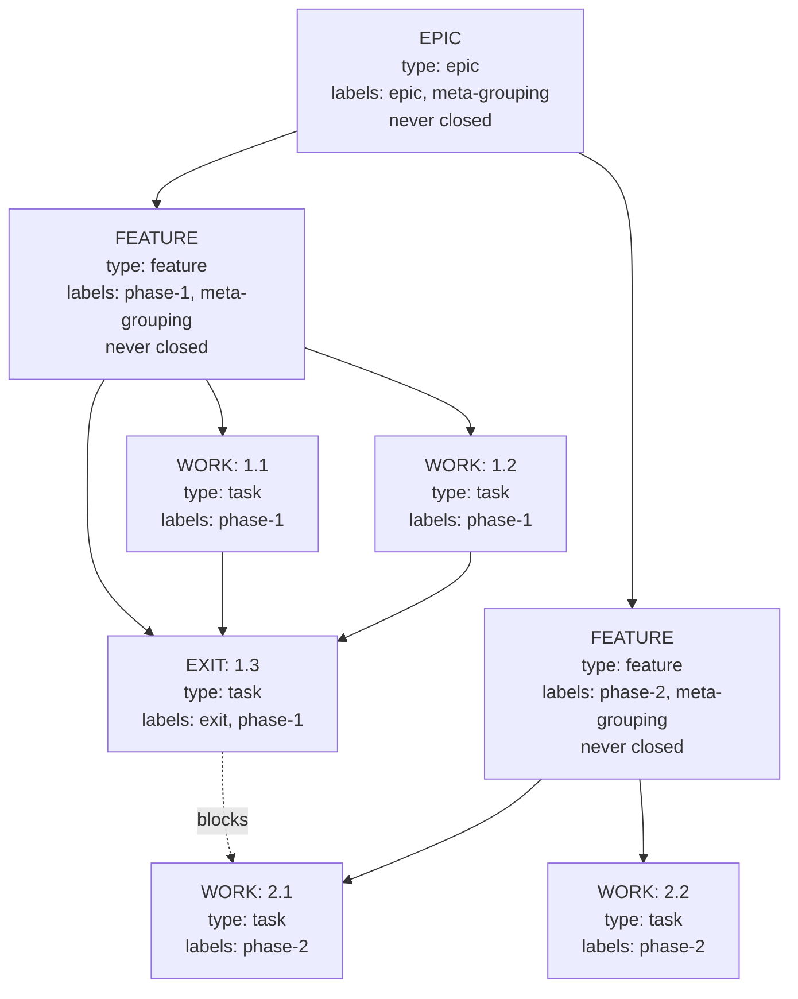
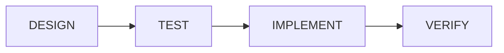

# Ticket Management — Working with Beads

> How to name, structure, and manage tickets in beads for Ralph to consume.

---

## Ticket Naming Convention

Ralph's deterministic sorter reads ticket IDs to order work. Follow this format:

```
<project-slug>.<feature-number>.<task-number>
```

### Examples

| ID | Meaning | Sort Order |
|----|---------|------------|
| `mybot.1.1` | Feature 1, Task 1 | First |
| `mybot.1.2` | Feature 1, Task 2 | Second |
| `mybot.1.3` | Feature 1, Task 3 (EXIT) | Third — blocks next feature |
| `mybot.2.1` | Feature 2, Task 1 | Fourth |
| `mybot.2.2` | Feature 2, Task 2 | Fifth |

### Rules

- Feature numbers must be integers: `phase-1`, `phase-2`, etc. Ralph parses `.<N>.` from the ID.
- Task numbers must be integers, sequential within a feature.
- Non-numeric suffixes break sorting — don't use `phase-1a` or `task-1b`.
- Lower numbers are built first.

---

## Ticket Hierarchy



### Label Rules

| Ticket Type | Allowed Labels | Example |
|-------------|---------------|---------|
| **EPIC** | `epic`, `meta-grouping` + optional `phase-N` | `epic,meta-grouping` |
| **FEATURE** | `<phase-tag>`, `meta-grouping` | `phase-1,meta-grouping` |
| **WORK** (task, bug, test, docs) | `<phase-tag>` only | `phase-1` |
| **EXIT** | `exit`, `<phase-tag>` | `exit,phase-1` |

### Dependency Rules

1. **FEATUREs are containers** — they must not carry blocking dependencies.
2. **Phase gating** — a phase's first work ticket depends on the previous phase's EXIT ticket only.
3. **EXIT tickets** depend on all their phase's work tickets.
4. **Work tickets** must have exactly one label (`<phase-tag>`). EXIT tickets are the exception: `exit, <phase-tag>`.
5. **No redundant transitive dependencies** — if A→B and B→C, don't add A→C.
6. **No cross-phase skip links** — a phase-3 ticket must not directly depend on a phase-1 ticket.

---

## Beads Commands

### Creating Tickets

```bash
# Epic — container, never closed
bd new "My Project v1" --type epic --labels "epic,meta-grouping"

# Feature — container, never closed
bd new "Phase 1: Core Engine" --type feature --labels "phase-1,meta-grouping"

# Task — work item
bd new "P1: Implement data model" --type task --labels "phase-1"

# Bug fix
bd new "Fix null pointer in parser" --type bug --labels "phase-1"

# Exit ticket — last ticket in the phase
bd new "[EXIT] P1: Integration tests" --type task --labels "exit,phase-1"
```

### Dependencies

```bash
bd dep add <child-id> <parent-id>    # add dependency
bd dep tree <id>                      # view dependency tree
bd dep list <id> --json              # list dependencies as JSON
```

### Viewing the Queue

```bash
bd list                    # all tickets
bd ready                   # only unblocked tickets
bd ready --label phase-1   # filtered by label
bd ready --json            # as JSON (what Ralph calls)
```

### Updating Status

```bash
bd update <id> --claim                                    # claim a ticket
bd update <id> --status in_progress                       # mark in progress
bd update <id> --status blocked --notes="Waiting for API" # mark blocked
bd update <id> --status closed --notes="All tests pass"   # close completed
bd update <id> --status open                              # re-open
```

### Remembering Context

```bash
bd remember checkpoint "Last completed: phase-1 exit ticket"
bd recall checkpoint
```

---

## Monitoring Progress

### Check What's in the Queue

```bash
bd list

# Count by status
bd list --json | python3 -c "
import json, sys
from collections import Counter
tickets = json.load(sys.stdin)
statuses = Counter(t.get('status','unknown') for t in tickets)
for s, c in sorted(statuses.items()):
    print(f'{s:12s}: {c}')
"
```

### Check a Specific Ticket

```bash
bd show <id>                          # full details
bd show <id> --json | python3 -m json.tool   # as JSON
```

---

## Common Patterns

### Sequential Build Phase

```
phase-1, meta-grouping (FEATURE)     ← container
├── phase-1 (TASK) mybot.1.1         ← first task, no deps
├── phase-1 (TASK) mybot.1.2         ← depends on 1.1
├── phase-1 (TASK) mybot.1.3         ← depends on 1.2
└── exit, phase-1 (TASK) mybot.1.4   ← EXIT: depends on 1.1, 1.2, 1.3
                                       blocks mybot.2.1
```

### Parallel Work Within a Phase

```
phase-1, meta-grouping (FEATURE)
├── phase-1 (TASK) mybot.1.1         ← no deps (parallel with 1.2)
├── phase-1 (TASK) mybot.1.2         ← no deps (parallel with 1.1)
├── phase-1 (TASK) mybot.1.3         ← depends on 1.1 AND 1.2
└── exit, phase-1 (TASK) mybot.1.4   ← EXIT: depends on 1.3
```

### Bug Fix Sprint

```
bugfix-sprint, meta-grouping (FEATURE)
├── bugfix-sprint (BUG) mybot.bug.1
├── bugfix-sprint (BUG) mybot.bug.2
├── bugfix-sprint (BUG) mybot.bug.3
└── exit, bugfix-sprint (TASK) mybot.bug.4   ← EXIT: all bugs + regression tests
```

### Creating a New Phase

```bash
# 1. Create the feature container
bd new "Phase 2: API Layer" --type feature --labels "phase-2,meta-grouping"

# 2. Create tasks
bd new "P2: Implement REST endpoints" --type task --labels "phase-2"
bd new "P2: Add request validation" --type task --labels "phase-2"
bd new "[EXIT] P2: API integration tests" --type task --labels "exit,phase-2"

# 3. Phase gating — P2.1 depends on P1's EXIT ticket
bd dep add <p2-task1-id> <p1-exit-id>

# 4. EXIT dependencies
bd dep add <p2-exit-id> <p2-task1-id>
bd dep add <p2-exit-id> <p2-task2-id>
```

---

## Pipeline Workflow Per Ticket

Each ticket goes through 4 independent sessions:



| Stage | Command | Beads Status | Git |
|-------|---------|-------------|-----|
| **DESIGN** | `ralph design --ticket=<id>` | `in_progress` | Design notes in PROGRESS.md |
| **TEST** | `ralph test --ticket=<id>` | `in_progress` | Test files added — should FAIL |
| **IMPLEMENT** | `ralph implement --ticket=<id>` | `in_progress` | Code committed, all tests pass |
| **VERIFY** | `ralph verify --ticket=<id>` | `closed` or `open` | Final commit and push |

---

## Ticket Sizing Guidelines

**Keep tickets small.** Each should be completable in a single agent iteration (5–30 minutes).

If a ticket is too large:
- The agent will run out of context or steps
- Validation will likely fail
- The checkpoint will persist and the ticket will cycle

If a ticket cycles repeatedly, break it into two smaller tickets.

---

## Troubleshooting

### Tickets Are Being Skipped

Check the loop log:
```
[RALPH] Task proj.1.1 skipped — BLOCKED: some_reason
```

Common reasons:
- Ticket has `meta-grouping` label — epics and features are containers, skipped by default
- Ticket type is `epic` or `feature`
- A custom guardrail rule in `config/ralph_preflight.sh` is blocking it

### Wrong Build Order

Ralph sorts by feature number, then task number. Verify your ticket IDs follow the `<slug>.<feature>.<task>` convention with integer values.
