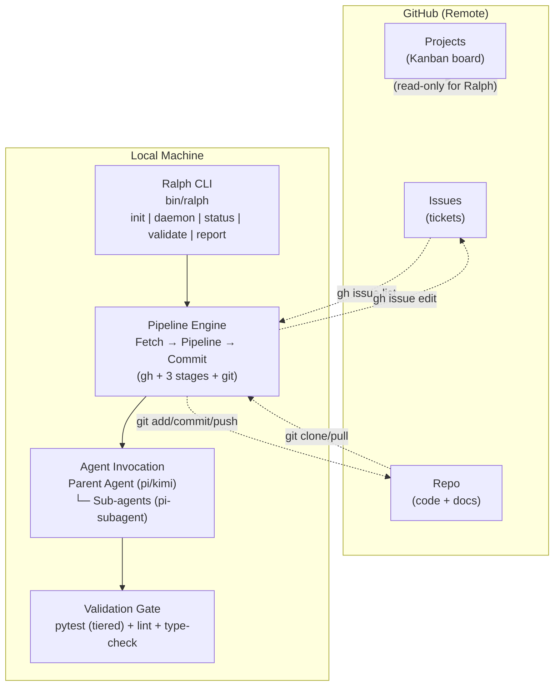
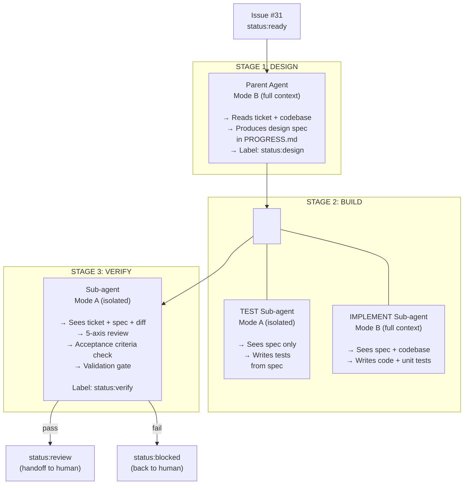
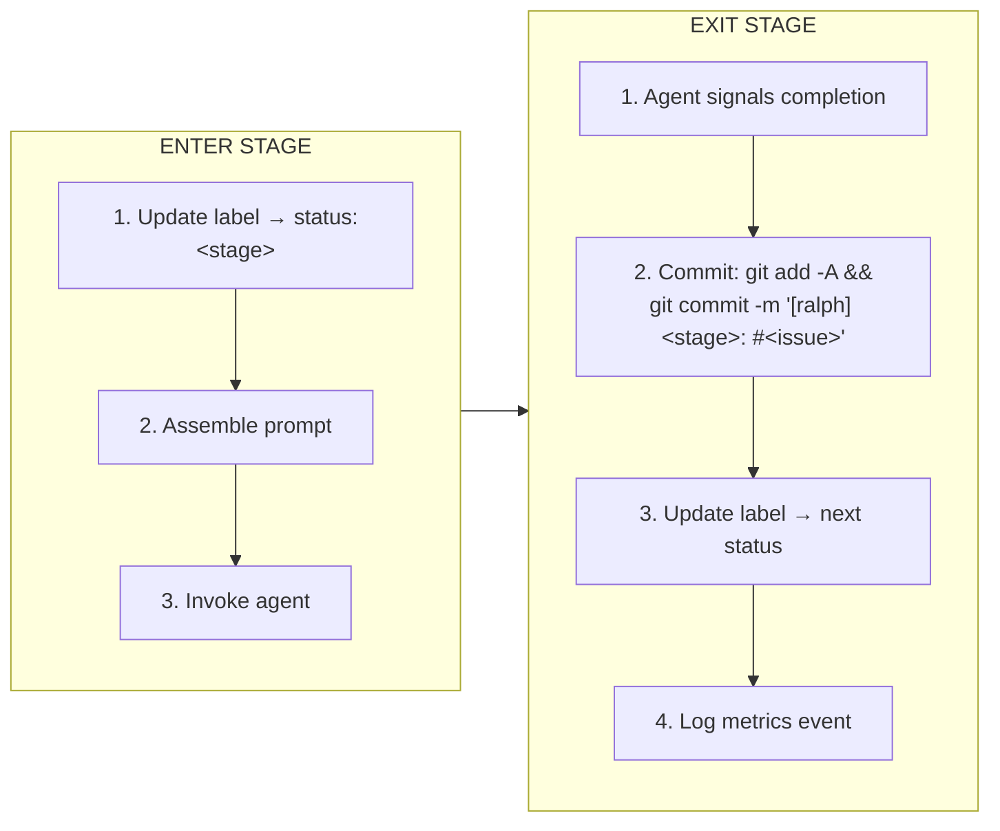
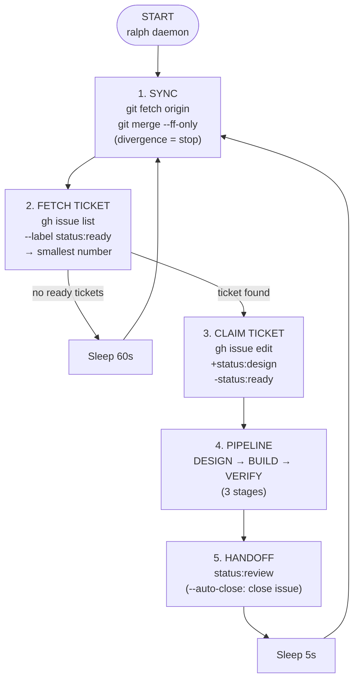
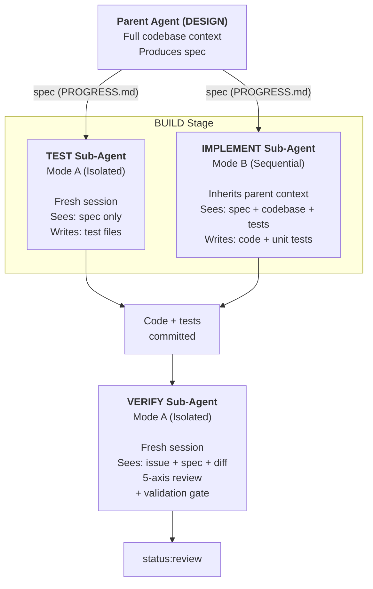
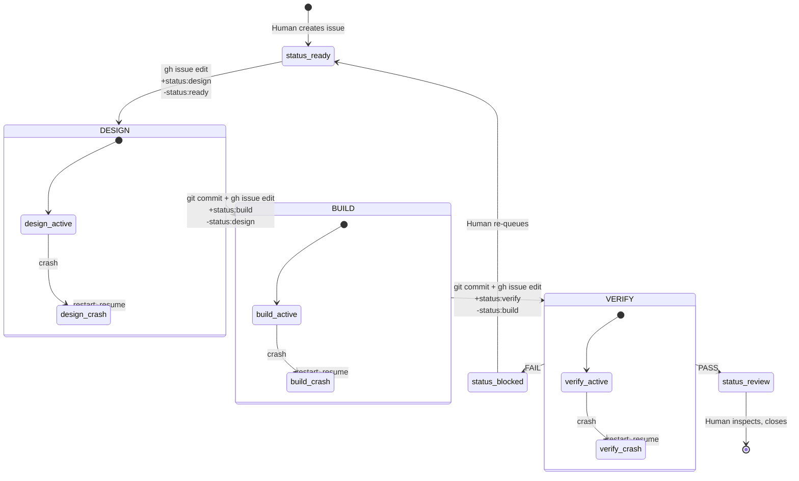

# Ralph v3 — Product Requirements Document

> Phase 1 ✅ | Phase 2 ✅ | Phase 3 ✅
> Working draft. Defines the revamped system. Updated as phases complete.

---

## 0. Prerequisites

### 0.1 Required Tools (Per Machine)

Every machine that runs Ralph needs these installed:

| Tool | Version | Install | Purpose |
|------|---------|---------|---------|
| **git** | 2.30+ | `brew install git` / `apt install git` / built-in on macOS | Version control, clone, push, pull |
| **gh** (GitHub CLI) | 2.0+ | `brew install gh` / `apt install gh` / `winget install gh` | Issue read/write, label management |
| **python3** | 3.10+ | `brew install python` / `apt install python3` | Core orchestrator language. All Ralph engine code is Python. |
| **pi** or **kimi** | latest | `npm install -g pi-coding-agent` or `npm install -g kimi-cli` | AI agent for code generation |
| **pi-subagent** (pi extension) | latest | `pi extension install @mjakl/pi-subagent` | Sub-agent support for Mode A/B isolation (Phase 3) |

**Implementation language:** All Ralph v3 engine code is **Python 3.10+**. No bash beyond the CLI entry point (`bin/ralph`) and the install script. The v2 mistake of 1000+ lines of bash is not repeated.

### 0.2 GitHub CLI Authentication (One-Time Per Machine)

```bash
# Must be authenticated to read/write issues
ga auth login

# Verify
ga auth status
gh issue list --repo samdharma/my-project --limit 1  # smoke test
```

### 0.3 Ralph Global Install (One-Time Per Machine)

```bash
git clone https://github.com/samdharma/Ralph_loop.git ~/.ralph
cd ~/.ralph && git checkout ralph-v3
bash ~/.ralph/scripts/install.sh
source ~/.zshrc   # or ~/.bashrc
ralph version     # verify: ralph v3.0.0
```

---

### 0.4 GitHub Project Setup (Per Project)

Before Ralph can build a project, the GitHub repo must have:

### Labels

Create these labels in the repo (one-time, or automatable via `ralph init`):

```bash
# Type labels
ga label create "type:task" --color 0E8A16 --repo owner/repo
ga label create "type:bug" --color D73A4A --repo owner/repo
ga label create "type:feature" --color 0075CA --repo owner/repo
ga label create "type:epic" --color 3F2D7E --repo owner/repo
ga label create "type:exit" --color FBCA04 --repo owner/repo

# Status labels (Ralph manages these)
ga label create "status:ready" --color 0E8A16 --repo owner/repo
ga label create "status:design" --color 1D76DB --repo owner/repo
ga label create "status:build" --color 0052CC --repo owner/repo
ga label create "status:verify" --color 5319E7 --repo owner/repo
ga label create "status:review" --color D4C5F9 --repo owner/repo
ga label create "status:blocked" --color B60205 --repo owner/repo

# Phase labels
ga label create "phase:1" --color F9D0C4 --repo owner/repo
ga label create "phase:2" --color FEF2C0 --repo owner/repo
ga label create "phase:3" --color C2E0C6 --repo owner/repo

# Optional priority labels
ga label create "priority:1" --color D93F0B --repo owner/repo
ga label create "priority:2" --color E99695 --repo owner/repo
ga label create "priority:3" --color F9D0C4 --repo owner/repo
```

### Kanban Board (GitHub Projects)

Create a GitHub Project with the **Kanban** template. Columns map to status labels:

| Column | Maps To Label |
|--------|---------------|
| **Backlog** | No `status:*` label (or `type:epic`, `type:feature`) |
| **Ready** | `status:ready` |
| **In Design** | `status:design` |
| **In Build** | `status:build` |
| **In Verify** | `status:verify` |
| **Review** | `status:review` |
| **Blocked** | `status:blocked` |
| **Done** | Closed |

Ralph moves issues between columns automatically by updating labels. The human watches the board — no CLI tailing.

### Issue Template (Optional)

A GitHub Issue template to encourage consistent ticket formatting for Ralph:

```markdown
### Description
<!-- What needs to be built or fixed -->

### Acceptance Criteria
<!-- Checkboxes that must all be ticked for the issue to be done -->
- [ ] Criterion 1
- [ ] Criterion 2

### Reference Docs
<!-- Optional: BUILD_<feature>.md files to include in agent context -->
Reference: docs/reference/BUILD_order_book.md

### Dependencies
<!-- Optional: other issues this depends on -->
Depends on: #42
```

### Cloning a Ralph Project on a New Machine

```bash
git clone https://github.com/owner/repo.git
cd repo
ralph setup          # checks gh auth, git remote, creates local dirs
ralph daemon         # start building
```

No `bd init`. No `dolt pull`. No local database. Just git clone + ralph setup.

---

## 1. Context & Rationale

### What Went Wrong With v2

Ralph v2 was a "decoupling" effort that produced more coupling:

| Problem | Details |
|---------|---------|
| **Two overlapping engines** | `ralph_loop.sh` (all-in-one loop) and `ralph_build.sh` (orchestrator) share ~70% of their logic — arg parsing, beads interaction, prompt assembly, agent invocation — but are separate 500-line bash scripts. `build.sh` just calls `loop.sh --session=X` in a for-loop. |
| **Bash spaghetti** | State management via `python3 -c "import json..."` one-liners. Checkpoint/resume duplicated but incompatible between the two engines. Two different completion signals (`RALPH_ITERATION_COMPLETE` vs `RALPH_SESSION_COMPLETE`). |
| **Beads is heavy** | Requires `dolt` database. `bd` upgrades break worktrees. Sqlite vs JSONL syncing issues with older reports. Cannot install `bd` on all target machines. Beads is the deepest coupling surface in the entire system. |
| **Zero observability** | The 4-stage pipeline runs silently. You don't know which stage a ticket is in without tailing logs. Status is buried in JSON state files. |
| **16 CLI subcommands, 2 real engines** | The CLI is a facade. `design`, `test`, `implement`, `verify`, `loop`, `daemon`, `build` — all route to the same two scripts with flag permutations. |

### Principles for v3

1. **Remove beads entirely.** Tickets live in GitHub Issues. Code lives in git. No local DB.
2. **Clean core first, then enhance.** Define minimal, well-bounded interfaces before adding sub-agents.
3. **Observable by default.** Ticket status is a GitHub label visible on the Kanban board. Every state transition is a label change.
4. **GitHub is source of truth.** One remote, many local repos. Push/pull is the sync mechanism.
5. **Simplify the pipeline.** 3 stages with sub-agents, not 4 stages with flag-hacks.

---

## 2. Architecture Overview



### Key Dependencies

| Dependency | Role | Notes |
|------------|------|-------|
| **git** | Code versioning, push/pull sync | Assumed always available |
| **gh** (GitHub CLI) | Issue read/write, label management | Assumed network available |
| **pi / kimi** | AI agent + sub-agents | At least one required |
| **pytest** (or project test runner) | Validation gate | Project-specific |

**Removed from v2:** `bd` (beads), `dolt`, `dolt status`, `.beads/` directory, embedded Dolt DB.

---

## 3. Ticket Management

### GitHub Issues as the Ticket Store

All tickets are GitHub Issues. No local database. No sync problems.

### Label Convention

| Label | Purpose | Set by |
|-------|---------|--------|
| `type:task` | Work ticket | Human (during creation) |
| `type:bug` | Bug fix | Human |
| `type:feature` | Feature container | Human |
| `type:epic` | Epic container | Human |
| `type:exit` | Exit / integration ticket | Human |
| `phase:N` | Phase group (e.g., `phase:1`) | Human |
| `status:ready` | Ready to be worked on | Human OR Pipeline |
| `status:design` | In design stage | Pipeline |
| `status:build` | In build stage (test + implement) | Pipeline |
| `status:verify` | In verify stage | Pipeline |
| `status:review` | Awaiting human review | Pipeline |
| `status:blocked` | Cannot proceed | Human OR Pipeline |
| `priority:N` | Priority 1, 2, 3 (optional ordering) | Human |

### How Ralph Queries Tickets

```bash
# Get all ready, unblocked issues
gh issue list \
  --label "status:ready" \
  --state open \
  --json number,title,labels,body \
  --limit 50
```

No local DB. No `dolt pull`. No `bd ready`.

### How Ralph Updates Ticket Status

```bash
# Move to in-progress (claims the ticket)
gh issue edit $NUMBER --add-label "status:in-progress" --remove-label "status:ready"

# Move through pipeline stages
gh issue edit $NUMBER --add-label "status:design" --remove-label "status:in-progress"
gh issue edit $NUMBER --add-label "status:build" --remove-label "status:design"
gh issue edit $NUMBER --add-label "status:verify" --remove-label "status:build"

# Hand off to human
gh issue edit $NUMBER --add-label "status:review" --remove-label "status:verify"
```

Every state transition is observable on the GitHub Projects Kanban board in real time.

### Ticket Selection Order

Ralph selects the **open `status:ready` issue with the smallest number**. Example: if issues #31, #45, and #97 are all `status:ready`, Ralph picks #31. This is deterministic, predictable, and natural.

```bash
gh issue list --label "status:ready" --state open --json number \
  --jq 'min_by(.number).number'
```

### Dependencies Between Issues

A parenthetical `Depends on: #42` in the issue body. Ralph checks:

```bash
# If issue has "Depends on: #42", check if #42 is closed
gh issue view 42 --json state --jq '.state'
```

If any dependency is still open, Ralph skips the issue and optionally marks it `status:blocked`.

### EXIT Tickets

An exit ticket is simply a `type:exit` issue whose body lists acceptance criteria and integration tests. It depends on all `type:task` issues for its phase. Ralph processes it last.

---

## 4. The 3-Stage Pipeline



### Sub-Agent Modes

| Mode | Context | Used For | Rationale |
|------|---------|----------|-----------|
| **A — Isolated** | Sub-agent gets a FRESH session. Does not inherit parent context. | TEST sub-agent, VERIFY sub-agent | Genuine independent testing. Prevents "marking your own homework." |
| **B — Sequential** | Sub-agent inherits parent context (full conversation history, codebase knowledge). | IMPLEMENT sub-agent | Developer needs to see the design spec, test files, and codebase to implement correctly. |

### Prompt Personas

| Role | Stage | Initial Prompt |
|------|-------|----------------|
| **Architect / Systems Analyst** | DESIGN (Parent) | "You are a systems architect. Read the issue, research the codebase, surface assumptions, define success criteria. Produce a design spec in PROGRESS.md. Do NOT write implementation code or tests." |
| **QA Engineer** | TEST (Sub, Mode A) | "You are a QA engineer reviewing a design spec. Write functional and system tests from the spec ONLY. Do not see or reference any implementation code. Every acceptance criterion must map to at least one test. Tests SHOULD FAIL — there is no implementation yet." |
| **Developer** | IMPLEMENT (Sub, Mode B) | "You are a developer building to spec. The design spec and tests exist. Write minimal code to make the tests pass. Write unit tests for internal logic. Do not modify existing tests (except compilation fixes). Commit each working slice." |
| **Independent Reviewer** | VERIFY (Sub, Mode A) | "You are an independent reviewer. You see: the original issue, the design spec, and the git diff. Do a 5-axis review (correctness, simplicity, tests, security, maintainability). Run the validation gate. Report pass/fail per acceptance criterion." |

### Stage Transition Protocol

Each stage follows a strict entry/exit contract:



---

## 5. Loop Lifecycle (Daemon Mode)

### Continuous Loop Flow



### Signal Handling & Crash Recovery

- **SIGINT/SIGTERM:** Clear active checkpoint, mark current issue as `status:blocked` with note "interrupted", exit cleanly.
- **Crash during stage:** On restart, check for any issue marked `status:design|status:build|status:verify`. Re-enter pipeline at the appropriate stage. Git worktree check determines partial progress.
- **Power loss:** Same as crash. Checkpoint file tracks active issue + active stage + pre-stage commit SHA.

### Concurrency Guard

PID-file singleton (same as v2). Only one `ralph daemon` per project.

---

## 6. Validation Gate (unchanged from v2)

The validation gate is one part of v2 that works well. It stays largely as-is.

```
ralph validate --tier=<smoke|targeted|integration|full>
```

| Tier | Scope | Use |
|------|-------|-----|
| `smoke` | Unit tests, fail-fast | Fastest feedback |
| `targeted` | Affected tests only (via TEST_MAP.yaml + git diff) | Default in loop |
| `integration` | Integration marker tests | Pre-merge |
| `full` | All tests except e2e/perf | VERIFY stage |

Lint tools run on modified files only. e2e and performance tests are blocked in the loop (override: `RALPH_ALLOW_E2E=1`).

---

## 7. CLI Surface (Simplified)

| Command | Purpose | v2 Equivalent |
|---------|---------|---------------|
| `ralph init` | Scaffold new project | `ralph init` |
| `ralph setup` | Post-clone: check gh, git, dependencies, create local dirs | `ralph setup` (new) |

**`ralph setup` details:**

```
ralph setup must:
  1. Verify gh is authenticated (gh auth status)
  2. Verify git remote exists (git remote -v)
  3. Create local directories: logs/, .ralph/
  4. Check python3, pi/kimi, pytest are available
  5. Report missing dependencies with install instructions
  6. Exit 0 if all checks pass
```

| `ralph daemon` | Start background build loop | `ralph daemon` |
| `ralph status` | Project health dashboard | `ralph status` |
| `ralph validate` | Run validation gate | `ralph validate` |
| `ralph report` | Generate daily/weekly report | `ralph report` |

**Removed from v2 CLI:** `ralph loop` (merged into daemon), `ralph design|test|implement|verify|build` (all internal to the pipeline engine — not user-facing), `ralph health` (merged into status), `ralph sync` (automatic in daemon loop), `ralph metrics` (merged into report/status).

---

## 8. Project Scaffold (ralph init)

The init wizard generates a project with:

```
my-project/
├── .ralph/
│   └── config.toml          # Project config (no secrets)
├── config/
│   ├── ralph_preflight.sh   # Pre-flight guardrails
│   └── TEST_MAP.yaml        # Source → test mapping
├── docs/
│   └── agent/
│       ├── PROMPT.md         # Base agent prompt
│       ├── PROGRESS.md       # Agent progress log
│       └── prompts/
│           ├── design.md     # DESIGN stage prompt
│           ├── test.md       # TEST sub-agent prompt
│           ├── implement.md  # IMPLEMENT sub-agent prompt
│           ├── verify.md     # VERIFY sub-agent prompt
│           ├── feature.md    # Feature-specific guidance
│           ├── bugfix.md     # Bugfix-specific guidance
│           └── docs.md       # Documentation guidance
├── logs/
│   ├── ralph_daemon.log      # Daemon output
│   └── ralph_metrics.jsonl   # Structured metrics
├── src/
│   └── my_project/
├── tests/
│   ├── unit/
│   └── integration/
├── AGENTS.md                 # Quick reference for agents
└── .gitignore
```

**Removed from v2 scaffold:** `.beads/` directory, `bd init`, `dolt pull`, `config.toml.j2` with `[beads]` section.

---

## 9. Metrics & Observability

### Issue Status = Real-Time Progress

Because every pipeline stage updates the issue label, the GitHub Kanban board shows live progress. No need to `tail -f logs/ralph_loop.log` to know what's happening.

### Structured Metrics (ralph_metrics.jsonl)

```json
{"timestamp":"2026-06-14T10:30:00Z","event":"pipeline_start","issue":"31","agent":"pi"}
{"timestamp":"2026-06-14T10:30:05Z","event":"stage_start","issue":"31","stage":"design","agent":"pi"}
{"timestamp":"2026-06-14T10:32:10Z","event":"stage_complete","issue":"31","stage":"design"}
{"timestamp":"2026-06-14T10:32:15Z","event":"stage_start","issue":"31","stage":"build","subagent_test":"pi","subagent_implement":"pi"}
{"timestamp":"2026-06-14T10:35:00Z","event":"stage_complete","issue":"31","stage":"build"}
{"timestamp":"2026-06-14T10:35:05Z","event":"stage_start","issue":"31","stage":"verify","subagent":"pi"}
{"timestamp":"2026-06-14T10:36:00Z","event":"validation_pass","issue":"31","tier":"targeted"}
{"timestamp":"2026-06-14T10:36:05Z","event":"pipeline_complete","issue":"31","result":"review"}
```

---

## 10. Build Phase Reference Docs

In v2, `BUILD_PHASE_N.md` files under `docs/reference/` provided pre-discovered type mappings and SDK references to save the agent from re-researching APIs. These are **kept** in v3 but generalized:

- Renamed to `BUILD_<feature>.md` (e.g., `BUILD_websocket_feed.md`)
- Referenced in the issue body: `Reference: docs/reference/BUILD_websocket_feed.md`
- The DESIGN agent reads this as part of its research
- Lives in the repo, versioned alongside code
- Optional — the pipeline works without them, just slower

---

## 11. Agent Orchestrator — Summary

> This section consolidates the orchestrator design decisions from sections 4 and 5
> into a single reference for implementers.

### Orchestrator Responsibilities

The orchestrator is the pipeline engine. It is NOT a bash wrapper around an all-in-one loop — it is the core itself.

| Responsibility | How |
|---------------|-----|
| **Ticket selection** | `gh issue list --label status:ready` → pick lowest issue number |
| **Claiming** | `gh issue edit` — add `status:design`, remove `status:ready` |
| **Stage dispatch** | Invoke parent agent or sub-agent with stage-specific persona prompt |
| **State tracking** | Checkpoint file: `{ issue, stage, pre_commit_sha, started_at }` |
| **Stage commits** | `git add -A && git commit -m "[ralph] <stage>: #<issue>"` after each stage |
| **Label transitions** | `gh issue edit` at every stage boundary |
| **Crash recovery** | On restart, find any issue with `status:design|status:build|status:verify`, resume at that stage |
| **Handoff** | After VERIFY passes → mark `status:review`. After VERIFY fails → mark `status:blocked`. |

### The 3 Stages (Recap)

| Stage | Agent | Mode | Input | Output |
|-------|-------|------|-------|--------|
| **DESIGN** | Parent agent | B (full context) | Issue body + codebase + BUILD_*.md reference docs | Design spec in PROGRESS.md |
| **BUILD** | 2 sub-agents | TEST: Mode A (isolated), IMPLEMENT: Mode B (sequential) | Design spec | Tests that fail + code that passes + unit tests |
| **VERIFY** | Sub-agent | A (isolated) | Issue + design spec + git diff | Pass/fail report + acceptance criteria checklist |

### Sub-Agent Invocation Model



### Mode A vs Mode B — Implementation Detail

| | Mode A (Isolated) | Mode B (Sequential) |
|---|---|---|
| **Context** | Fresh agent session. No conversation history. No codebase knowledge. | Full parent context. All prior conversation, codebase familiarity. |
| **What it receives** | Only what the orchestrator explicitly injects: issue body, design spec, git diff, prompt file. | Everything the parent agent saw plus the orchestrator's stage instructions. |
| **Implementation** | `pi --print "<assembled prompt>"` — a brand-new invocation with no prior session. | `pi --continue` or sub-agent API that passes parent context. For pi: extension `@mjakl/pi-subagent` with context=inherit. |
| **Use for** | TEST, VERIFY — independence is the point | IMPLEMENT — needs to see spec + codebase |
| **Anti-pattern** | Using Mode A for IMPLEMENT (agent codes blind, can't reference conventions or existing code) | Using Mode B for TEST (agent sees implementation details, writes biased tests) |

### State Machine



### Build Order Within BUILD Stage

Two options for TEST + IMPLEMENT under BUILD:

| Approach | How | Pros | Cons |
|----------|-----|------|------|
| **Sequential** | TEST runs first (writes test files). Then IMPLEMENT runs (writes source files). | No git conflicts. Simple. | Slower — IMPLEMENT waits for TEST. |
| **Parallel** | Both run simultaneously. TEST in git worktree A, IMPLEMENT in git worktree B. Merge after both finish. | Faster wall-clock time. | Complex merge logic. Conflict resolution needed. |

**Decision:** Phase 2 implements **sequential** (safe default). Phase 3 adds **parallel** as an optimization when git worktree isolation is implemented.

---

## 12. Implementation Sequence

### Phase 1: Core Pipeline Engine (no sub-agents yet) ✅ COMPLETE

**Goal:** A working `ralph daemon` that picks up a `status:ready` issue, invokes the agent with an all-in-one prompt, runs validation, and marks it `status:review`. Single Python file for the engine.

**Files to create:**

| File | Purpose |
|------|---------|
| `bin/ralph` | CLI entry point (bash). Minimal dispatcher: init, setup, daemon, status, validate, report, version, help. |
| `core/engine.py` | Pipeline engine (Python). The core loop: fetch ticket, claim, invoke agent, validate, handoff. |
| `core/init.py` | Project scaffold wizard. Generates the project tree from Section 8. No beads. |
| `core/setup.py` | `ralph setup` implementation. Checks prerequisites, creates local dirs. |
| `core/status.py` | `ralph status` dashboard. Shows daemon PID, active issue, recent metrics. |
| `core/report.py` | `ralph report` generator. Daily/weekly summary from metrics.jsonl + gh issue history. |
| `templates/PROMPT.md` | Base agent prompt (hardcoded string in init.py, or static file). All-in-one for Phase 1. |
| `templates/AGENTS.md` | Quick reference for agents (in-repo). |
| `templates/PROGRESS.md` | Agent progress log template (in-repo). |
| `templates/config.toml` | Project config for the scaffold (in-repo). |
| `scripts/install.sh` | Symlink `bin/ralph` into PATH. |

**Phase 1 checkpoint schema (`.ralph/checkpoint.json`):**

```json
{
  "issue": "31",
  "pre_commit_sha": "abc1234",
  "started_at": "2026-06-14T10:30:00Z"
}
```

In Phase 1 there is only one stage, so no `stage` field. The checkpoint exists only to know which issue was in-flight and what commit to roll back to. If the daemon starts and finds a checkpoint, it rolls back to `pre_commit_sha`, marks the issue `status:blocked` with note "interrupted", and continues.

**Phase 1 agent prompt assembly:**

Phase 1 has ONE agent invocation per issue (no stages). The prompt is:

```
PROMPT.md (base rules + conventions)
  +
Issue body (from gh issue view --json body)
  +
"Run ralph validate --tier=targeted when done."
```

The agent is instructed to: understand the issue, implement code, write tests, run validation, commit, and close the issue (mark `status:review`). The orchestrator handles label changes — the agent does NOT call `gh issue edit`.

**Build steps:**

1. **Clean scaffold** — New `ralph init` without beads references
2. **Ticket fetcher** — `gh issue list` wrapper with label filtering + ordering
3. **Single-stage loop** — One agent invocation per issue (all-in-one, like v1)
4. **Label management** — Issue status transitions via `gh issue edit`
5. **Validation gate** — Port `ralph_validate.sh` (cleanly)
6. **Daemon wrapper** — PID-file singleton, signal handling
7. **Crash recovery** — Checkpoint file tracking issue + pre-commit SHA

**Acceptance criteria:** `ralph daemon` picks up a `status:ready` issue, invokes the agent, runs validation, marks it `status:review`. The agent does not touch GitHub labels — the orchestrator does.

### Phase 2: 3-Stage Pipeline ✅ COMPLETE

**Goal:** Split the single invocation into DESIGN → BUILD → VERIFY with distinct persona prompts.

**Phase 2 checkpoint schema (`.ralph/checkpoint.json`):**

```json
{
  "issue": "31",
  "stage": "design|build|verify",
  "pre_stage_sha": "abc1234",
  "started_at": "2026-06-14T10:30:00Z"
}
```

**Files to modify:**

| File | Change |
|------|--------|
| `core/engine.py` | Split `run_pipeline()` into `run_design()`, `run_build()`, `run_verify()` |
| `templates/prompts/design.md` | New — Architect persona prompt |
| `templates/prompts/build.md` | New — Developer persona prompt (Phase 2 has no sub-agents yet, so BUILD is one agent) |
| `templates/prompts/verify.md` | New — Independent reviewer persona prompt |
| `core/init.py` | Generate the 3 prompt files during scaffold |

**Build steps:**

1. Split the single invocation into DESIGN → BUILD → VERIFY
2. Each stage gets a distinct persona prompt
3. Stage state tracked in checkpoint file
4. Resume from any incomplete stage after crash

**Acceptance criteria:** An issue progresses through all 3 stages sequentially. Interrupting during DESIGN resumes at DESIGN on restart. Labels transition: `status:ready` → `status:design` → `status:build` → `status:verify` → `status:review`.

### Phase 3: Sub-Agents ✅ COMPLETE

**Goal:** Replace single-agent BUILD/VERIFY stages with sub-agents in Mode A (isolated) and Mode B (sequential).

**Files to modify:**

| File | Change |
|------|--------|
| `core/engine.py` | `run_build()` spawns two sub-agents. `run_verify()` spawns one sub-agent in Mode A. |
| `templates/prompts/test.md` | New — QA Engineer persona prompt (Mode A sub-agent for BUILD) |
| `templates/prompts/implement.md` | New — Developer persona prompt (Mode B sub-agent for BUILD) |
| `templates/prompts/verify.md` | Update — Independent reviewer (now Mode A sub-agent instead of inline) |
| `templates/prompts/design.md` | Unchanged — DESIGN is still parent agent |

**Build steps:**

1. TEST sub-agent (Mode A — isolated, pi-subagent extension)
2. IMPLEMENT sub-agent (Mode B — sequential context)
3. VERIFY sub-agent (Mode A — isolated)
4. Parallel TEST + IMPLEMENT within BUILD stage (if git worktree isolation is ready)

**Acceptance criteria:** TEST writes tests from spec without seeing implementation. VERIFY does independent review. Both use Mode A (fresh context).

---

## 13. Acceptance Criteria (Full System)

1. `ralph init` scaffolds a project with zero beads references.
2. `ralph daemon` starts a background loop that:
   - Fetches the lowest-numbered `status:ready` issue via `gh`
   - Runs the 3-stage pipeline (DESIGN → BUILD → VERIFY)
   - Updates issue labels at each stage transition
   - On success: marks issue `status:review` for human review
   - On failure: marks issue `status:blocked` with notes
3. The GitHub Kanban board reflects issue status in real time.
4. Crash during any stage recovers cleanly on restart (resumes from incomplete stage).
5. `ralph status` shows: daemon PID, active issue, active stage, recent metrics.
6. `ralph validate --tier=targeted` runs affected tests + lint on changed files.
7. `ralph report` generates daily/weekly summary from metrics + issue history.
8. All BUILD_<feature>.md reference docs are optional and versioned in the repo.
9. Zero `bd` or `dolt` references anywhere in the system, docs, or templates.

---

---

## 14. Build Notes & Feedback (2026-06-14)

> Written after completing Phase 1 + Phase 2 + Phase 3 implementation.

### Implementation Summary

| Phase | Status | Commits | Files |
|-------|--------|---------|-------|
| Phase 1 | ✅ Done | `93d9ffa`, `72c7c90`, `a617bed` | `bin/ralph`, `core/engine.py`, `core/init.py`, `core/setup.py`, `core/status.py`, `core/report.py`, `core/validate.py`, `scripts/install.sh` |
| Phase 2 | ✅ Done | `fd38cca` | `core/engine.py` (3-stage split), `core/init.py` (design/build/verify prompts) |
| Phase 3 | ✅ Done | `(current)` | `core/engine.py` (sub-agents: TEST Mode A / IMPLEMENT Mode B / VERIFY Mode A), `core/init.py` (test.md + implement.md prompts), `core/setup.py` (pi-subagent check) |

### Deviations from Original Design

1. **No separate `templates/` directory in RALPH_HOME.** All templates are inline strings in `core/init.py`. The scaffold generates them into the project's `docs/agent/` directory. This keeps init.py fully self-contained — no external template files to ship.

2. **Prompt stubs `test.md`, `implement.md` are now filled.** Phase 3 filled them with QA Engineer and Developer persona prompts. Remaining stubs `feature.md`, `bugfix.md`, `docs.md` are for future human customization.

3. **Validation gate runs inside BUILD and VERIFY stages, not just at the end.** The BUILD stage runs `ralph validate --tier=targeted` after the agent finishes implementing. The VERIFY stage also runs it after the review. This double-gate provides defense-in-depth.

4. **Pre-flight runs at pipeline start AND before BUILD.** A second pre-flight check before BUILD catches environmental issues (e.g., API keys, DB state) that may have changed during the DESIGN stage.

5. **Git branch auto-detection for sync.** Instead of hardcoding `origin/main`, the daemon runs `git rev-parse --abbrev-ref HEAD` and merges `origin/<branch>`. This supports feature branches.

### Bugs Fixed During Implementation

| Bug | Fix |
|-----|-----|
| `validate.py` path pointed to `PROJECT_ROOT/core/validate.py` | Use `RALPH_CORE_DIR` env var; fallback to `Path(__file__).parent` |
| Git merge hardcoded `origin/main` | Auto-detect current branch via `git rev-parse --abbrev-ref HEAD` |
| Checkpoint not cleared on stage failure | Added `clear_checkpoint()` before all failure-return paths |
| Label transitions used wrong remove-label in 3 places | Fixed: pre-flight fail, crash recovery, claim — all now remove correct current label |

### Architecture Decisions

- **`bin/ralph` is the only bash file.** All logic is Python. The bash entry point just dispatches via `exec python3 core/<module>.py`. This matches the PRD principle: "No bash beyond the CLI entry point."
- **`core/validate.py` is a clean port of `ralph_validate.sh`.** Same tier system, same lint tools, same policy. The old `.sh` is still in the repo but unused by v3.
- **`core/detect_affected_tests.py` is unchanged from v2.** It still works for the targeted tier.
- **Checkpoint JSON schema:** `{issue, stage, pre_stage_sha, started_at}`. `pre_stage_sha` is the commit hash *before* the stage started, used to rollback on crash.
- **Crash recovery flow:** On daemon start, if checkpoint exists → rollback to `pre_stage_sha` → fetch issue body from GitHub → jump to `resume_stage`. The `run_loop()` has explicit handling for each stage in the recovery path.

### Phase 3 Implementation Notes (Completed, Corrected)

Phase 3 implemented the sub-agent architecture with true context inheritance:

1. **`run_build_stage()` split into two sub-agent invocations:**
   - `_run_test_subagent()` — Mode A (isolated, fresh `pi --print`). Sees design spec + issue only. Writes tests that SHOULD FAIL.
   - `_run_implement_subagent()` — Mode B (`pi --continue --session <file> --print`). Truly inherits DESIGN session context including full codebase knowledge. Finds test files on disk, implements code to pass them.
   - Sequential order: TEST runs first, then IMPLEMENT.

2. **True Mode B via `pi --continue --session`:**
   - DESIGN saves session to `.ralph/session-<issue>.jsonl` via `pi --print --session`.
   - IMPLEMENT loads that session via `pi --continue --session --print`, inheriting full conversation history, codebase knowledge, and design decisions.
   - No need to re-inject design spec or test file content — the session has design knowledge, and tests are discoverable on disk.

3. **`run_verify_stage()` — Mode A isolated sub-agent:**
   - Fresh `pi --print` session. Sees only: issue + design spec + git diff.
   - Explicit isolation notice: "Do NOT attempt to read implementation code."

4. **`_assemble_subagent_prompt()` manages Mode A vs Mode B:**
   - Mode A: PROMPT.md base + stage persona + issue body + design spec + isolation notice.
   - Mode B: PROMPT.md base + stage persona + issue body + reference docs + continuation notice. Design spec NOT re-injected (already in session).

5. **`_cleanup_session()` removes session files** after pipeline completes (success or failure).

6. **Prompt stubs filled in `init.py`:**
   - `test.md`: QA Engineer persona — writes tests from spec only.
   - `implement.md`: Developer persona — continues from DESIGN, finds tests, implements code.
   - `verify.md`: Independent reviewer — Mode A isolated sub-agent.

7. **`setup.py` added `check_pi_subagent()`** — warns if `pi-subagent` extension not installed (engine uses native `pi --continue`).

8. **`_has_commits()` helper** for VERIFY stage diff generation in fresh repos.

**Correction from initial Phase 3 commit (83fe95d):** The initial implementation used `pi --print` with a richer prompt for Mode B — this was a workaround, not true context inheritance. The corrected implementation uses `pi --continue --session` to inherit the DESIGN session, matching the PRD's Mode B specification.

### Open Items

- [ ] `ralph daemon` needs end-to-end testing with real GitHub issues
- [ ] `ralph setup` needs testing against a real GitHub repo with proper labels
- [ ] The `--auto-close` flag mentioned in Section 5 is not yet implemented
- [ ] TEST_MAP.yaml auto-generation from project structure would be useful
- [ ] `install.sh` still references `core/*.sh` for backwards compat — those are v2 artifacts

---

---

## 15. Phase Validation Gates

> Each phase must pass ALL checks below before it is considered complete.
> The final step is a **human + agent joint review** that walks the entire
> execution path end-to-end.

### 15.1 Phase 1 Validation

| # | Check | Type | Expected |
|---|-------|------|----------|
| P1.1 | `ralph init my-project --no-input` exits 0 | Wired y/n | ✅ PASS |
| P1.2 | Scaffold contains all files from Section 8 | Wired y/n | ✅ PASS |
| P1.3 | Zero `bd`, `beads`, `dolt`, `.beads/` in any scaffolded file | Dead code | ✅ PASS |
| P1.4 | `bin/ralph version` prints `ralph v3.0.0` | Wired y/n | ✅ PASS |
| P1.5 | `bin/ralph help` lists all 6 commands | Wired y/n | ✅ PASS |
| P1.6 | All `core/*.py` files compile (`py_compile`) | Wired y/n | ✅ PASS |
| P1.7 | `ralph setup` checks gh auth, git remote, python, agent, labels, dirs | E2E | ✅ PASS |
| P1.8 | `engine.py` can fetch ticket via `gh issue list` (mocked or real) | E2E | ⬜ TODO |
| P1.9 | `engine.py` can transition labels via `gh issue edit` (mocked or real) | E2E | ⬜ TODO |
| P1.10 | `validate.py --tier=targeted` runs pytest + lint on modified files | E2E | ⬜ TODO |
| P1.11 | Daemon PID-file singleton prevents duplicate runs | Wired y/n | ⬜ TODO |
| P1.12 | Checkpoint save → crash → recover flow works | E2E | ⬜ TODO |
| P1.13 | Agent invocation (pi --print) succeeds with assembled prompt | E2E | ⬜ TODO |
| P1.14 | No empty/stub prompt files in scaffold (PROMPT.md, PROGRESS.md, AGENTS.md, config.toml populated) | Stub check | ✅ PASS |
| P1.15 | `scripts/install.sh` checks for `gh` (not `bd`) as prerequisite | Dead code | ✅ PASS |

**Phase 1 Joint Review:** Human + agent verify: scaffold a fresh project, run `ralph setup`, confirm all checks pass, confirm `ralph daemon` starts and idles (no real tickets).

### 15.2 Phase 2 Validation

| # | Check | Type | Expected |
|---|-------|------|----------|
| P2.1 | `design.md`, `build.md`, `verify.md` prompt stubs have content (>0 bytes) | Stub check | ✅ PASS |
| P2.2 | `test.md`, `implement.md`, `feature.md`, `bugfix.md`, `docs.md` are empty stubs (deferred to Phase 3 / human) | Stub check | ✅ PASS |
| P2.3 | `engine.py` has `run_design_stage()`, `run_build_stage()`, `run_verify_stage()` | Wired y/n | ✅ PASS |
| P2.4 | Checkpoint JSON includes `stage` field | Wired y/n | ✅ PASS |
| P2.5 | Crash during DESIGN resumes at DESIGN on restart | E2E | ⬜ TODO |
| P2.6 | Crash during BUILD resumes at BUILD on restart | E2E | ⬜ TODO |
| P2.7 | Crash during VERIFY resumes at VERIFY on restart | E2E | ⬜ TODO |
| P2.8 | Label flow: ready → design → build → verify → review (full run) | E2E | ⬜ TODO |
| P2.9 | Label flow: design → blocked (stage failure) | E2E | ⬜ TODO |
| P2.10 | Stage commits have format `[ralph] <stage>: #<issue>` | Wired y/n | ⬜ TODO |
| P2.11 | `commit_stage()` handles "nothing to commit" gracefully | Wired y/n | ✅ PASS |
| P2.12 | DESIGN prompt instructs "do NOT write code" | Wired y/n | ✅ PASS |
| P2.13 | BUILD prompt references design spec from PROGRESS.md | Wired y/n | ✅ PASS |
| P2.14 | VERIFY prompt includes git diff + 5-axis review | Wired y/n | ✅ PASS |
| P2.15 | No dead code: old `assemble_prompt()` function removed, only `assemble_stage_prompt()` exists | Dead code | ✅ PASS |
| P2.16 | No beads/dolt references in any stage prompt | Dead code | ✅ PASS |

**Phase 2 Joint Review:** Human + agent verify: create a GitHub issue with `status:ready`, run `ralph daemon`, watch it progress through all 3 stages on the Kanban board. Interrupt with Ctrl+C during BUILD stage, restart, confirm resume at BUILD.

### 15.3 Phase 3 Validation

| # | Check | Type | Expected |
|---|-------|------|----------|
| P3.1 | `test.md` prompt stub filled with QA Engineer persona (>0 bytes) | Stub check | ✅ PASS |
| P3.2 | `implement.md` prompt stub filled with Developer persona (>0 bytes) | Stub check | ✅ PASS |
| P3.3 | `run_build_stage()` spawns TEST sub-agent in Mode A (fresh `pi --print`) | Wired y/n | ✅ PASS |
| P3.4 | `run_build_stage()` spawns IMPLEMENT sub-agent in Mode B (context inherit) | Wired y/n | ✅ PASS |
| P3.5 | `run_verify_stage()` spawns VERIFY sub-agent in Mode A (fresh `pi --print`) | Wired y/n | ✅ PASS |
| P3.6 | TEST sub-agent sees design spec ONLY, not implementation code | E2E | ⬜ TODO |
| P3.7 | IMPLEMENT sub-agent sees design spec + test files + codebase | E2E | ⬜ TODO |
| P3.8 | VERIFY sub-agent sees issue + spec + git diff only (fresh session) | E2E | ⬜ TODO |
| P3.9 | TEST writes failing tests (before implementation exists) | E2E | ⬜ TODO |
| P3.10 | IMPLEMENT writes minimal code to make TESTs pass | E2E | ⬜ TODO |
| P3.11 | VERIFY does 5-axis review on the git diff | E2E | ⬜ TODO |
| P3.12 | No dead code: `run_build_stage()` no longer invokes a single agent inline | Dead code | ✅ PASS |
| P3.13 | No dead code: `run_verify_stage()` no longer invokes a single agent inline | Dead code | ✅ PASS |
| P3.14 | `ralph setup` validates `pi-subagent` extension is installed | Wired y/n | ✅ PASS |
| P3.15 | Full end-to-end: issue created → DESIGN → TEST writes tests → IMPLEMENT writes code → VERIFY reviews → status:review | E2E | ⬜ TODO |

**Phase 3 Joint Review:** Human + agent verify: full end-to-end run with a real GitHub issue. Confirm TEST sub-agent writes tests without seeing code. Confirm IMPLEMENT sub-agent makes tests pass. Confirm VERIFY sub-agent does independent review. Run `ralph status` and `ralph report` mid-run to verify observability.

### 15.4 Validation Types Explained

| Type | Meaning | How to Check |
|------|---------|-------------|
| **Wired y/n** | Binary pass/fail — a single command or grep confirms the fact | `grep`, `test -f`, `python3 -c "import py_compile"` |
| **Stub check** | Verify files are either properly populated OR intentionally empty | `test -s <file>` (non-empty) or `test ! -s <file>` (empty stub) |
| **Dead code** | Verify removed concepts/functions are truly gone | `grep -r "<term>" --include="*.py" --include="*.sh" --include="*.md"` returns nothing |
| **E2E** | End-to-end execution path — requires a real or mocked environment | Run the actual command sequence, verify output/labels |

### 15.5 Running Validation

```bash
# Automated wired checks (run from ralph repo root)
cd ~/.ralph  # or wherever Ralph is installed

# Phase 1 dead code check
! grep -r "beads\|dolt\|\.beads" --include="*.py" --include="*.sh" --include="*.md" core/ bin/ scripts/

# Phase 1 stub check
python3 -c "
from pathlib import Path
import sys
p = Path('core')
for f in sorted(p.glob('*.py')):
    py_compile.compile(str(f), doraise=True)
    print(f'OK: {f}')
"

# Phase 2 prompt stub check (run in a scaffolded project)
for f in docs/agent/prompts/design.md docs/agent/prompts/build.md docs/agent/prompts/verify.md; do
    test -s "$f" && echo "PASS: $f populated" || echo "FAIL: $f empty"
done

# E2E tests require a GitHub repo with proper labels and a status:ready issue
# See individual phase validation tables above for E2E test procedures
```

---

*Last updated: 2026-06-14. Phase 1 + 2 + 3 complete.*
