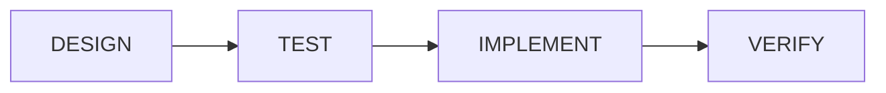

# Version History

> Release notes, breaking changes, and migration notes.

---

## v1.2.0 — 4-Stage Pipeline (2026-06-13)

### Independent TEST Phase

Upgraded from 3-stage to 4-stage pipeline with an independent test-writing phase:



**Why:** The implement session was writing its own functional tests — the AI was "marking its own homework." The new TEST stage writes functional, system, and integration tests from the design spec **before any code exists**. The IMPLEMENT session then writes code to pass those tests, plus unit tests for internal logic.

### New Commands

```bash
ralph test --ticket=<id> [--agent=pi|kimi]
```

### New Files

- `templates/prompts/sessions/test.md` — TEST session prompt
- `tests/e2e/ralph_4stage_pipeline_e2e_test.sh` — 33 e2e tests

### Updated Files

- `bin/ralph` — added `ralph test` command
- `templates/prompts/sessions/design.md` — explicitly no test-writing
- `templates/prompts/sessions/implement.md` — test-first workflow
- `init.py` — 4-stage output messages
- `README.md`, `docs/deployment.md`, `scripts/install.sh` — 4-stage docs

**E2E Tests:** 33/33 passing.

---

## v1.1.0 — 3-Session Pipeline + Bug Fixes (2026-06-13)

### 3-Session Pipeline Commands

Added explicit session commands for the design → implement → verify workflow:

```bash
ralph design --ticket=<id> [--agent=pi|kimi]
ralph implement --ticket=<id> [--agent=pi|kimi]
ralph verify --ticket=<id> [--agent=pi|kimi]
```

### Enhanced Installer

Comprehensive prerequisite validation with pass/warn/fail reporting and install instructions.

### Session Prompt Templates

- `templates/prompts/sessions/design.md`
- `templates/prompts/sessions/implement.md`
- `templates/prompts/sessions/verify.md`

### Bug Fixes

- Fixed legacy validation paths: `bash scripts/ralph/ralph_validate.sh` → `ralph validate`
- Fixed repo URL: `gastownhall/ralph` → `samdharma/Ralph_loop`

---

## v1.0.0 — Initial Release (2026-05-24)

### Global Tool Architecture

Ralph is a **global CLI tool** installed at `~/.ralph/`. Core build scripts live there. Projects carry only config files — no build scripts in project repos.

### Implementation Phases

**Phase 1 — Extract and Clean:** Extracted the build system from SAM Trader V3 into a standalone repository. All SAM Trader references removed. Twelve core scripts generalized: `ralph_loop.sh`, `run_ralph_loop.sh`, `ralph_preflight.sh`, `ralph_validate.sh`, `ralph_health.sh`, `ralph_metrics.sh`, `ralph_metrics_viewer.py`, `ralph_report.sh`, `ralph_report.py`, `ralph_check_specs.py`, `ralph_performance_check.sh`, `detect_affected_tests.py`. Seven `.j2` templates for project scaffolding.

**Phase 2 — `ralph init` Wizard:** Interactive Q&A wizard (`init.py`) that asks 7 questions and scaffolds a complete project — git init, beads init, directory structure, language-specific config. Template rendering with simple `{{ VAR }}` replacement (no Jinja2 dependency). CLI entry point (`bin/ralph`) with subcommand dispatch.

**Phase 3 — Documentation and Polish:** Comprehensive documentation (10 markdown files + single-page HTML with Mermaid diagrams). One-line installer (`scripts/install.sh`). Project health dashboard (`ralph status`). Self-update mechanism.

### Commands at v1.0.0

`ralph init`, `ralph setup`, `ralph status`, `ralph loop`, `ralph daemon`, `ralph validate`, `ralph health`, `ralph report`, `ralph metrics`, `ralph sync`, `ralph migrate`.

---

## Migration Notes

### v1.1 → v1.2

No breaking changes. Existing projects continue to work. To upgrade an existing project with the new TEST stage prompts:

```bash
cp ~/.ralph/templates/prompts/sessions/test.md docs/agent/prompts/sessions/
```

### v1.0 → v1.1

No breaking changes. Upgrading Ralph globally (`git pull` in `~/.ralph/`) gives all projects access to the new session commands.

### Legacy → v1.0

Projects with `scripts/ralph/` (embedded scripts) can migrate:

```bash
cd your-project
ralph migrate
```

This creates `.ralph/config.toml`, updates `AGENTS.md` and `PROMPT.md` to use `ralph` commands. You can then remove `scripts/ralph/`.
